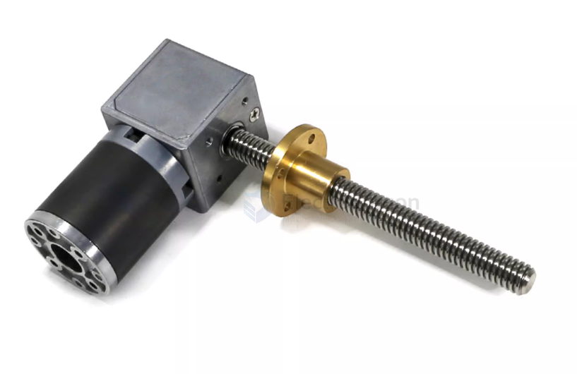
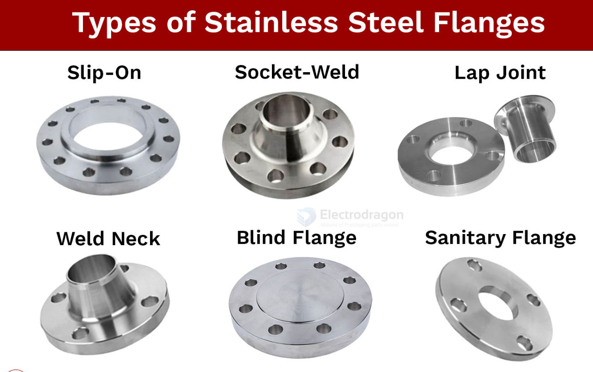
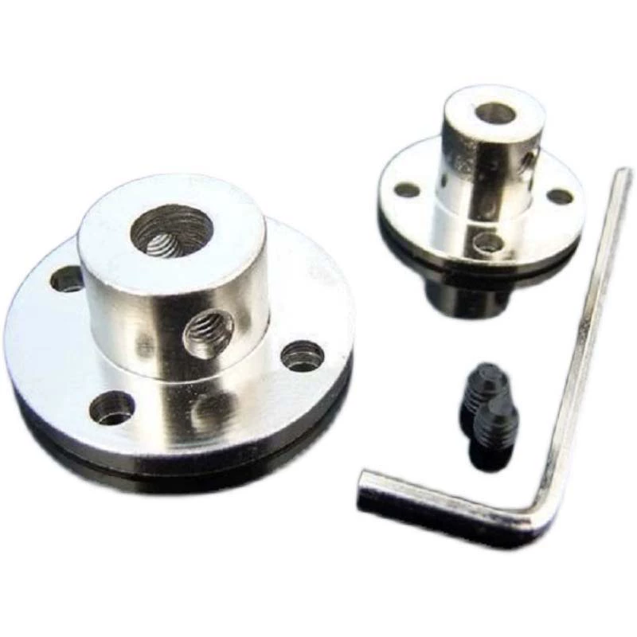
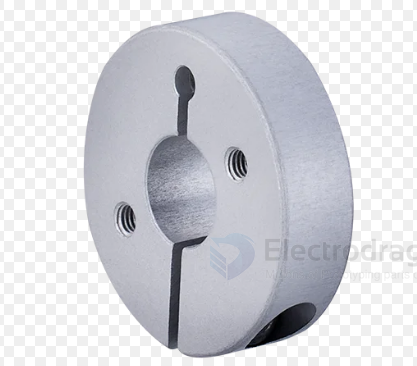
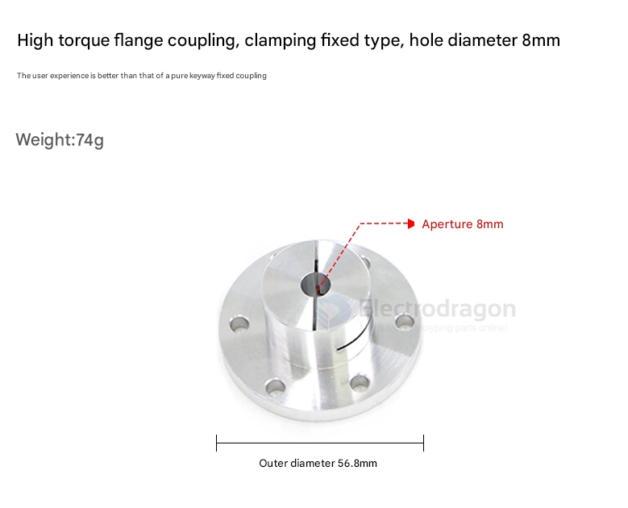
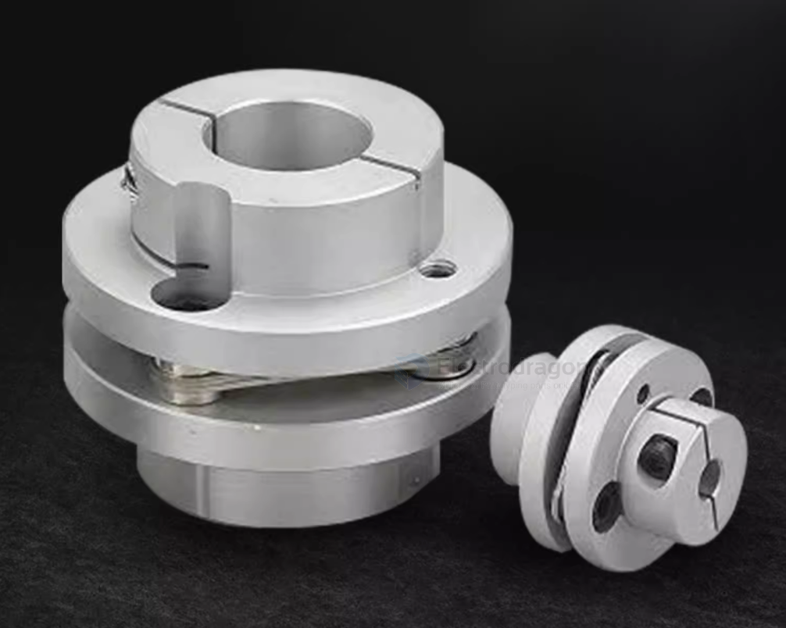

# flange-dat.md

- [[shaft-coupling-dat]] - [[flange-dat]] - [[shaft-dat]]

### 为什么必须选【刚性法兰盘】而放弃联轴器？

1. **变“轴向摩擦”为“面刚性死锁”**
   * **普通联轴器**：管身太瘦，哪怕是夹紧式，在高频正反转和 5KG 惯性冲击下，仅靠 6mm 圆周的摩擦力极易发生微量滑移，导致 4 个轴的位置迅速脱节。
   * **法兰盘**：通过其巨大的圆盘端面，与你的负载机构（如车轮毂、摆臂、传动板）进行**面对面紧贴**。通过 3~4 颗金属螺栓实现多点分布的机械死锁，抗弯曲和抗扭剪切力的能力呈指数级提升。
2. **利用力臂分散 5KG 冲击力**
   * 5KG 的重物在启动和急停时，会产生极大的瞬间冲击。法兰盘外圈的固定螺丝孔径（通常在 15mm ~ 22mm 之间）远大于 6mm 的轴径。根据杠杆原理，力臂放大后，螺丝所承受的剪切力被大幅平摊，能够有效防止电机轴在根部被硬生生扭断。

---

### 二、 适配你电机的【法兰盘选型规范】

你必须采购满足以下三个物理特征的**“变径锁紧并用型刚性法兰盘”**（商品通常名为：`夹紧顶丝并用型法兰联轴器` 或 `带台阶孔刚性法兰座`）：

1. **孔径与配合**：电机端孔径必须是刚好的 **6mm**，且必须带有**侧面切缝（夹紧螺丝孔）**。
2. **内部必须带台阶孔（Counterbore）**：法兰盘中心孔内部必须带有机械台阶。当 **M3 轴心螺栓** 从法兰盘正前方插入时，螺丝头必须能被台阶死死挡住，从而能拧进电机轴心，将法兰盘向后“死死拉紧”在电机的轴肩上。
3. **顶丝孔位**：必须在垂直于夹紧缝的方向，额外带有一个**顶丝（紧定螺钉）孔**，用于死锁电机的 D 型铣平面。

flange with [[Motor-reduction-Gear-dat]]

A flange is a protruding rim, lip, or ridge used for various purposes, including fixing, strengthening, guiding, or connecting. It can be a flat surface sticking out from an object, or a decorative edge on clothing. 

## shaft coupling flange set == set-screw flange

The image shows a shaft coupling flange set, typically used to connect a motor shaft to a wheel, gear, or other rotating component. The screw part in this flange assembly refers to the grub screws (set screws) shown next to the hex key (Allen wrench).

Breakdown of the parts:

**Grub screws (set screws):**
These are the small black screws included in the image. They are inserted into the threaded side holes of the flange (visible on the cylindrical hub) to secure the shaft in place.

Function:

Once the shaft is inserted into the flange's central hole, the grub screws are tightened using the included hex key to clamp the shaft securely, preventing it from slipping.

These components are commonly used in RC cars, robotics, CNC machines, and 3D printers for coupling motors to shafts or wheels.

### set-screw flange for 100KG motor 

NO, a basic set-screw flange on an 8mm shaft is not recommended to handle 100 kg load especially under torque or dynamic conditions.

Consider:

- A larger diameter shaft (12–16mm)
- Clamping flanges
- Keyed shafts
- Stronger materials
- Proper bearing support

## Clamping Flange 

## keyed flange

## Options selection

If possible, use a clamping flange — it’s safer, more secure, and better for D-shafts and higher loads.

If you already have a set screw flange (like in your image), it can work, especially on a D-shaft, but be extra careful with alignment and torque.

## ref 

-[[motor-shaft]]

- [[flange]] - [[mechanics]]