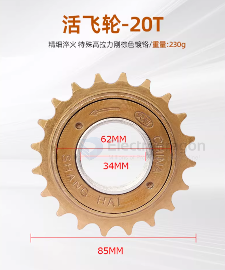
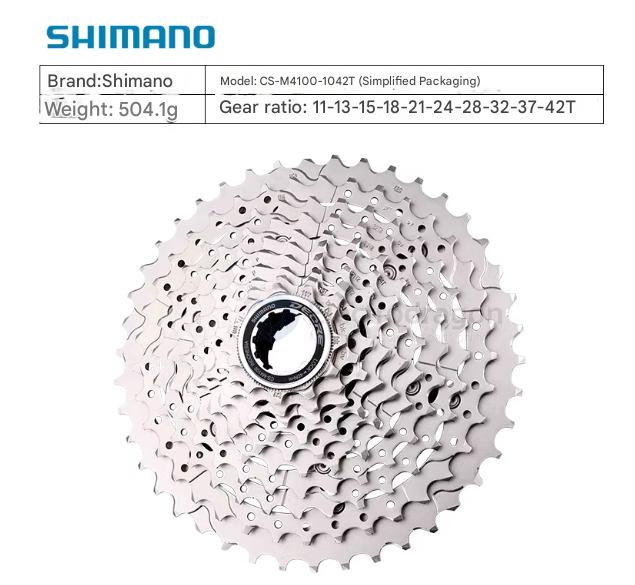

# gear-dat

- [[gear-dat]] - [[gearbox-dat]]

- [[RPM-dat]] - [[physics-dat]] - [[gear-dat]] - [[Sprocket-dat]] - [[wheel-dat]] 

- [[chain-dat]]

## gear ratio 

To get a 1:5 ratio, the wheel gear must be 5 times larger than the motor gear.

Common Combinations:

- 9-tooth motor sprocket $\rightarrow$ 45-tooth wheel sprocket.
- 10-tooth motor sprocket $\rightarrow$ 50-tooth wheel sprocket.
- 11-tooth motor sprocket $\rightarrow$ 55-tooth wheel sprocket.

## Small Wheel Bicycle Drivetrain Specifications (12" - 16")

For small-diameter wheels, the gear ratio is designed to balance pedaling effort with the shorter distance traveled per wheel revolution. Most bikes in this category use a **Single-Speed Freewheel** system.

---

#### 1. Typical Tooth Counts by Wheel Size

| Wheel Size  | Front Chainring (Teeth) | Rear Cog (Teeth) | Gear Ratio  | Purpose                                 |
| :---------- | :---------------------- | :--------------- | :---------- | :-------------------------------------- |
| **12-inch** | **24T - 26T**           | **16T**          | 1.50 - 1.62 | Maximum torque for toddlers/beginners.  |
| **14-inch** | **28T**                 | **16T**          | 1.75        | Balanced ratio for neighborhood riding. |
| **16-inch** | **28T - 32T**           | **16T or 18T**   | 1.77 - 2.00 | Higher top speed for older children.    |

---

#### 2. Component Anatomy

* **The Rear Cog (The Driven Sprocket):** * **Standard Size:** 16T is the industry default. 
    * **Thread Type:** Most use a standard 1.375" x 24 TPI (Threads Per Inch) interface, allowing you to swap cogs easily.
* **The Front Chainring (The Drive Sprocket):** * Larger wheels require more teeth on the front to prevent "ghost pedaling" (where the legs move too fast for the speed of the bike).
* **The Chain:** * Standard small bikes use a **1/2" x 1/8"** chain (wider than multi-speed chains).

## bicycle gear 

| Feature           | Freewheel (Old Standard/Budget)                      | Cassette (Modern/Performance)                     |
| :---------------- | :--------------------------------------------------- | :------------------------------------------------ |
| **Mounting**      | Screws onto threads on the hub.                      | Slides onto a splined "freehub" body.             |
| **Mechanism**     | Ratchet is inside the gear cluster.                  | Ratchet is built into the hub (freehub).          |
| **Replacement**   | You replace the gears and ratchet together.          | You replace only the gear cluster.                |
| **Axle Strength** | Higher risk of bent axles (bearings are further in). | Lower risk (bearings are positioned further out). |

| Feature              | **Freewheel (Live Flywheel)**                                      | **Fixed Gear (Dead Flywheel)**                                        |
| :------------------- | :----------------------------------------------------------------- | :-------------------------------------------------------------------- |
| **Coasting**         | Can coast; pedals can remain stationary while the bike moves.      | Cannot coast; if the wheels are turning, the pedals **must** turn.    |
| **Reverse Pedaling** | The pedals spin freely backward without affecting the wheel.       | Used to reverse the bike or apply "back-pressure" to slow down/brake. |
| **Mechanical Link**  | Connected via a one-way ratcheting mechanism (clutch).             | Directly "fixed" or bolted to the hub; no internal moving parts.      |
| **Primary Use**      | Standard commuter bikes, vintage mountain bikes, most kids' bikes. | Track cycling (velodrome), "Fixie" culture, and some indoor trainers. |

## Cassette

## Common Freewheel Thread Standards

| Standard Name            | Metric Diameter (Approx.) | Imperial Specification | Common Application                                   |
| :----------------------- | :------------------------ | :--------------------- | :--------------------------------------------------- |
| **Standard ISO/English** | **34.92 mm**              | **1.375" x 24 TPI**    | **Most bicycles (95%)**; this is the "34mm" you see. |
| **BMX / Metric Small**   | **30.00 mm**              | **1.181" x 30 TPI**    | Small freewheels (under 16 teeth) for BMX.           |
| **French Standard**      | **34.70 mm**              | **M34.7 x 1.0 mm**     | Vintage European bikes (now obsolete).               |
| **Italian Standard**     | **35.00 mm**              | **35mm x 24 TPI**      | Vintage Italian racing bikes.                        |

## ref 

- [[motor-dat]]