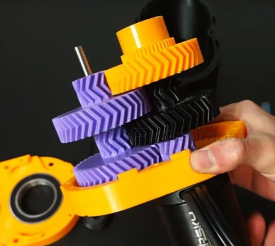

# gear-herringbone-dat

A **herringbone gearbox** is a specialized mechanical gearbox that uses **herringbone gears** (also known as **double helical gears**) to transmit power between parallel shafts. 

To understand the gearbox, it helps to look at the unique gear design inside it, how it works, and why it is used.

---

### 1. What is a Herringbone Gear?
A herringbone gear looks like two angled (helical) gears placed side-by-side in a **V-shape** (resembling the skeleton bones of a herring fish). 

* **Single Helical Gears:** Have teeth cut at an angle, which makes them run much smoother and quieter than standard straight-cut (spur) gears. However, the angle creates a side-push force called **axial thrust**, which tries to push the gears sideways out of the gearbox and requires heavy thrust bearings to manage.
* **Herringbone / Double Helical Gears:** Solve this problem by combining a left-handed helix and a right-handed helix. Because the V-shapes point in opposite directions, the **axial thrust forces cancel each other out** completely.

---

### 2. Key Advantages of a Herringbone Gearbox
* **No Axial Load:** Because the side-thrust forces neutralize one another, the gearbox does not need massive thrust bearings to keep the shafts from shifting laterally.
* **Smooth, Quiet Operation:** Multiple teeth are engaged simultaneously, resulting in a continuous, fluid transfer of power with significantly less vibration and noise than spur gearboxes.
* **High Load Capacity:** The V-shape provides a larger effective contact area and greater tooth strength, making them ideal for handling massive torque.
* **Self-Centering:** The geometry of the V-teeth naturally tends to keep the gears aligned on their axes.

---

### 3. Common Applications
Because they are complex and expensive to manufacture (often requiring specialized shaping machines or modern 3D printing), herringbone gearboxes are typically reserved for heavy-duty, high-performance, or high-precision applications, such as:
* **Heavy Industrial Machinery:** Large rolling mills, crushers, and mining equipment.
* **Marine Propulsion:** Large ship drives and steam/gas turbine reduction gearboxes.
* **Power Generation:** Hydroelectric plants and wind turbine drives.
* **High-End Automotives:** Historically used in specialized car transmissions and final drives (such as early Citroën vehicles—whose famous double-chevron logo is actually a stylized herringbone gear).

## ref 