# gearbox-dat

- [[gearbox-miter-dat]]

- [[gear-dat]] - [[gear-worm-dat]] - [[gearbox-dat]]

- [[gear-dat]] - [[gearbox-dat]]

- [[gearbox-RV-dat]] - [[gearbox-planetary-dat]]

- [[motor-dat]] - [[motor-driver-dat]]

- [[gearbox-dat]] - [[mechanical-claw-dat]] - [[fab-3d-print-dat]]

## gearbox speed control 

### 1. Continuously Variable Gearbox (CVT / Friction-Type CVT)

* **Features:** Can adjust speed continuously and smoothly over a range, with no fixed gears/steps.

* **Common Types:** Mechanical friction-type CVTs (e.g., MB-series CVTs), steel-belt / belt-driven CVTs.

* **How It Works:** Changes the gear ratio by varying the contact radius between the input and output friction wheels (or cone pulleys). Turning the speed-adjustment handwheel provides seamless, stepless transition from maximum to minimum speed.

* **Typical Applications:** Conveyor lines, mixing equipment, packaging machinery — applications that need precise fine-tuning of speed.

### 2. Stepped (Multi-Speed) Gearbox

* **Features:** Similar to a manual transmission in a car — a fixed set of gears (e.g., 2-speed, 4-speed, 6-speed, etc.) that changes the reduction ratio by switching gear combinations.

* **How It Works:** Contains multiple gear sets with different tooth ratios. A shift fork or synchronizer switches which gear set is engaged.

* **Typical Applications:** Spindle heads of heavy-duty lathes, construction machinery, large hoists — equipment that needs high torque and only switches between a few specific speeds.

### 3. Motor + Fixed-Ratio Gearbox (The Modern Mainstream Approach: Electrical Speed Control)

- [[motor-dat]] + [[gearbox-dat]]

In modern industry, purely mechanical "adjustable gearboxes" are less common due to mechanical wear and complex structures. The most widely used alternative is actually a **variable-frequency motor / servo motor + fixed-ratio gearbox**:

* **How It Works:** A fixed-ratio gearbox (e.g., planetary or RV gearbox) provides the fixed-ratio speed reduction and torque increase, while the speed adjustment is handled by a front-end VFD (variable-frequency drive) or servo drive that controls the motor's frequency.

* **Advantages:** Extremely wide speed range, very high precision, simple structure, and almost no friction losses.

* **Typical Applications:** Industrial robots, CNC machine tools, automated production lines, etc.

## type of gearbox 

- [[motor-servo-dat]] - [[gearbox-dat]] == - [[SG90-dat]]

### Planetary Gearbox: 

These are highly efficient and keep the output shaft in line with the motor shaft. They are great for high-torque applications like robotics or electric vehicles.

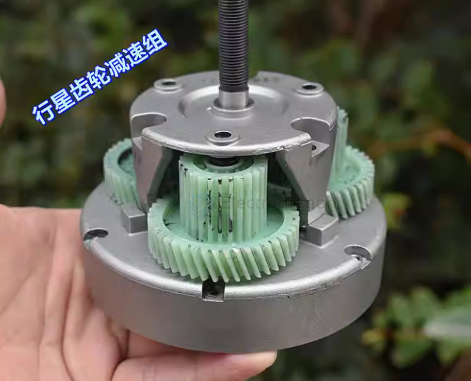

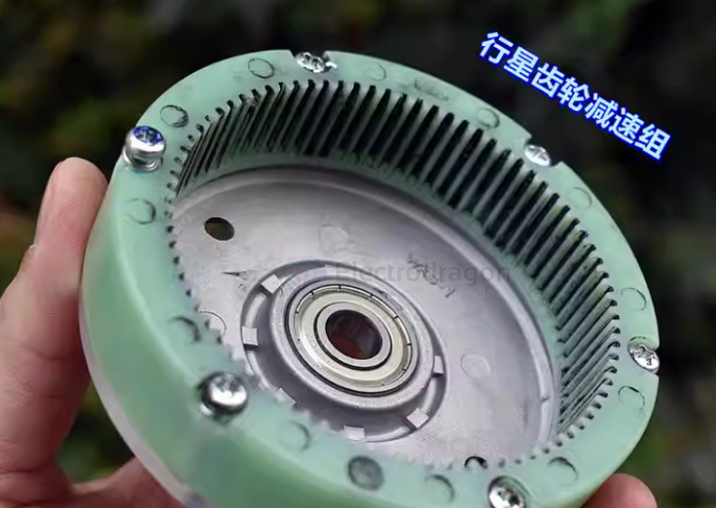

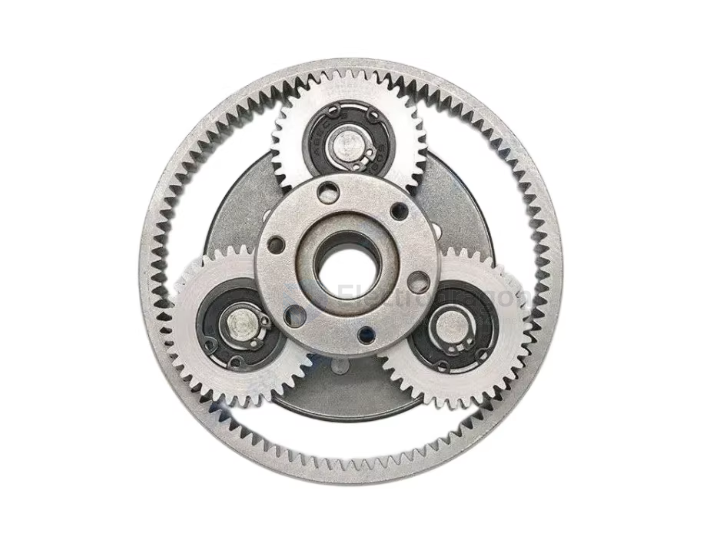

outter gear == "sun" gear 

inner gear == "Clutch" gear

- [[wheel-dat]] - [[wheel-hub-dat]] - [[gearbox-dat]] inside

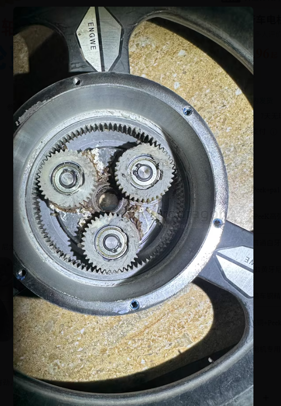

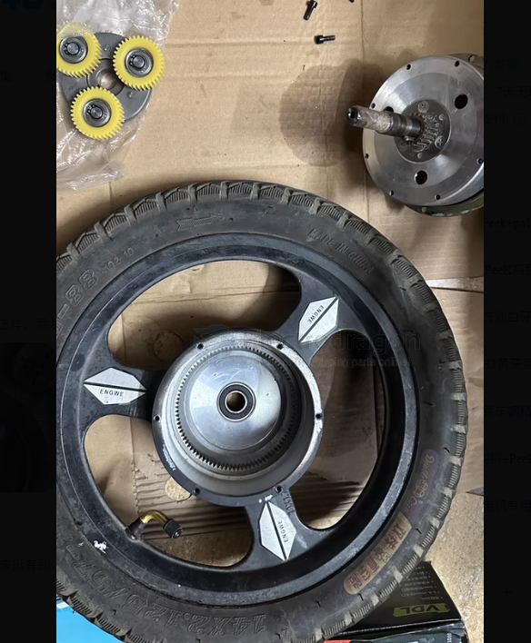

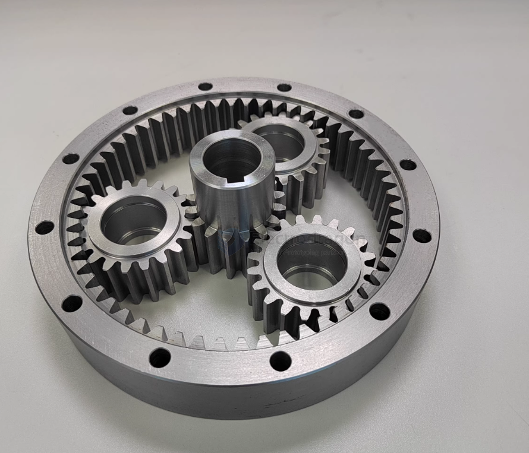

inner and outter pair 

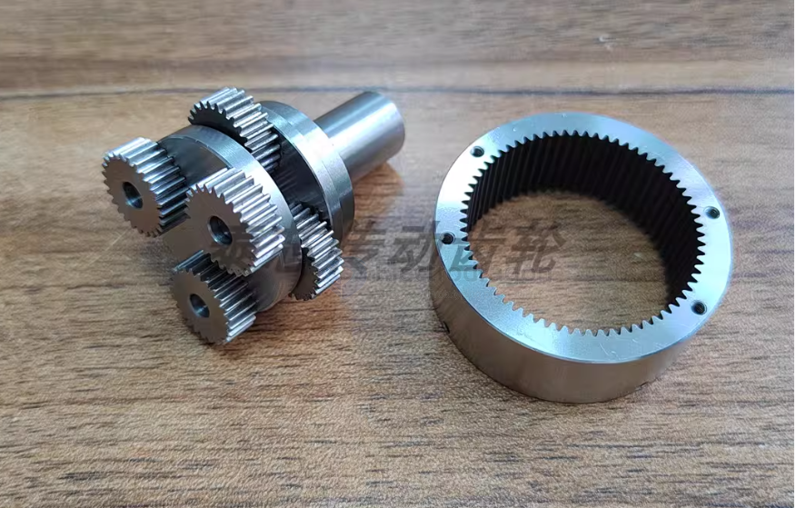

just more nice examples 

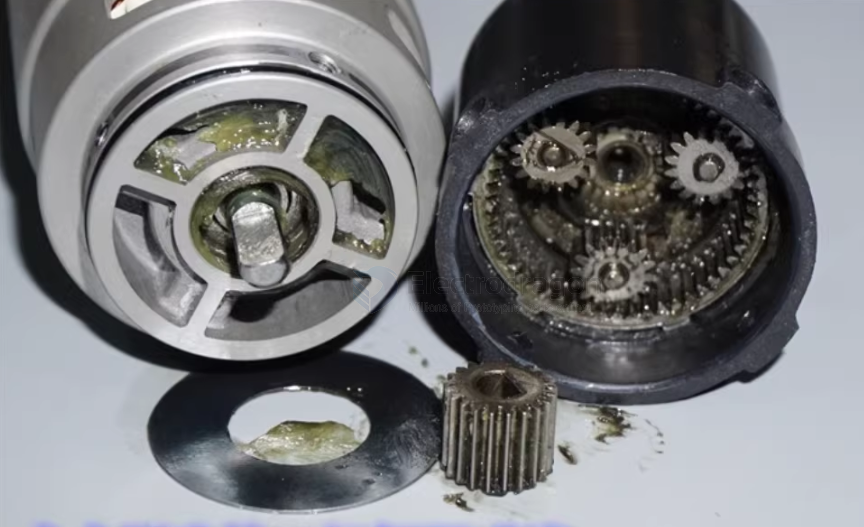

double planetary gearbox 

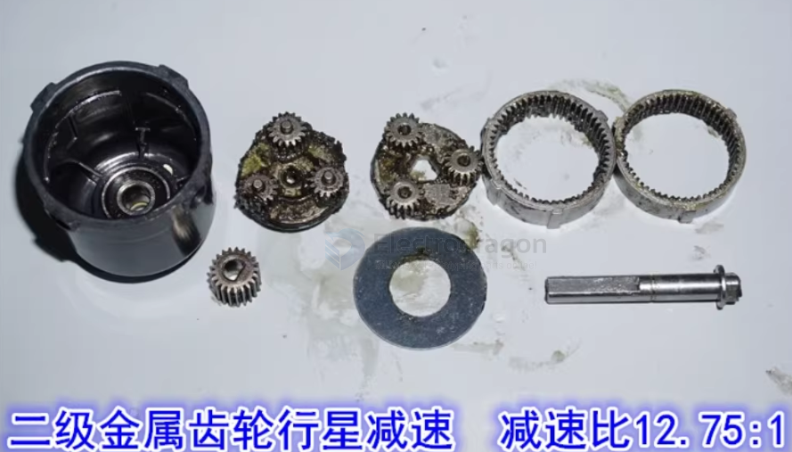

### Worm Gearbox: 

These provide massive reduction in a small space (e.g., 60:1) and have a "self-locking" feature, meaning the output shaft won't turn unless the motor is spinning.

## common gearbox 

small size 

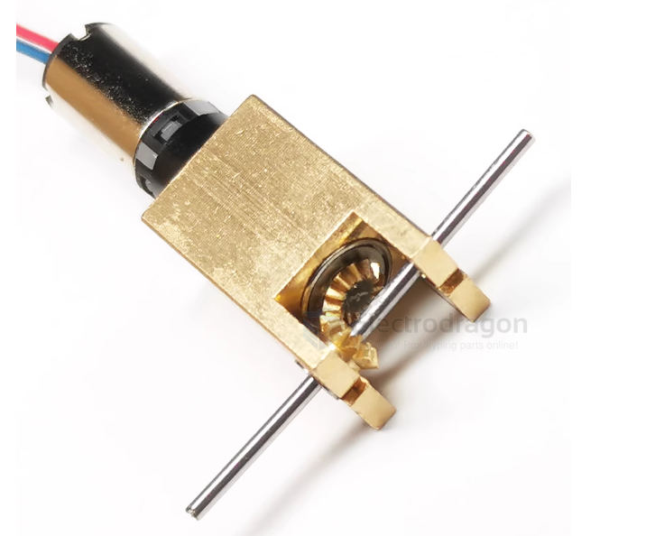

ratio 1:1 dimension 50x50x25mm 

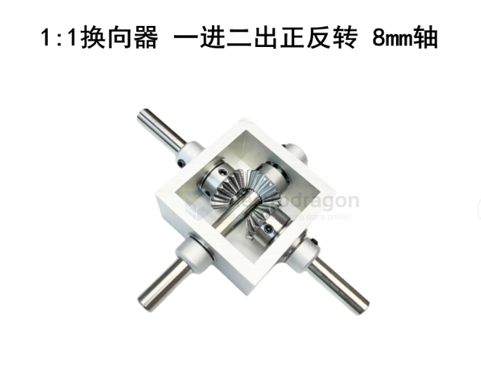

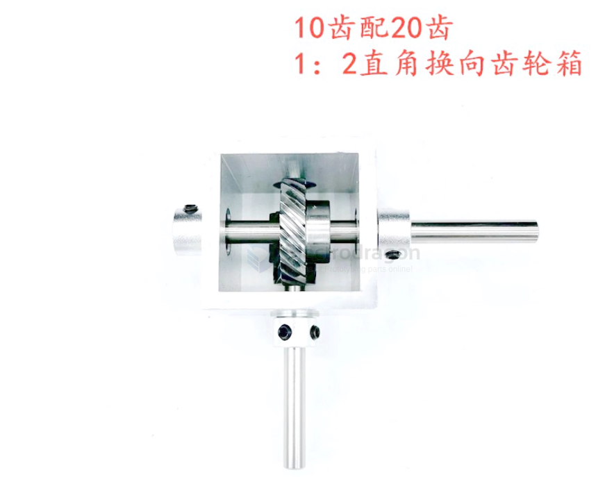

- [[gearbox-differential-dat]]

### plate gearbox 

- this specially for motor 5555 - [[metal-dat]] - [[metal-molded-dat]]

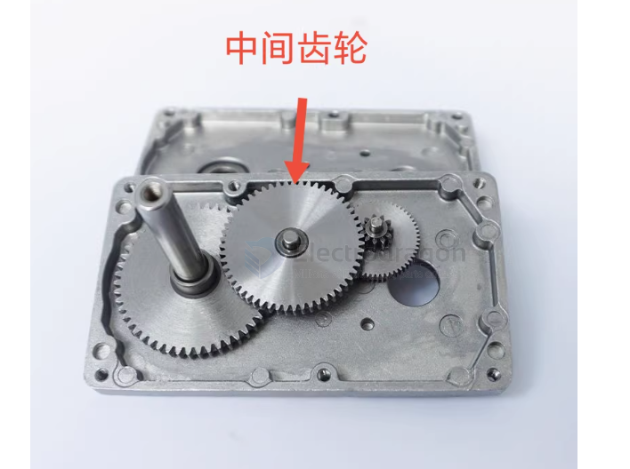

### angular gearbox 

- [[gear-bevel-dat]]

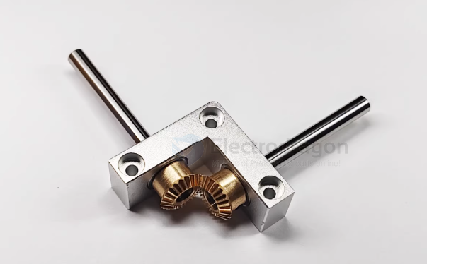

## apps

- [[motor-N20-dat]] - [[Motor-reduction-Gear-dat]]

- [[motor-TT-dat]]

RC clawer gearbox 

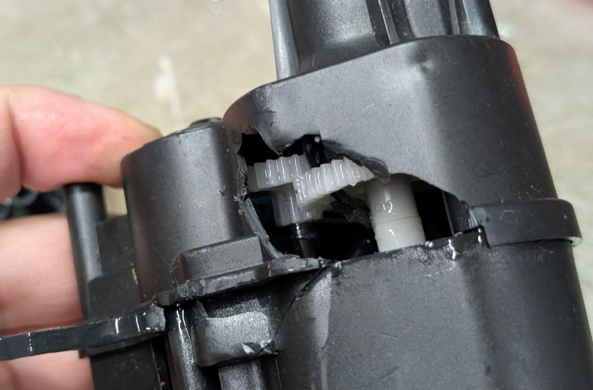

work with [[motor-stepper-dat]] - [[motor-brushless-dat]] - [[motor-servo-dat]]

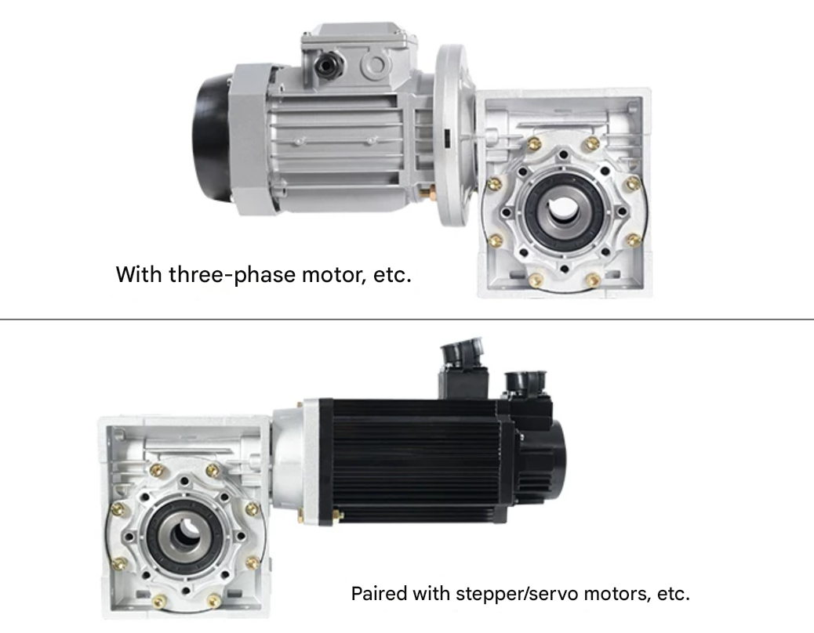

meta cutting full metal gears 

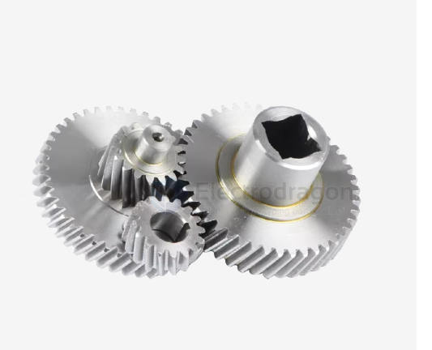

### gearbox to sprocket 

- [[sprocket-dat]]

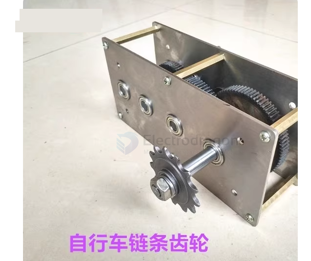

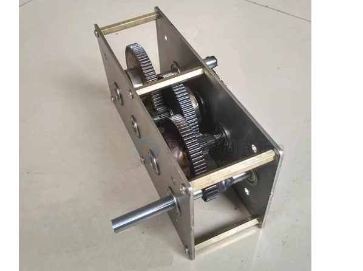

### gearbox assembly 

- 25:1 
- 37型减速箱

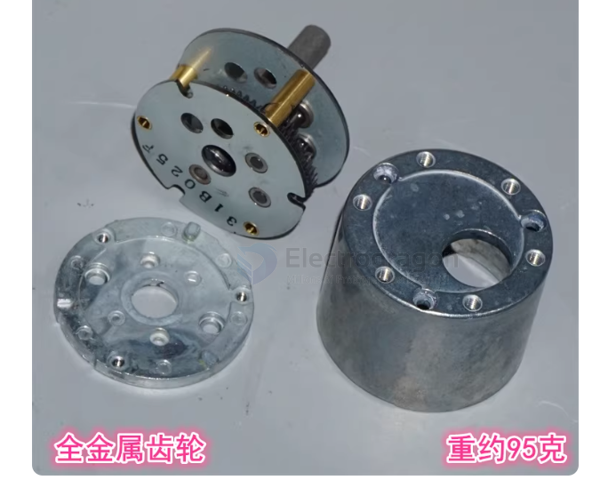

## ref 

- [[gearbox]] - [[mechanism]]