# mechanical-Fastener-dat

- [[mechanical-parts-dat]] - [[mechanical-Fastener-dat]] - [[mechanical-drive-dat]]

- [[Circlip-dat]]

- [[hose-dat]] - [[clamp-dat]]

- [[pin-dat]]

- [[elbow-dat]] - [[eyebolt-dat]] 

U型螺栓

U型带 连胶条 骑马卡 钢管卡扣 夹箍 管卡子 喉箍锁

弹性圆柱销 定位销 开口销 弹簧销

登山扣

膨胀螺丝 - [[screw-dat]] - [[screw-expansion-dat]]

- [[rivet-dat]]

尼龙碳钢 脚杯 固定地脚螺丝

木工内外牙螺母沉头内六角家具螺帽实木预埋件梯形螺丝帽

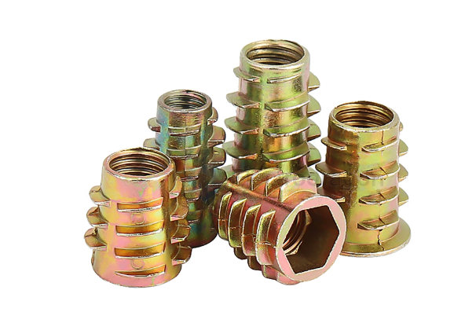

锤仔螺母 锤头螺帽 家具二合一连接件 元柱预埋内六角螺丝帽

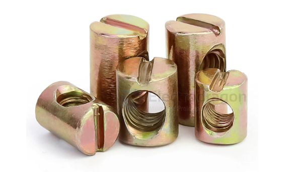

对锁螺丝 螺母倒边内六角子母家具连接夹板对接螺栓M3-M8

圆柱销 打横孔 预埋连接字锤头锤子螺母异性螺丝丝

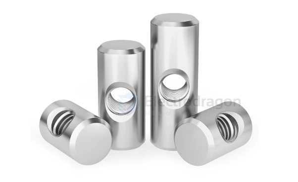

平头内六角螺丝横孔螺母套装锤头一字家具螺丝钉五金配件

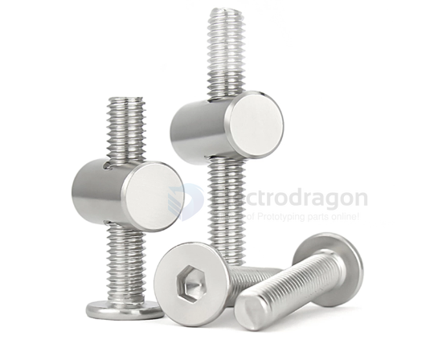

T字型螺丝圆柱焊接螺杆T形螺钉丁字螺栓MM4M5M6M8M10M12
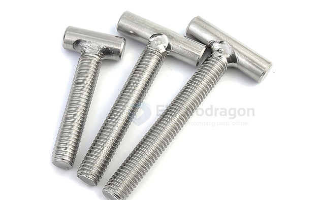

七字螺丝直角螺钉 L型螺杆地脚螺栓

- [[shaft-limit-ring-dat]]

六角开槽螺母 槽型螺帽GB6181/GB6178 M6M8M10M12M14

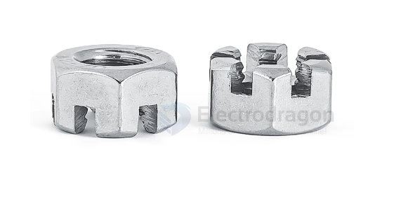

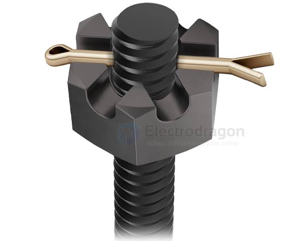

六角开槽螺母（英文通常称为 Hex Slotted Nut 或 Castellated Nut，俗称“槽型螺帽”）是一种特殊的防松螺母。GB6178（主要是 1 型和 2 型六角开槽螺母）和 GB6181（六角薄开槽螺母）是它的中国国家标准。

这种螺母的核心用途是配合“带孔螺栓”和“开口销（Cotter Pin）”使用，实现极高可靠性的机械强制锁死，防止螺母在剧烈震动或交变载荷下松脱。

一、 核心工作原理与使用方法
六角开槽螺母的顶部比普通螺母多了几个呈放射状的凹槽（通常是 6 个槽），它的安装和防松过程如下：

拧紧螺母：将六角开槽螺母拧紧在带有横向通孔的螺栓或轴上。

对齐槽孔：调整螺母的拧紧位置，使其顶部的某一个凹槽与螺栓上的通孔对齐。

插入开口销：将一根开口销穿过螺母的凹槽和螺栓的孔。

锁死销子：用钳子将开口销露出的尾部向两侧扳开，使其无法脱落。

这样一来，螺栓、螺母和开口销就形成了一个刚性的物理卡位。只要开口销不折断，螺母就绝对不可能发生旋转和松脱。

K型螺母带齿螺帽 K帽螺母多齿/花齿螺帽

旋转环8字环扣宠物狗链万向转环防打结链条旋转扣连接

滑轮 304不锈钢滑轮 定滑轮 双滑轮 单滑轮 起重滑轮

加粗S型晒腊肉挂钩实心不锈钢挂猪肉烤鸭香肠勾挂肉S钩子

双U型螺栓螺丝U形卡扣十字水管卡子固定器管夹抱箍

聚氨酯304包胶螺丝防撞缓冲螺钉减震胶头螺栓M5M6M8M10M12

野外帐篷钉营钉拴狗桩360度旋转户外加粗304不锈钢拴狗钉宠物地钉

加长圆柱套管 轴套衬套空心管 无牙螺丝间隔柱 套管销套

管夹 托盘 圆柱螺母 管支架 底座固定管卡圆盘支撑脚座

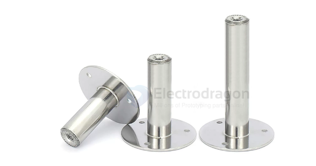

挂钩大全 吊扇 钩子 沙袋钩 固定钩 U型承重 顶钩吊环灯

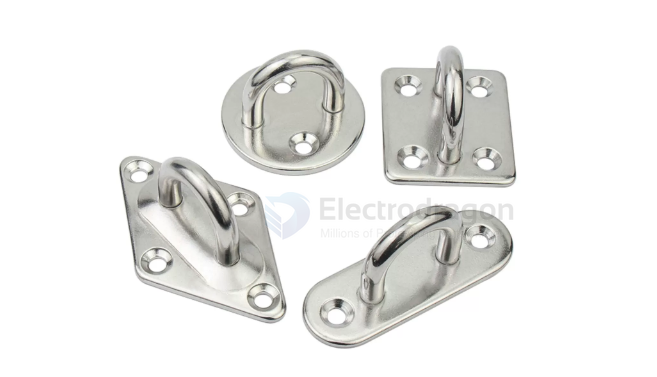

锥形螺母 锥型螺帽 滚花内爆螺丝帽 M6M8M10M12

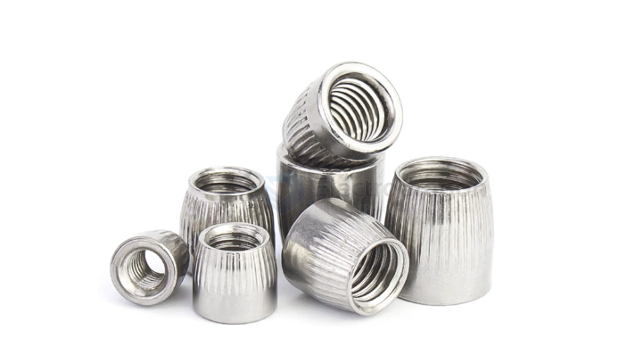

蝴蝶扣起重合金钢强力环子母环链条链接扣双环扣长吊环圆环吊索具

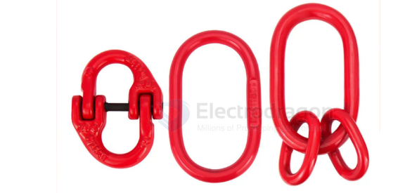

PVC管PPR水管钩钉固定管卡钉入墙勾钉钩钉水泥钢钉4分6分1寸

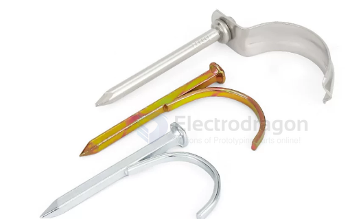

屋顶空中瑜伽沙袋包秋千空中吊床椅固定盘挂钩吊钩

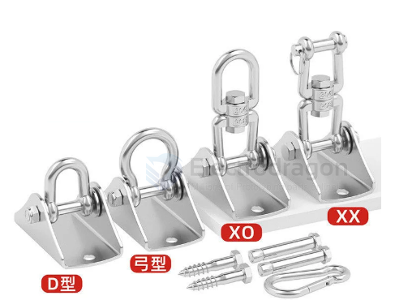

带齿弹性销波纹开口销锯齿形空心圆柱销M2M2.5M3M4M5M6

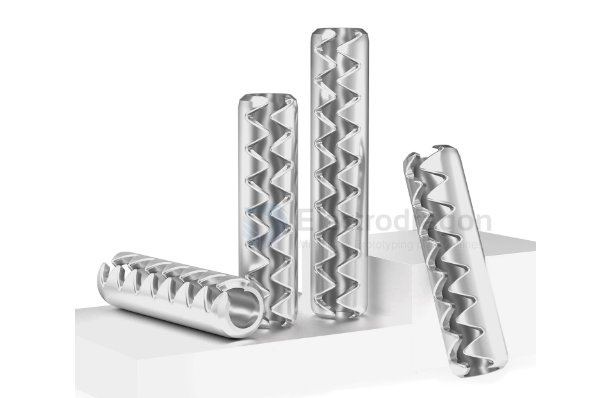

## ref 

- [[mechanical-Fastener]] - [[mechanics]]