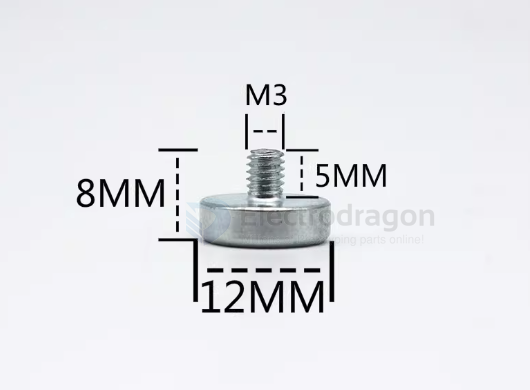
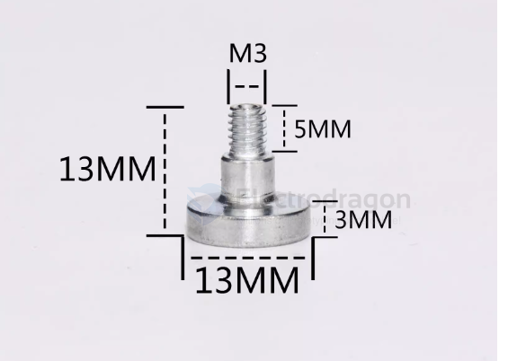
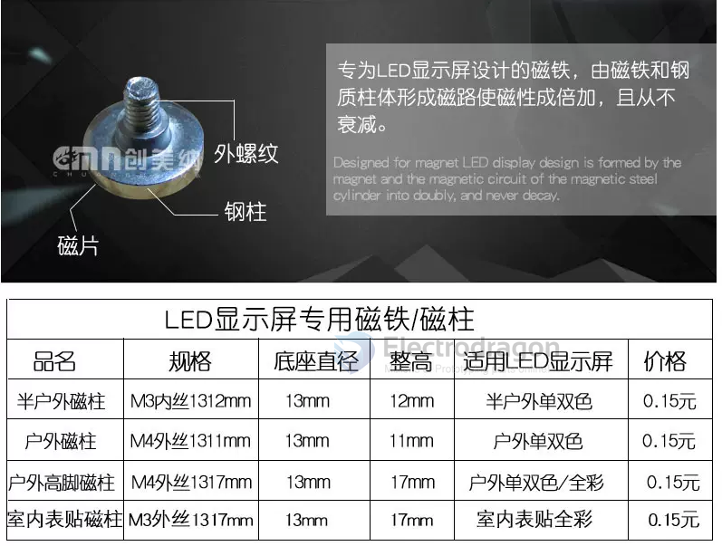
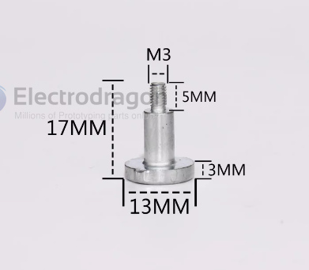
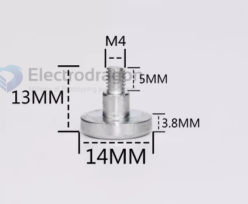

# screw-magnetic-dat

- 1208-M3（装好9.8*1.2mm磁片）
- 1208-M4（装好9.8*1.2mm磁片）
- 1313-M3（装好9.8*1.2mm磁片）
- 1313-M4（装好9.8*1.2mm磁片）
- 1317-M3（装好9.8*1.2mm磁片）
- 1317-M4（装好9.8*1.2mm磁片）
- 强磁 1408-M4（装好10*1.3mm磁片）
- 强磁 1413-M4（装好10*1.3mm磁片）
- 强磁 1417-M3（装好10*1.3mm磁片）
- 强磁 1417-M4（装好10*1.3mm磁片）
- 加强磁 1413M4-Pro（装好11*1.3mm磁片）
- 加强磁 1417M4-Pro（装好11*1.3mm磁片）
- 加强磁 1513-M4（装好12*1.3mm磁片）
- 加强磁 1517-M3（装好12*1.3mm磁片）
- 加强磁 1517-M4（装好12*1.3mm磁片）
- 加强磁 1520-M4（装好12*1.3mm磁片）
- N35强磁-圆形沉孔M3，10*3mm
- 加强磁N42-圆形沉孔M3，12*3mm

# magnetic-screw-dat 

## 1317-M3
- diameter 13mm, height 17mm
- drill - M3 

## 1313-M4

## Demo video

https://www.youtube.com/shorts/bYAMpQTe3k0

## ref 

- [[PCB-accesories-dat]]

## ref 

- [[screw-dat]]