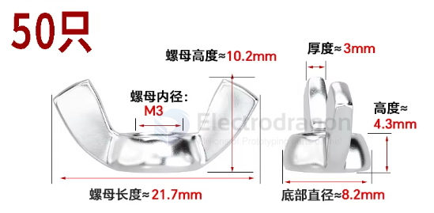

# screw-thumb-dat

- [[screw-thumb-dat]] - [[nut-thumb-dat]] - [[product-dat]] - [[user-friendly-mechanical-design-dat]]

- [[screw-dat]] - [[nut-dat]]

- [[nut-wing-dat]] - [[screw-wing-dat]] 

## screw thumb types 

- wing-screw / wing-nut 

### Knurled Head Thumbscrews: * Features a textured (diamond or straight) pattern on the side of a cylindrical head.

Best for: Precise, low-torque adjustments in electronics or robotics.

### Wing Screws (Butterfly Screws):

Has two flat "wings" protruding from the head.

Best for: Providing maximum leverage for hand-tightening without tools.

### Spade Head Thumbscrews:

The head is a thin, flat "spade" (like a key).

Best for: Situations where you need to apply torque with your whole hand rather than just fingertips.

### T-Handle / Tee-Head Screws:

Shaped like a 'T'.

Best for: Large machinery or heavy-duty outdoor gear where you might be wearing gloves.

