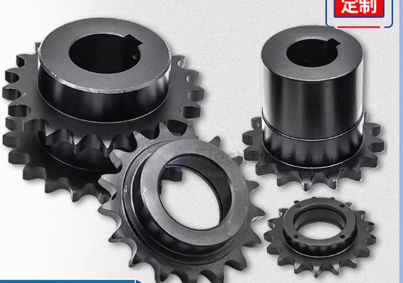

# Sprocket-dat

- [[gear-dat]] - [[chain-dat]]

| 中文名稱            | 英文術語               | 常用縮寫/別名                |
| :------------------ | :--------------------- | :--------------------------- |
| **大鏈輪 (輪端)**   | **Large Sprocket**     | Driven Sprocket, Rear Gear   |
| **小鏈輪 (電機端)** | **Small Sprocket**     | Drive Sprocket, Motor Pinion |
| **齒數**            | **Tooth Count**        | 50T, 10T (T = Teeth)         |
| **鏈條型號**        | **Chain Pitch / Size** | #25, T8F, #35                |
| **安裝孔位**        | **Mounting Pattern**   | BCD (Bolt Circle Diameter)   |

Sprocket (鏈輪): 這是專指與「鏈條」嚙合的帶齒輪子。如果它是用皮帶帶動的，則稱為 Pulley (皮帶輪)。

Driven Sprocket / Rear Sprocket: 指安裝在輪子上的那個「大齒盤」。

Drive Sprocket / Motor Sprocket / Pinion: 指安裝在電機軸上的那個「小齒輪」。

## Large Sprocket

## info 

A **sprocket** (or sprocket-wheel) is a profiled wheel with teeth that mesh with a chain, track, or other perforated or indented material. 

It is distinguished from a **gear** in that sprockets are never meshed together directly, and from a **pulley** in that sprockets have teeth and pulleys are smooth.

---

## Key Characteristics of a Sprocket
The design of a sprocket is strictly tied to the specific chain it is intended to drive. Key parameters include:

* **Teeth (Z):** The number of individual projections that engage the chain links.
* **Pitch (P):** The distance between the centers of two consecutive teeth. This must match the chain's pitch perfectly.
* **Bore:** The center hole where the shaft (e.g., a motor shaft) is inserted.
* **Hub:** The raised portion around the bore that often contains a set screw or keyway to lock the sprocket to the shaft.

---

## Sprocket vs. Gear: The Main Differences

| Feature         | Sprocket                                   | Gear                                |
| :-------------- | :----------------------------------------- | :---------------------------------- |
| **Engagement**  | Meshes with a chain or belt.               | Meshes directly with another gear.  |
| **Distance**    | Ideal for long-distance power transfer.    | Usually requires close proximity.   |
| **Slip**        | No slip (due to teeth).                    | No slip (due to teeth).             |
| **Maintenance** | Requires chain tensioning and lubrication. | Requires alignment and lubrication. |

---

## Common Applications

1.  **Bicycles & Motorcycles:** The most recognizable use. The "chainring" at the pedals and the "cassette" at the rear wheel are both sprockets.
2.  **Tracked Vehicles:** Tanks, bulldozers, and excavators use a large drive sprocket to pull the heavy metal tracks.
3.  **Industrial Conveyors:** Moving goods along a factory floor often relies on long chain drives powered by sprockets.
4.  **Robotics & DIY Projects:** Especially useful for mobile platforms like your **Rover V2** if you are moving from a direct-drive wheel to a tank-tread or high-torque chain system.

## ref 

