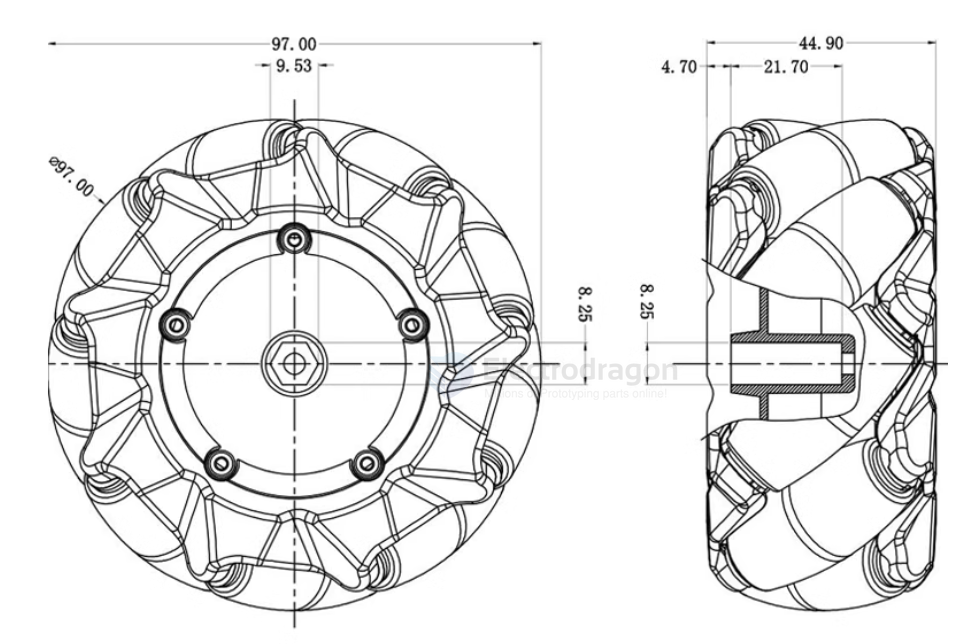
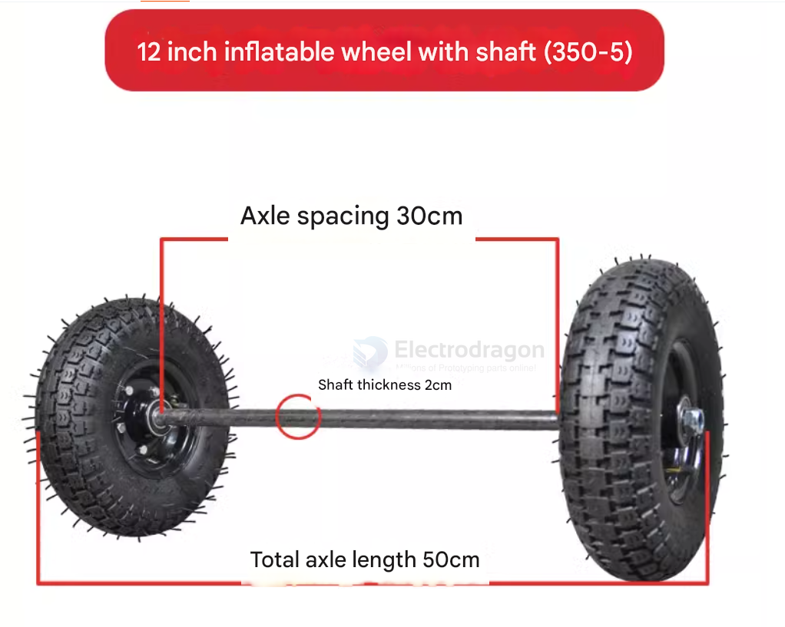
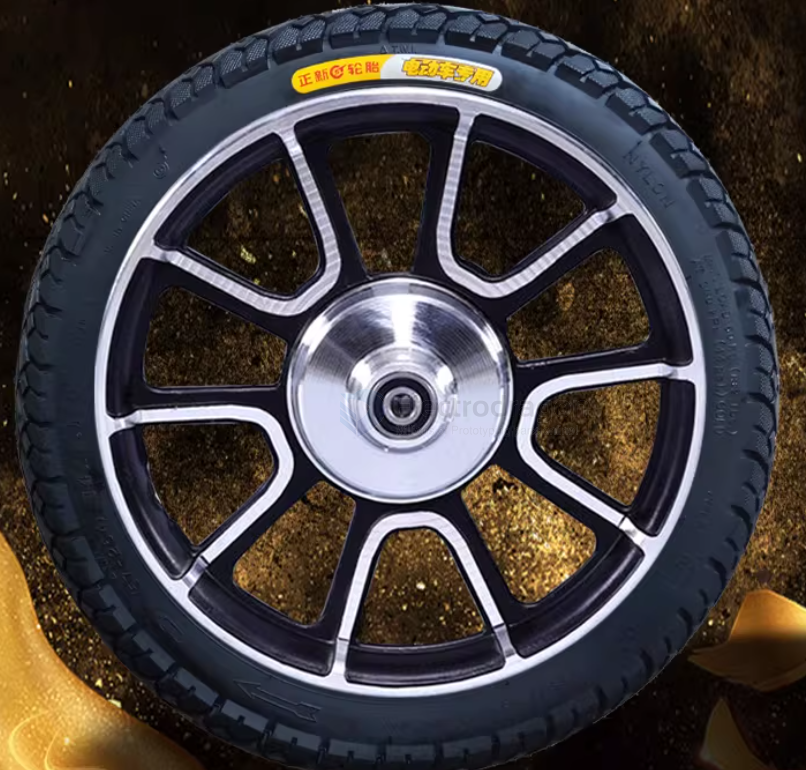
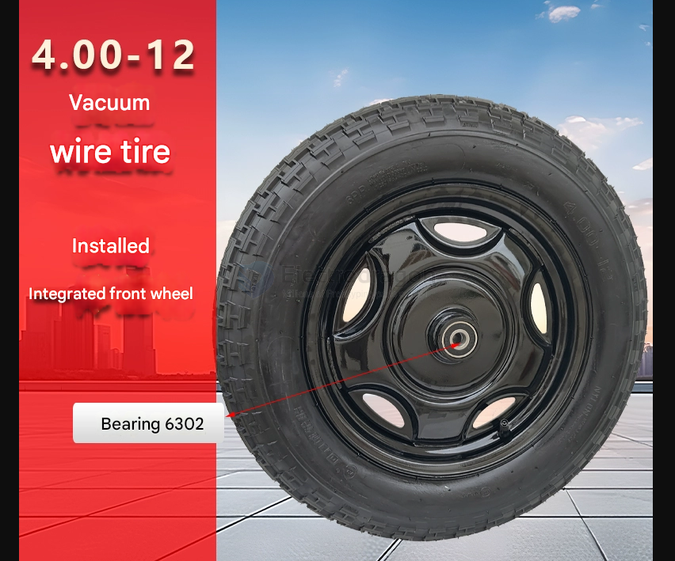
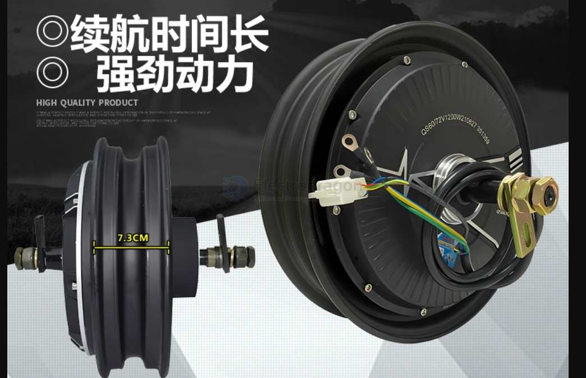
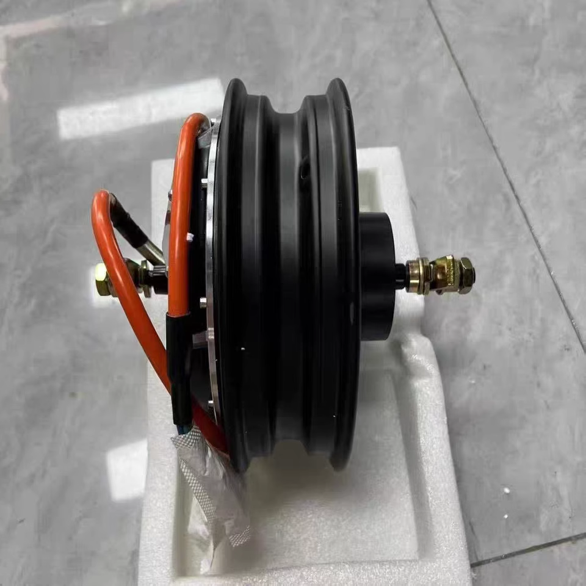
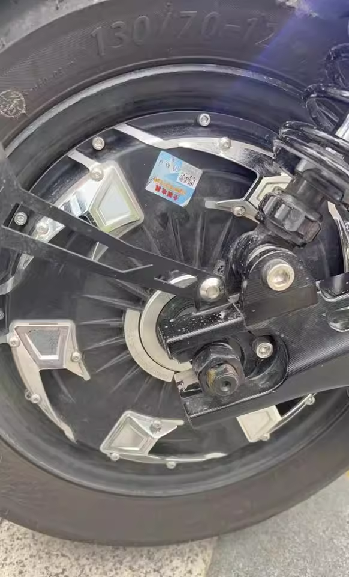

# wheel-dat

- [[Mecanum-wheel-dat]]

- [[tank-wheels-supporting-dat]]

- [[RPM-dat]] - [[physics-dat]] - [[gear-dat]] - [[Sprocket-dat]] - [[chain-dat]]

- [[wheel-hub-dat]] - [[wheel-dat]] - [[bearing-dat]]

97 dia mm 

125 dia mm 

## 12"

12 inches is equal to:

- 30.48 centimeters (cm)
- 304.8 millimeters (mm)

## wheel front == Driven Wheel / Idler Wheel

wheel without motor 

bearing 6302

## wheel with motor / rear wheel == Driving Wheel

mostly used for balancer kart, electric go-kart, and electric tri-cycle,

12-inch 3000W 18-shaft + Mingzhe semi-molten tire

## wheels with hub 

- [[wheel-hub-dat]]

## ref 

- [[robot-dat]]

- [[bearing-dat]]

## ref 

- [[wheels]]

