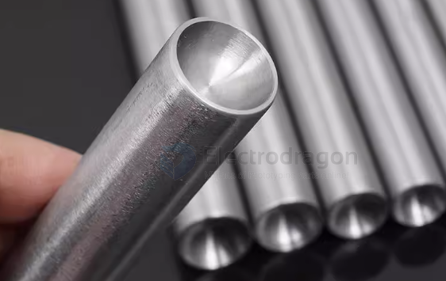

# Rivet-dat

- [[rivet-nut-dat]] - [[bracket-dat]] - [[rivet-dat]]

- [[fab-joining-dat]] - [[rivet-dat]] - [[fab-product-dat]]

- [[mechanical-structure-dat]]

## Connecting Round Tubes Perpendicularly Using Rivets

**Yes, it is absolutely possible!** However, because round tubes have curved surfaces, trying to rivet them directly face-to-face will result in an unstable joint that wobbles, and the rivets will easily loosen over time. 

To create a rock-solid, professional-grade perpendicular joint using rivets, you should use one of the following three proven engineering methods:

---

#### Method 1: The Internal T-Connector Method (Highly Recommended)

This is the most common method used in commercial products like outdoor tents, display racks, and lightweight aluminum frames. It is highly structural and aesthetically clean.

* **How to do it:**
    1.  Obtain an **internal T-connector** (made of nylon, plastic, or aluminum) that matches the inner diameter (ID) of your tubes.
    2.  Insert the connector into the ends of the tubes to join them perpendicularly.
    3.  Drill pilot holes through the outer tube wall and into the connector.
    4.  Insert and pop-rivet them together.
* **Pros:** The rivet clamps against a solid internal insert, preventing the thin-walled tube from crushing. Highly stable and visually seamless.

---

#### Method 2: Coped Joint (Fishmouth Cut) + Saddle Washer Method

If you want the two metal tubes to touch directly without using internal plastic or nylon fittings, you must contour the intersecting tube.

当你把垂直管切出鱼嘴口并贴在横管上时，垂直管的末端会形成两个“耳朵”（即贴合在横管外侧的弧形管壁）。

* **How to do it:**
    1.  **Cut a "Fishmouth" (Coping):** Profile the end of the perpendicular tube into a curved, concave shape (called a fishmouth or coped cut) so it perfectly cradles the radius of the receiving tube.
    2.  **Use a Saddle Washer:** Since a standard flat rivet head cannot sit flush on a curved tube, you must place a curved **saddle washer** (also known as an arc washer) over the hole.
    3.  **Rivet:** Use a blind pop rivet to fasten through the saddle washer, the first tube, and into the wall of the second tube.
* **Pros:** Pure metal-to-metal contact with no external plastic parts.
* **Cons:** Cutting a perfect fishmouth joint requires a tubing notched/coper tool, or careful grinding by hand.

---

#### Method 3: The External Split-Clamp Method (Best for Heavy-Duty)

This method relies on an external metal clamp or bracket to wrap around the intersection, which is then riveted in place.

* **How to do it:**
    1.  Get a **two-piece perpendicular pipe clamp** (also called a split-tee clamp or saddle bracket).
    2.  Clamp the bracket halves around the T-junction of the two pipes.
    3.  Drill through the pre-made holes on the bracket straight into the pipe walls, then secure them with heavy-duty pop rivets.
* **Pros:** Excellent load-bearing capacity; zero tube-cutting or profiling required.
* **Cons:** Bulky and industrially rugged appearance; not suitable for sleek or compact designs.

---

### 💡 Pro Tips & Common Pitfalls

1.  **Never Use Flat Washers on Curvatures:** Attempting to flatten a standard washer over a round tube with a rivet gun will simply crush and dent thin-walled tubing, making the joint loose and weak.
2.  **Always Use Pop (Blind) Rivets:** Since you cannot access the inside of the tubes to hold a bucking bar or a nut, **blind pop rivets** are mandatory because they expand and lock from the outside.
3.  **Mind the Tube Wall Thickness:** If your tube wall is very thin (under $1.5 \text{ mm}$), rivets can easily tear out under stress. In these cases, **Method 1 (Internal T-Connector)** is highly recommended to distribute the load.

## Spacer / Washer + Pin or Rivet
- Place a **metal or plastic washer** between parts.
- Insert a solid or semi-tubular rivet/pin through the washer.
- Rivet clamps only the washer, leaving a **free gap for rotation**.
- Works with many rivet types and is very precise.

## cap rivet 

- Also called a **decorative rivet**, commonly used in leather, fabric, or light metal decoration.
- Once installed, the head and shaft clamp the materials tightly.
- **Does NOT allow rotation** and is not suitable as a spacer by itself.
- For **decorative** or permanent fastening**, not mechanical rotation.

## info 

A **rivet** is a type of permanent mechanical fastener used to join two or more pieces of material together, such as metal, plastic, or leather.

### How a Rivet Works
1. A hole is drilled through the materials.
2. The rivet is inserted into the hole.
3. The tail end of the rivet is deformed (flattened or expanded).
4. This creates two “heads” that clamp the materials tightly together.

Once installed, a rivet **cannot be removed without destroying it**, making it a strong and reliable connection.

---

### Basic Structure
- **Head**: The factory-made top of the rivet.
- **Shank**: The cylindrical body that goes through the hole.
- **Tail**: The end that gets deformed during installation.

---

### Common Types of Rivets
- **Solid Rivet**: Strongest type, used in aircraft and heavy machinery.
- **Blind Rivet (Pop Rivet)**: Installed with a rivet gun, used when only one side is accessible.
- **Hollow Rivet**: Used for leather, fabric, or light materials.
- **Semi-Tubular Rivet**: Used for rotating joints; the tail is partially hollow.

---

### Why Rivets Are Used
- Strong and vibration-resistant
- Simple and low-cost
- Good for thin sheets and layered materials
- Do not loosen like screws can

---

### Simple Explanation
A rivet is **a metal pin that you put through a hole and squash the end to lock two parts together**.

## Can a Rivet Joint Keep a Gap and Allow Rotation?

Yes, a rivet joint **can** keep a controlled gap and allow rotation — but only if you use the correct method. A normal rivet creates a tight, permanent joint that cannot rotate. Here are the practical solutions:

---

### ✅ Method 1: Loose Riveting (Hinge-Style Rivet Joint)
Do not fully squeeze the rivet tail. Leave a small clearance so the two plates are not clamped tightly.

**Effect:**
- The plates stay aligned by the rivet shaft.
- A small gap remains.
- The plates can rotate around the rivet.

**Cons:**
- Gap is hard to control precisely.

- Rotation may not be very smooth.

---

### ✅ Method 2: Add a Washer or Spacer
Place **washers** or a **spacer** between the two plates, then rivet through them.

**Effect:**
- The gap is controlled by the washer/spacer thickness.
- The rivet clamps the spacer, not the plates.
- The joint rotates smoothly and reliably.

👉 This is the **recommended** method for precise rotation.

## ref 