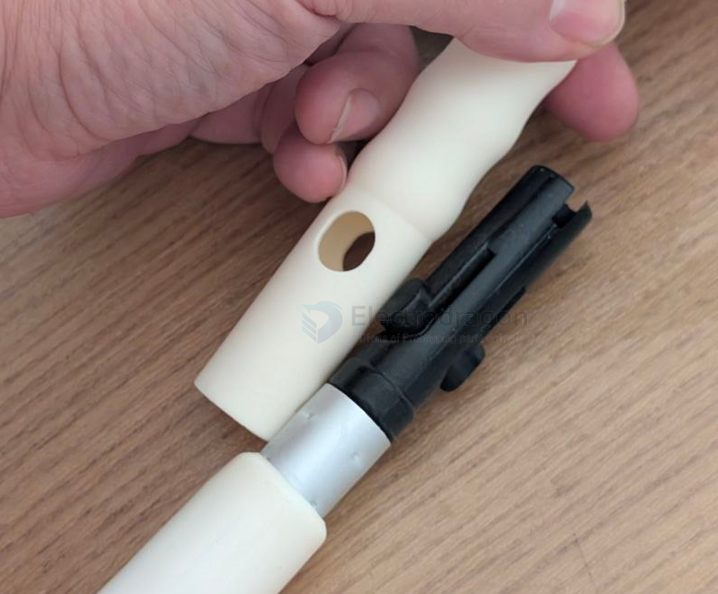

# shaft-connection-dat

- [[Shaft-Cross-Connector-dat]] - [[shaft-coupler-dat]]

- [[shaft-dat]]

## connection methods 

- [[screw-dat]]

- [[thread-dat]]

- [[rivet-dat]] - [[screw-dat]]

### 方案 3：钎焊 / 焊接（非烙铁）

铝钎焊（>500°C）

激光焊 / TIG（专业设备）

⚠️ 这是完全不同工艺，非 DIY 范畴

### large tube hold small shaft 

三、可行的解决方案
方案 1：开槽 + 喉箍（薄壁首选）

薄壁 1.5 mm 攻丝不可靠

改用喉箍或外夹方式

可加 2 条喉箍提高稳定性

### round-ball locking system 

methods 

## enforce the shaft connection

### 1. The "D-Flat" Method (Best Performance)
If your motor shaft is perfectly round, the set screw has no mechanical advantage. You need to create a flat surface for the screw to sit on.

* **Action:** Use a metal file or a rotary tool (Dremel) to grind a small, flat section onto the motor shaft where the set screw contacts it.
* **Why it works:** The screw now acts as a physical "stop" rather than just relying on friction. Even if the screw loosens slightly, the shaft cannot rotate past the flat wall.

### 2. Chemical and Mechanical Tweaks
If you cannot grind the shaft, try these tactical fixes:

* **Threadlocker (Blue Loctite 242):** Vibrations from the motor often back out the small hex screws. Apply a drop of **Blue Loctite** to the threads. It stays secure during operation but can still be removed with a hand wrench.
* **Dimpling:** Instead of a full flat side, use a drill bit to make a very shallow "crater" or dimple in the shaft. The tip of the set screw will nest inside this hole.
* **Double Screws:** If your coupler has space, try to use two set screws at **90 degrees** to each other. One hits the flat side, the other provides lateral tension.

### 3. Hardware Upgrades
For high-torque projects like your **Rover V2**, the entry-level hardware might be the bottleneck. Consider upgrading to these types:

| Coupler Type                | Why it solves the problem                                                                                                                         |
| :-------------------------- | :------------------------------------------------------------------------------------------------------------------------------------------------ |
| **Clamping Coupler**        | Instead of a screw "poking" the shaft, the entire coupler body "squeezes" the shaft 360°. This offers massive surface area and zero shaft damage. |
| **Flexible/Spider Coupler** | Includes a rubber "spider" insert. It grips better and absorbs the vibrations that usually shake set screws loose.                                |
| **Keyway Coupler**          | Uses a square metal "key" that fits into slots on both the shaft and coupler. This is the industrial standard for zero-slip power transfer.       |

### 4. Check Axial Alignment
If the motor shaft and the load shaft are not perfectly centered, the coupler has to "bend" slightly with every rotation. This creates a pulsing force that effectively unscrews your hex bolts over time.

* **Quick Test:** Spin the motor slowly. If you see the coupler "wobbling" or the motor vibrating on its mount, you need to realign the brackets or switch to a **Universal Joint (U-Joint)**.

## ref 

- [[shaft-dat]]