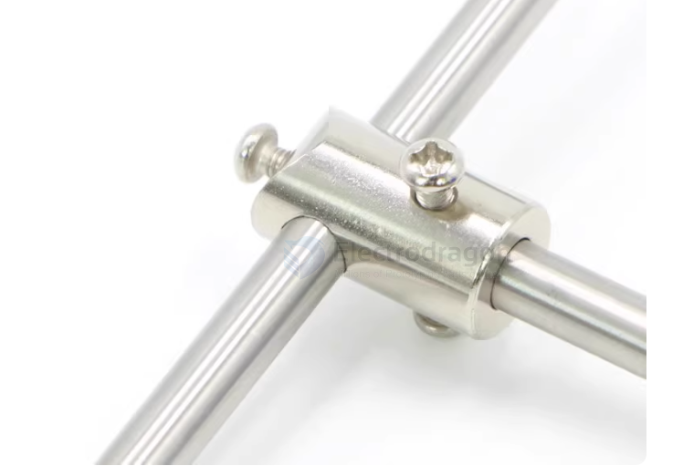
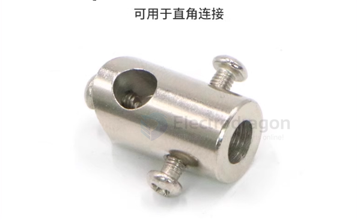

# shaft-coupler-dat

## L type coupler 

## Shaft Coupler  

A **shaft coupler** is a mechanical component used to **connect two rotating shafts**. It primarily functions to transmit torque while allowing for slight axial, radial, or angular misalignments.  

---

### Types of Shaft Couplers  

#### 1. Rigid Coupler  
- **Features**: No elasticity, provides a solid connection, requires precise shaft alignment.  
- **Applications**: High-precision CNC machines, industrial machinery.  

#### 2. Flexible Coupler  
- **Features**: Can absorb slight misalignment, reduce vibration, and minimize impact.  
- **Common Types**:  
  - **Jaw Coupling** – Uses an elastomer insert to absorb vibrations; suitable for stepper and servo motors.  
  - **Bellows Coupling** – High torque transmission capability, ideal for precision applications.  
  - **Disc Coupling** – Used in high-speed and high-precision applications, such as robotics and aerospace.  

#### 3. Universal Joint (U-Joint)  
- **Features**: Allows for larger angular misalignment, commonly used for shafts that are not in perfect alignment.  
- **Applications**: Automotive drivetrains, heavy machinery.  

#### 4. Oldham Coupling  
- **Features**: Compensates for significant radial misalignment, commonly used in automation and 3D printing.  

---

### Key Functions of Shaft Couplers  
✅ **Torque Transmission** – Connects the motor to the driven shaft for power transfer.  
✅ **Misalignment Compensation** – Allows slight shaft misalignment, reducing stress.  
✅ **Vibration & Shock Absorption** – Helps dampen vibrations and protect mechanical components.  
✅ **Equipment Protection** – Some couplers act as safety devices in case of overload.  

## Why Diaphragm Couplers (Disk Couplers) Are Superior

Yes, a **Diaphragm Coupler** (also known as a **Disk Coupler**) offers significantly better gripping power than a standard set-screw coupler. For a high-torque project like your **Rover V2**, this is a professional-grade upgrade.

---

### 1. Clamping vs. Poking (The Grip Factor)
The primary reason it works better is the **fixing method**:
* **Your Current Coupler:** Uses a "Set Screw" that pokes a single point. On an aluminum tube, this just dents the metal and slips.
* **Diaphragm Coupler:** Most use a **Clamping Design**. When you tighten the side bolt, the entire inner circumference of the coupler shrinks to "hug" the shaft 360°.
* **Result:** The friction is distributed over the entire surface area of the shaft, making slippage nearly impossible.

### 2. Eliminating Backlash (Precision)
In robotics, you often have frequent "Start-Stop-Reverse" movements.
* **The Problem:** Set screws eventually wiggle and create "play" (backlash). Every time the motor reverses, the screw slams against the side of its hole, widening it.
* **The Solution:** Diaphragm couplers are **Zero-Backlash**. The torque is transmitted through thin stainless steel springs (the disks). There are no moving parts to "clatter," which keeps the connection tight forever.

### 3. Comparison Table: Why Upgrade?

| Feature | Entry-Level (Set Screw) | **Diaphragm (Clamping)** |
| :--- | :--- | :--- |
| **Grip Strength** | Low (Point contact) | **High (Surface contact)** |
| **Shaft Damage** | Heavy (Scratches/Dents) | **Zero (Safe for Alu tubes)** |
| **Misalignment** | Rigid (Causes vibration) | **Flexible (Absorbs offset)** |
| **Longevity** | Low (Screws loosen) | **High (All-metal durability)** |

## ref 

- [[shaft-dat]] - [[shaft-coupler]] - [[shaft]]