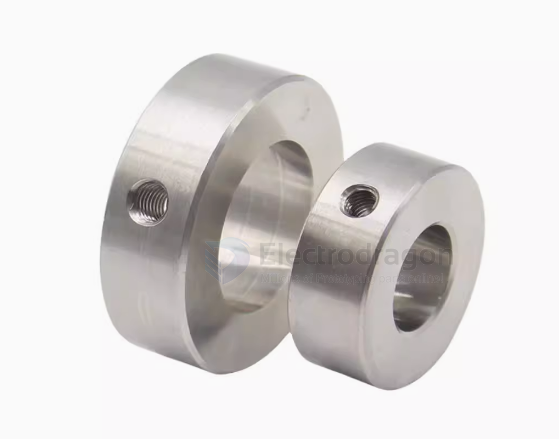
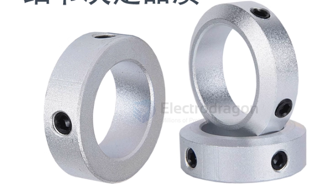

# shaft-limit-ring-dat

- [[shaft-dat]] - [[shaft-limit-ring-dat]] - [[hose-clamp-dat]]

limiter / position locker 

ID == 6 / OD == 12 / Thickness == 6

## sizes specs 

❗️规格：内径 ID - 外径 OD - 厚度 Thickness

- Φ3 - 7 - 6（5套）
- Φ3 - 7 - 8（5套）
- Φ4 - 8 - 6（5套）
- Φ4 - 8 - 8（5套）
- Φ5 - 11 - 6（5套）
- Φ5 - 11 - 8（5套）

- Φ6 - 12 - 6（5套）
- Φ6 - 12 - 8（5套）

- Φ8 - 14 - 6（5套）
- Φ8 - 14 - 8（5套）
- Φ10 - 16 - 6（3套）
- Φ10 - 16 - 8（3套）
- Φ12 - 20 - 6（3套）
- Φ12 - 20 - 8（3套）
- Φ13 - 22 - 8（3套）
- Φ14 - 21 - 8（3套）
- Φ15 - 24 - 10（3套）
- Φ16 - 26 - 10（3套）
- Φ17 - 32 - 10（2套）
- Φ18 - 32 - 10（2套）
- Φ20 - 32 - 10（2套）
- Φ20 - 32 - 12（2套）
- Φ22 - 35 - 10（2套）
- Φ25 - 38 - 12（2套）
- Φ30 - 46 - 15（1套）
- Φ32 - 46 - 15（1套）
- Φ35 - 50 - 15（1套）
- Φ40 - 60 - 20（1套）
- Φ45 - 60 - 20（1套）
- Φ50 - 70 - 22（1套）

## ref 

- [[screw-dat]]