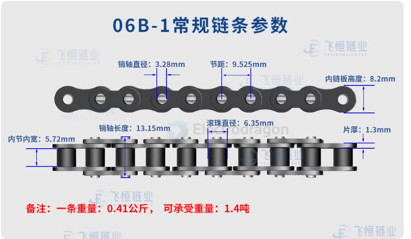
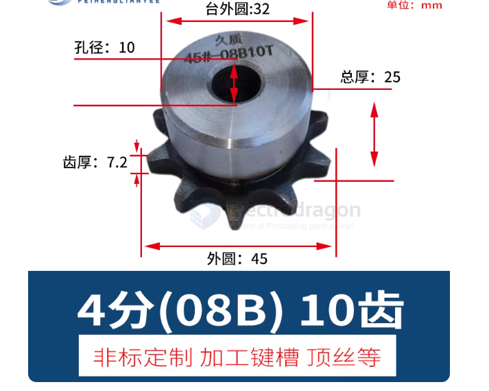

# chain-dat

## chain gear Sprocket

## chain types

| Chain / Model                    | Pitch (in) | Pitch (mm) | Internal Width (W) | Avg. Tensile Strength | Typical / Best Use Case                         |
| :------------------------------- | :--------- | :--------- | :----------------: | :-------------------: | :---------------------------------------------- |
| **Bicycle Standard (410 / 415)** | 1/2"       | 12.70      |         —          |           —           | Standard bicycles, most electric bike motors    |
| **#25 (1/4")**                   | 1/4"       | 6.35       |      3.18 mm       |       ~4,000 N        | Small, high-speed motors; miniature robotics    |
| **T8F (8 mm)**                   | —          | 8.00       |      4.80 mm       |       ~6,000 N        | Heavy-duty scooters; higher-torque small drives |
| **#35 (3/8")**                   | 3/8"       | 9.525      |      4.77 mm       |       ~9,500 N        | Go-karts, high-power motors, heavy-load DIY     |

Notes:
- Pitch is the most critical parameter — chain and sprocket must share the same pitch to mesh correctly.
- Inner width (W) and tooth thickness must match or be compatible with the sprocket.

## 1/2" Circular Pitch (CP) / #40 Sprockets

If the gear is designed for a 1/2" spacing (common in ANSI #40 roller chains or 1/2" CP spur gears), the following tooth counts are industry standards:

| Category                 | Common Tooth Counts ($N$)      |
| :----------------------- | :----------------------------- |
| **Small (Drive/Pinion)** | 9, 10, 11, 12, 13, 14, 15      |
| **Medium (Idler)**       | 16, 17, 18, 19, 20, 24, 25     |
| **Large (Driven)**       | 30, 32, 35, 40, 48, 54, 60, 72 |

## main specs 

- 06B 
- 08B 

## specs 

### 1. Chain — Main Parameters

| Parameter                     | Description                                             | Unit / Example           |
| ----------------------------- | ------------------------------------------------------- | ------------------------ |
| Pitch (p)                     | Distance between adjacent roller centers                | mm (e.g., 12.7, 15.875)  |
| Roller Diameter (d₁)          | Roller outer diameter                                   | mm                       |
| Inner Width (b₁)              | Inner width between chain plates (sprocket tooth fit)   | mm                       |
| Chain Length                  | Total number of links × pitch                           | mm                       |
| Plate Thickness               | Determines load capacity                                | mm                       |
| Tensile Strength / Rated Load | Maximum allowable tension the chain can carry           | N or kN                  |
| Type / Series                 | Standard or series (ANSI, ISO, DIN, light/medium/heavy) | e.g., ANSI 40, DIN 08B-1 |

> ⚠️ Pitch is the most critical parameter. The chain and sprocket must have the same pitch to mesh correctly.

### 2. Sprocket — Main Parameters

| Parameter                         | Description                                   | Unit / Example                   |
| --------------------------------- | --------------------------------------------- | -------------------------------- |
| Number of Teeth (z)               | Sprocket tooth count; determines gear ratio   | 10–120 teeth                     |
| Pitch (p)                         | Must match the chain pitch                    | mm                               |
| Tooth Profile Standard            | Defines the tooth shape for proper engagement | ANSI, ISO, DIN                   |
| Outside Diameter (OD)             | Useful for layout and clearance calculations  | mm                               |
| Mounting Bore / Pin Hole Diameter | Sprocket mounting for shaft or bolts          | mm                               |
| Thickness / Tooth Width           | Must be compatible with chain inner width     | mm                               |
| Material / Strength               | Determines wear resistance and load capacity  | Steel, cast iron, aluminum alloy |

> ⚠️ Tooth count and sprocket diameter set the drive ratio but do not affect mesh compatibility as long as the pitch is the same.

### 3. Key Fit and Selection Points

- Pitch match: The chain pitch must match the sprocket pitch exactly.
- Inner width: Sprocket tooth width must be less than or equal to the chain inner width.
- Profile standard: Chain and sprocket standards (ANSI, ISO, etc.) must match to avoid poor engagement and premature wear.
- Minimum sprocket tooth count: Too few teeth increases bending fatigue on the chain; typically choose ≥ 12 teeth when possible.
- Mounting alignment: Shaft diameter, keyway, and bolt pattern must match the sprocket mounting method.

## chain modify 

To modify a chain for a bike, you need a specific tool called a **Chain Breaker**.

---

### 1. Opening the Chain

First, identify if your chain has a **Master Link** (a link that looks different and is designed to be removable).

#### Method A: With a Master Link
* **Action:** Use master link pliers (or needle-nose pliers) to squeeze the two pins together.
* **Result:** The side plates will slide and unlock, allowing the chain to pull apart.

#### Method B: Without a Master Link (Standard Link)
* **Action:** Place any link into the **Chain Breaker** tool.
* **Process:** 1. Align the tool's driving pin with the chain rivet (pin).
    2. Turn the handle to push the rivet out.
    3. **Important:** If you intend to reuse the pin, **do not push it all the way out**. Leave it hanging slightly on the outer plate.

---

### 2. Modifying the Length (Shortening)

To make the chain fit your specific motor-to-wheel distance:

1. **Measure:** Wrap the chain around your **Drive Wheel** (motor) and **Driven Wheel** (rear hub) to determine the required length.
2. **Determine the Cut Point:** * If using a **Master Link**: Both ends of the chain must be **Inner Links**.
    * If joining via a **Pin**: One end must be an **Inner Link** and the other an **Outer Link**.
3. **Remove Links:** Use the chain breaker to push the pins out completely on the excess section of the chain.

---

### 3. Reconnecting the Chain

1. **Threading:** Guide the chain through your frame and over the sprockets.
2. **Joining:**
    * **Using a Master Link:** Insert the two halves from opposite sides and pull the chain apart until you hear a "click."
    * **Using a Pin:** Use the chain breaker to push the pin back through the links until it is centered.
3. **Fixing Stiff Links:** If the connection point is stiff, gently bend the chain sideways at that joint to "set" the plates and ensure smooth rotation.

## ref 

- [[power-transmission-dat]]