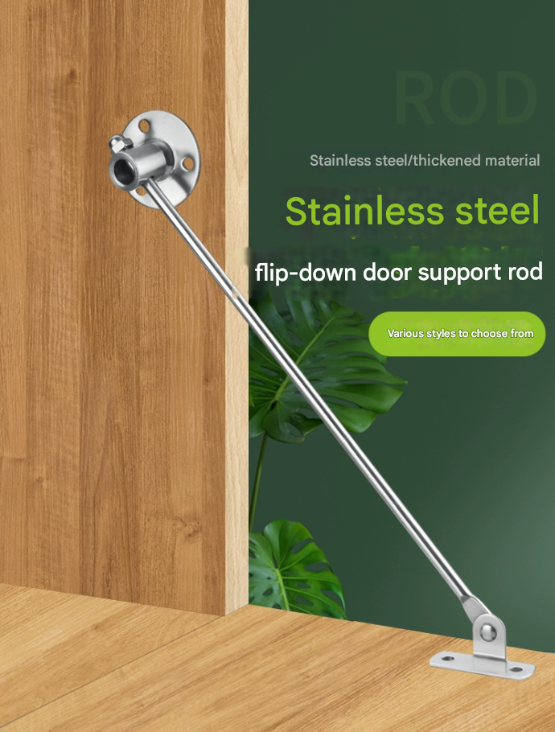
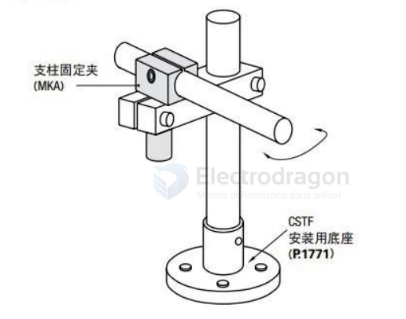
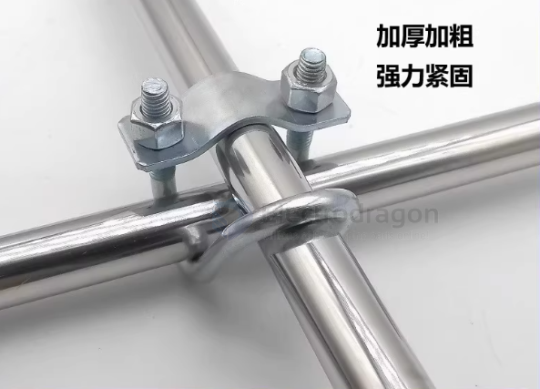
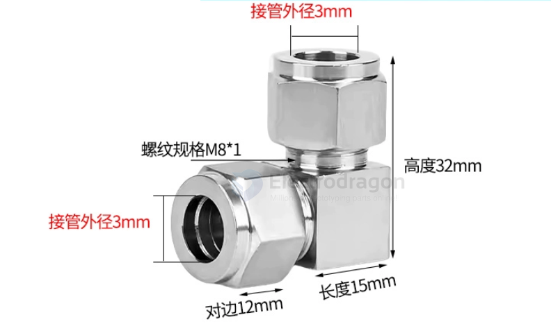

# rod-dat

- [[shaft-dat]] - [[tube-dat]] - [[rod-dat]] - [[lead-screw-dat]]

- [[shaft-dat]] 

- [[tube-PVC-dat]] 

- [[rod-carbon-dat]]

- [[rod-stainless-steel-solid-dat]]

- [[tube-stainless-steel-hollow-dat]]

- [[rod-system-dat]] 

- [[hinge-dat]] - [[rod-tie-dat]] - [[crank-dat]] - [[rod-dat]]

- [[shaft-coupling-dat]]

- [[steel-stainless-dat]] - [[rod-stainless-steel-solid-dat]] - [[metal-dat]]

- [[clamp-dat]]

rod hinge 

## info 

A **"Rod"** is a material shape (Geometry)

A rod is a raw, solid, cylindrical piece of material. It describes what it looks like, not what it does.

You can buy a "steel rod" from a hardware store.

That rod does nothing until you machine it or design it into a mechanism.

Analogy: A rod is like "lumber" (raw material).

A **"Shaft"** is a machine element (Function)

A shaft is a rotating machine component used to transmit power and torque from one part to another (like a motor shaft spinning a wheel). It describes what it does, not just what it looks like.

A shaft is highly engineered, often featuring specific keyways, steps, or splines to mount gears and bearings.

Analogy: A shaft is like a "table leg" (a finished product with a specific job).

## size 

- 3mm [[ABS-dat]] [[shaft-dat]] - weak 

- 3mm [[stainless-steel-solid-tube-dat]] - [[shaft-dat]] - ?

## common parts 

- [[shaft-limit-ring-dat]] - [[shaft-coupling-dat]]

- [[flange-dat]]

## compare 

| Feature | 3mm Solid Carbon Rod | 3mm Solid Stainless Steel Rod |
|---------|--------------------|-------------------------------|
| **Material** | Carbon fiber (reinforced with epoxy) | Stainless steel (commonly 304 or 316) |
| **Density / Weight** | ~1.6 g/cm³ (lightweight) | ~8.0 g/cm³ (heavy) |
| **Tensile Strength** | ~600–1000 MPa | ~500–700 MPa |
| **Flexural Strength / Stiffness** | Very high stiffness (high modulus) | Lower stiffness compared to carbon |
| **Impact / Shock Resistance** | Brittle, can snap under sudden impact | Tough, can bend under load without breaking |
| **Corrosion Resistance** | Excellent (does not rust) | Good (resists corrosion, but can rust in harsh environments) |
| **Weight-to-Strength Ratio** | Extremely high (very strong per gram) | Low (heavier for same strength) |
| **Practical Notes** | Ideal for **lightweight reinforcement**, RC aircraft spars, hobby robotics | Better for **impact-heavy or load-bearing metal parts**, mechanical shafts |

### Summary

- **Carbon rod** is **much lighter** and very stiff; for **bending stiffness** or lightweight structure, it is stronger per weight.  
- **Stainless steel rod** is **heavier but tougher**; it can withstand impact and bending better without snapping.  
- **Conclusion:**  
  - For **lightweight RC planes, drones, or aerospace applications** → **3mm carbon rod** is preferred.  
  - For **mechanical shafts or parts under heavy impact** → **3mm stainless steel rod** is safer.

## other 

cantilevel 

tube cross locker 

vertical tube connector == water pipe joint

## ref 

- [[mechanical-structure-dat]]

- [[mechanical-structure]] - [[mechanics]]

## ref 

- [[rod]]

- [[mechanics]]
