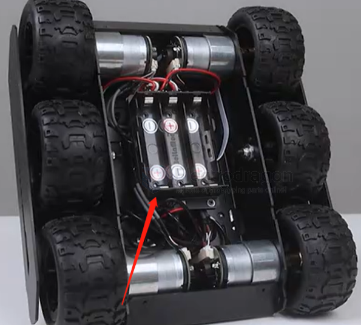
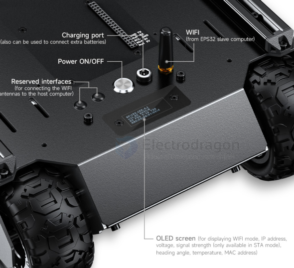

# chassis-6WD-dat

- [[chassis-6WD-dat]] - [[UGV-dat]] - [[chassis-dat]]

## design 

## off-road 

**Yes, for light-to-moderate outdoor terrain, but it has distinct physical limits.**

#### Advantages for Off-Road Use

* **6-Wheel Traction & Soft Tires:** High-grip rubber tires across six ground-contact points provide steady traction on loose dirt, gravel, and short grass.
* **Skid-Steering Agility:** Zero-radius turning allows the chassis to maneuver out of tight spots between rocks or vegetation without needing wide turning space.
* **Rigid Chassis Construction:** Built with 2mm thick 5052 aluminum alloy, offering high resistance to outdoor impacts, vibrations, and rough handling.
* **Closed-Loop Motor Control:** Encoder-equipped motors with PID control ensure consistent torque distribution across all wheels when climbing slight inclines or navigating uneven soil.

#### Limitations to Keep in Mind

* **Ground Clearance (~25mm / 1 inch):** The low belly clearance means it can get high-centered over large rocks, roots, or tall grass.
* **Lack of Articulated Suspension:** It relies on rigid/shock-absorbing mounts rather than a full rocker-bogie mechanism, limiting its ability to scale vertical steps larger than its wheel radius (~40mm).
* **Ingress Protection (Not Waterproof/Dustproof):** Exposed ports, motor mounts, and chassis seams are susceptible to fine sand, mud, and water damage without custom weatherproofing.

## ref 

