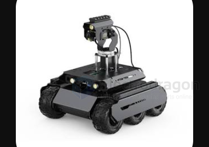

# chassis-dat.md

- [[sheet-dat]] - [[cad-dat]]

- [[suspension-dat]] - [[suspension]]

- [[wheel-dat]]

- [[motor-dat]] - [[motor-driver-dat]]

- [[tank-track-dat]] - [[chassis-dat]] - [[motion-control-dat]] - [[UAV-dat]] - [[UGV-dat]] - [[USV-dat]]

- [[differential-steering-dat]] - [[motion-control-dat]]

- [[Curiosity-rover-dat]] - [[chassis-dat]]

- [[chassis-6WD-dat]] - [[UGV-dat]]

## comparision of 6WD 

A six-wheel-drive (6WD) autonomous vehicle with three wheels on each side is a classic chassis design widely used in mobile robotics and specialized unmanned ground vehicles (UGVs).

---

Here are the key special features and characteristics of this setup:

### 1. Steering & Maneuverability

* **Skid Steering (Differential Steering):** Most 6WD UGVs do not use traditional steering gear or linkages. Instead, they turn by varying the speeds of the left and right wheel sets independently.
* **Zero-Turning Radius:** By rotating the left wheels forward and the right wheels in reverse, the vehicle can rotate 360 degrees on the spot, making it ideal for tight spaces and rough off-road terrain.

### 2. Terrain Adaptability & Traction

- [[Curiosity-rover-dat]] - [[chassis-dat]]

* **High Traction & Low Ground Pressure:** Having six driven wheels increases total ground contact area, distributing weight more evenly. This helps prevent the vehicle from getting stuck in mud, sand, or snow.
* **Superior Obstacle Clearance:** When paired with articulated or rocker-bogie suspension systems (similar to Mars rovers), the middle wheels act as pivot points, enabling the vehicle to easily climb steps, scale rocks, or cross trenches.

### 3. Redundancy & Mechanical Reliability
* **Fault Tolerance:** If one or two motors or wheels fail, the remaining active wheels can usually still provide enough traction for the vehicle to continue moving or self-rescue.
* **Durable & Simple Mechanics:** Eliminating complex steering knuckles, tie rods, and mechanical differentials simplifies the drive system and improves impact resistance.

---

### Comparison Matrix

| Feature | 6WD Skid-Steer UGV | 4WD Ackerman UGV | Tracked UGV |
|---|---|---|---|
| **In-Place Turning** | Yes (Zero-radius) | No | Yes |
| **Mechanical Complexity** | Low (Motor-controlled) | Medium (Steering linkages) | Medium to High |
| **Off-Road / Obstacles** | High | Moderate | Very High |
| **Paved Road Efficiency** | Moderate (Tire drag in turns) | High | Low |

## ref 