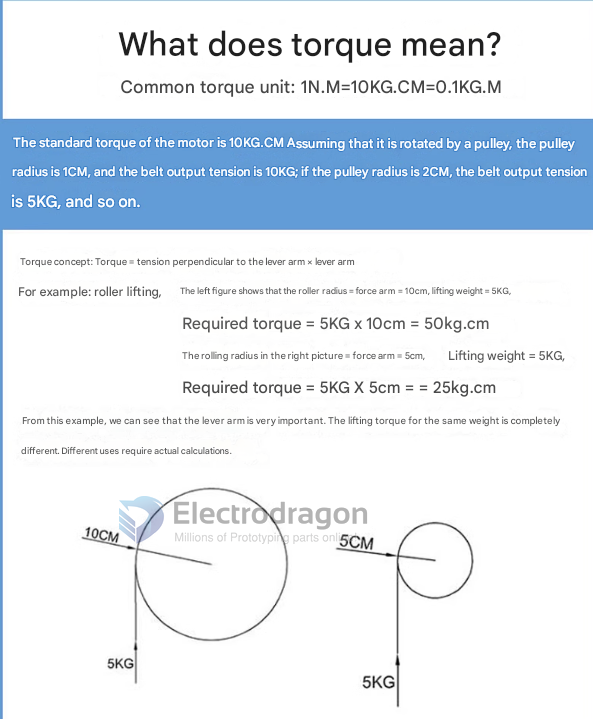
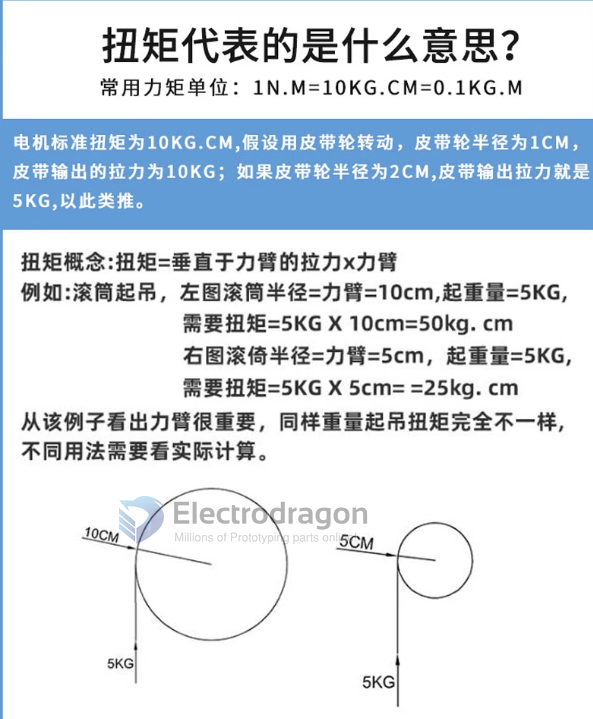

# torque-dat

## 0.35Nm vs 1200-1800 g·cm

$1200\text{--}1800$ $g\cdot cm$ becomes $1.2\text{--}1.8$ $kg\cdot cm$.

1200–1800 g⋅cm becomes  1.2–1.8 kg⋅cm.

- $1.2$ $kg\cdot cm \times 0.09807 \approx \mathbf{0.118}$ $N\cdot m$
- $1.8$ $kg\cdot cm \times 0.09807 \approx \mathbf{0.176}$ $N\cdot m$

## N·m and kg·cm

note the rated torque of a motor is the maximum torque that the motor can deliver at its rated speed.

and stall torque is the maximum torque that the motor can deliver at zero speed.

N·m and kg·cm (kgf·cm) are both used to express torque, but they come from different unit systems.

What they mean

N·m (Newton·meter)

SI (metric) standard unit

Based on force in newtons

kg·cm (kgf·cm)

Engineering / motor specs unit

Based on kilogram-force, not mass

1 kgf = force exerted by 1 kg under Earth gravity

Which one to use?

Engineering / physics / calculations → N·m

RC motors, servos, hobby electronics → kg·cm

    Torque (N·m)     Torque (kg·cm)
    --------------------------------
    0.1             ≈ 1.02
    0.5             ≈ 5.10
    1.0             ≈ 10.20
    2.0             ≈ 20.39
    5.0             ≈ 50.99
    10.0            ≈ 101.97

## what is torque 

# Torque Comparison: 45T Brushed Motor vs MG540 Brushed Motor

| Spec            | 45T Brushed Motor       | MG540 Brushed Gear Motor    |
| --------------- | ----------------------- | --------------------------- |
| Motor Size      | 540-class  ??           | 540-class    ??             |
| Turns           | 45T                     | Unknown (not T-rated)       |
| Torque          | ~400 g·cm               | 2.6 kgf·cm                  |
| Torque (kgf·cm) | ~0.4 kgf·cm             | 2.6 kgf·cm                  |
| Torque (N·m)    | ~0.0392 N·m             | ~0.255 N·m                  |
| Speed (RPM)     | ~9,000–11,000 RPM       | Likely lower                |
| Use Case        | RC crawler, trail drive | High-torque RC drive        |
| Notes           | High control, low speed | High torque, moderate speed |

## Torque 

Meaning:

Torque = Force × Distance from the axis of rotation

10 N·m means a force of 10 Newtons is applied 1 meter away from the pivot point (or 5 N applied 2 meters away, etc.).

## Newtons 

🧱 Real-World Examples of 10 N:

Lifting about 1 kg vertically against Earth's gravity.

Gravity exerts about 9.8 N of force on a 1 kg object.

So if you lift a 1-liter bottle of water (which weighs about 1 kg), you're applying roughly 10 N of force.

## 🔄 What is 100 kgf·cm?

kgf = kilogram-force

This is the force exerted by 1 kg of mass due to gravity (≈ 9.80665 newtons).

cm = centimeters, the distance from the axis of rotation.

So 100 kgf·cm means:

The torque generated by **a 100 kgf force acting 1 cm away from the axis**, or a 1 kgf force acting 100 cm away, and so on.

## compare 100 kgf·cm and 10 N·m

#### 🔁 Conversion
- 100 centimeters (cm) is equal to 1 meter (m).
- 1 kgf·cm = 0.0980665 N·m
- 100 kgf·cm = 100 × 0.0980665 = **9.80665 N·m**

#### ✅ Comparison Table

| Unit         | Value in N·m        |
|--------------|---------------------|
| 100 kgf·cm   | ≈ 9.81 N·m           |
| 10 N·m       | 10.00 N·m            |

#### 📌 Conclusion
- **100 kgf·cm ≈ 9.81 N·m**, slightly less than **10 N·m**
- Difference: **~0.19%**
- For practical purposes: **Nearly equal**

## ref 

- [[motor-dat]]