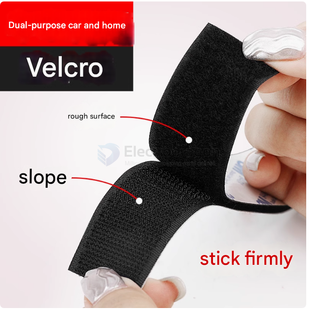
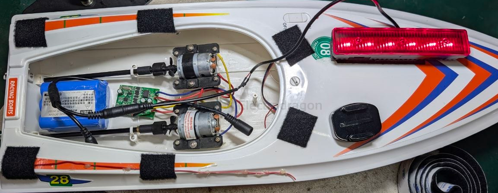
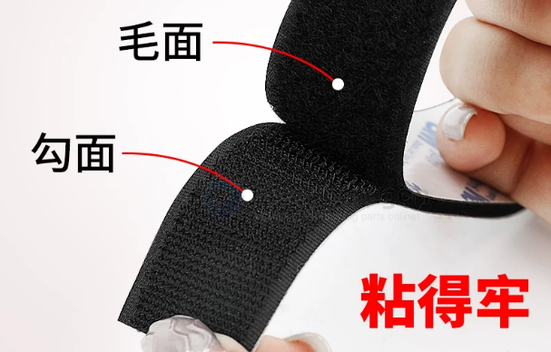

# velcro-dat

- quickly snap or remove 

## build 

fix a [[rc-boat]] which does not have the top lad with [[velcro-dat]]

## two sides structure 

## specs 

### white 

白色3cm宽 3米毛

白色3cm宽 3米勾

白色1.6cm宽 3米毛+3米勾

白色2cm宽 3米毛+3米勾

白色2.5cm宽 3米毛+3米勾

白色3cm宽 3米毛+3米勾

白色3.8cm宽 3米毛+3米勾

【白色5cm宽】3米毛+3米勾

【白色11cm宽】3米毛+3米勾

白色2cm宽*15cm长【10片毛+10片勾】

白色2.5cm宽*15cm长【10片毛+10片勾】

白色3cm宽*15cm长【10片毛+10片勾】

白色3.8cm宽*15cm长【10片毛+10片勾】

白色5cm宽*15cm长【10片毛+10片勾】

白色11cm宽*15cm长【5片毛+5片勾】

白色11cm宽*15厘米长【10片毛+10片勾】

## black 

黑色3cm宽 3米勾

黑色3cm宽 3米毛

黑色2cm宽*15cm长 5片毛+5片勾

黑色2cm宽 3米毛+3米勾

黑色2.5cm宽 3米毛+3米勾

黑色3cm宽 3米毛+3米勾

黑色3.8cm宽 3米毛+3米勾

黑色5cm宽 3米毛+3米勾

黑色11cm宽 3米毛+3米勾

【黑色1.6cm宽】3米毛+3米勾

黑色11cm宽*15cm长【5片毛+5片勾】

黑色11cm宽*15cm长【10片毛+10片勾】

黑色2cm宽*15cm长【10片毛+10片勾】

黑色2.5cm宽*15cm长【10片毛+10片勾】

黑色3cm宽*15cm长【10片毛+10片勾】

黑色3.8cm宽*15cm长【10片毛+10片勾】

黑色5cm宽*15cm长【10片毛+10片勾】

## pre-cut 

1.6cm*15cm【10片毛+10片勾】

## ref 

- [[velcro]]