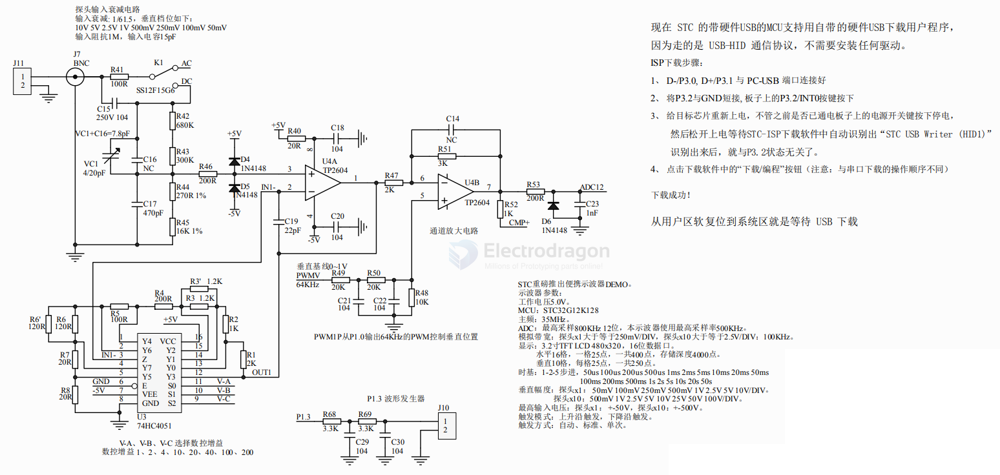
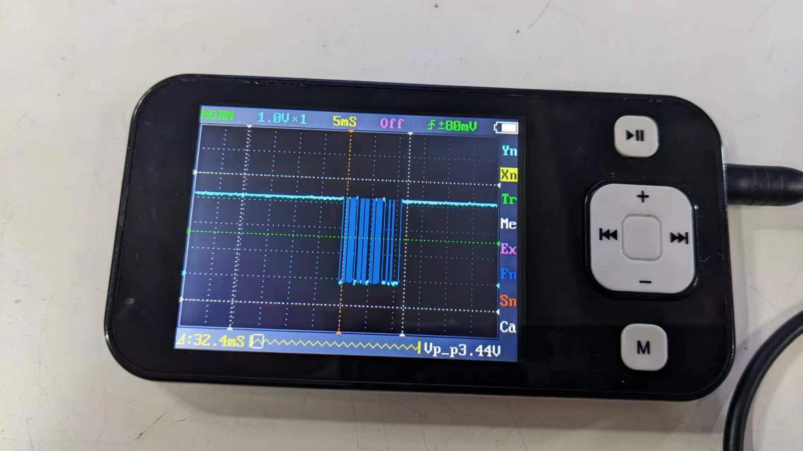
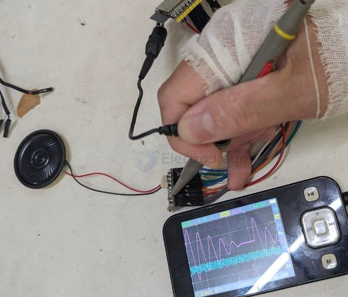
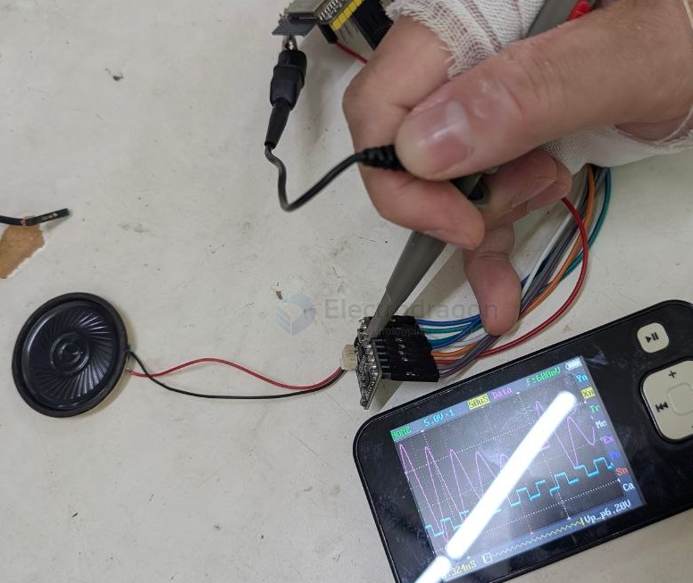
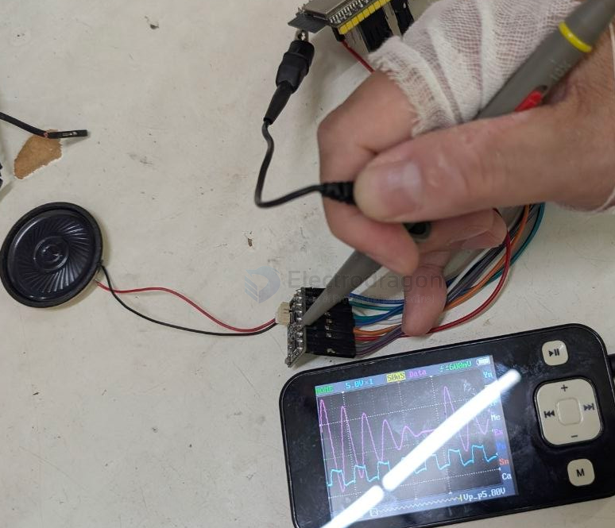

# Oscilloscope-dat

An oscilloscope (informally called an `O-scope` or scope) is an electronic test instrument that graphically displays varying electrical voltages as a function of time. It essentially acts as a high-speed visual graphing tool for signals, allowing you to measure properties like amplitude, frequency, rise time, and distortion.

- [[Oscilloscope-dat]] - [[fab-tools-electronic-dat]]

- [[voltage-dat]] - [[voltage-reference-dat]]

- [[signal-dat]] - [[wave-dat]]

## target 

- [[Oscilloscope-dat]] - [[voltage-divider-dat]] - [[sensor-microphone-dat]]

## S2026-02-12-15-13-29.png

- [[STC-dat]]

## ref 

- [[instrument-dat]] - [[oscilloscope-dat]] - [[multimeter-dat]] - [[tools-dat]] - [[fab-workspace-dat]]

# oscilloscope-dat

## build 

- [[DSO201-dat]]

arduino oscilloscope
https://dbuezas.github.io/arduino-web-oscilloscope/

wave of UARTS Data

- 196678365

## spectrum analyzer 

[Spectrum Analyzer](https://academo.org/demos/virtual-oscilloscope/)

## Selection 

$299 12bit == https://youtu.be/3hyp0-0ns9U?t=680

## test demo 

normal mode - 5V - 50uS 

- [[ES8311-dat]] - [[oscilloscope-dat]]

pin MCLK

pin LRCK 

pin SCLK 

## ref 

- [[fab-tools-dat]]