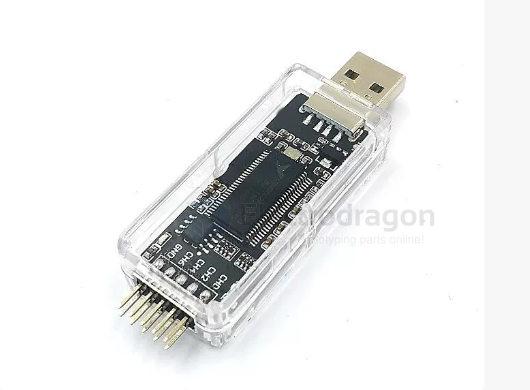

# logic-analyzer-dat

- nanoDLA

- [[logic-analyzer-dat]] - [[signal-digital-dat]] - [[signal-analog-dat]] - [[digital-dat]] - [[signal-dat]]

- [[fab-tools-dat]] - [[logic-analyzer-dat]] - [[fab-tools-electronic-dat]] - [[oscilloscope-dat]] - [[meter-dat]] - [[interface-dat]]

- [[cypress-dat]] - [[Infineon-dat]] - [[pins003-dat]] - [[MCU-dat]]

- [[app-dat]] - [[logic-analyzer-dat]] - [[USB-blaster-dat]] - [[data-acquisition-board-dat]] - [[PINS003-dat]]

You typically cannot connect a logic analyzer to raw RF data because:

- It’s analog high-frequency RF, not logic-level digital signals
- Logic analyzers work at MHz range, not GHz
- The data from the antenna to the chip is demodulated inside the chip, not accessible externally

## DSLogic Plus

- [[bq27541-dat]]

