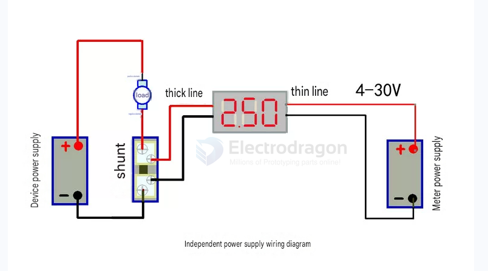
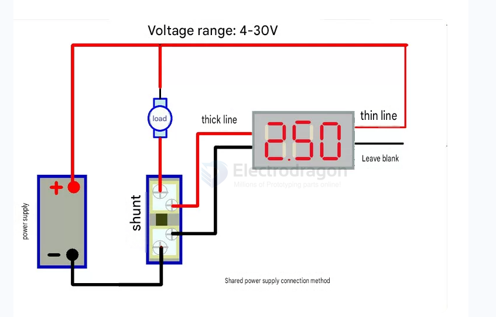
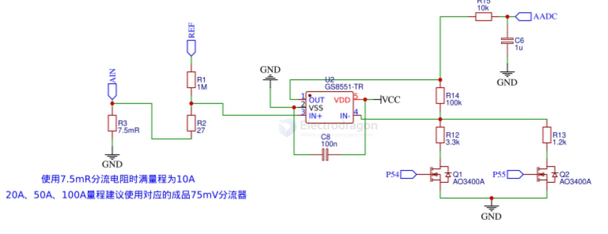

# meter-current-dat.md

use [[meter-voltage-current-dat]] instead of [[meter-current-dat]] only 

- [[meter-dat]]  - [[multimeter-dat]]

== memter am 

== ammeter == ampere meter == current meter

- [[sensor-voltage-dat]] - [[meter-voltage-dat]] - [[SVC1049-dat]] - [[SVC1017-dat]] 

- [[sensor-current-dat]] - [[meter-current-dat]] - [[SVC1022-dat]] - [[SVC1023-dat]] 

## board 

- [[meter-voltage-dat]] - [[SVC1019-dat]] - [[SVC1049-dat]] - [[SVC1017-dat]] - [[SVC1015-dat]]

- [[meter-current-dat]] - 10A [[SVC1022-dat]] - 50A [[SVC1023-dat]] - 100A [[SVC1024-dat]]

- [[SVC1000-dat]] - [[SVC1002-dat]] - [[SVC1004-dat]] - [[ACS712-dat]]

## wiring 

seperated power 

Shared power 

## selection 

- [[ADC-dat]] - [[ACS712-dat]]

When measuring current in embedded electronics and microcontrollers, you generally choose between a dedicated **isolated Hall-effect sensor (like the ACS712)** and a **shunt resistor paired with an Analog-to-Digital Converter (ADC)**. 

Here is a breakdown of why you would choose the ACS712 over a standard ADC-based shunt measurement setup.

---

## 1. Electrical Isolation (The Biggest Advantage)
* **ACS712:** It uses a Hall-effect sensor, meaning the high-current path being measured is **physically and electrically isolated** from the low-voltage microcontroller side (up to 2.1 kV RMS isolation). If your high-voltage side spikes or shorts, your microcontroller remains completely safe.
* **Normal ADC Reader:** A standard ADC measures current by reading the voltage drop across a shunt resistor ($\Delta V = I \times R$). Because the ADC pins must connect directly across this resistor, your sensitive microcontroller shares a common ground or electrical path with the high-current load. A massive surge can easily fry your chip.

---

## 2. Low High-Side Insertion Loss
* **ACS712:** The internal copper conduction path has an extremely low typical resistance of only **$1.2\text{ m}\Omega$**. This means it introduces negligible voltage drop into your target circuit and generates very little heat, even when running close to its maximum rated current (e.g., 5A, 20A, or 30A).
* **Normal ADC Reader:** To get a clean, readable voltage signal for a standard ADC without a massive amplifier, you often need a larger shunt resistor value. A larger resistance increases the voltage drop (burden voltage) across the sensor, robbing power from your load and generating unwanted heat ($I^2R$ losses).

---

## 3. High-Side and Low-Side Versatility
* **ACS712:** Because the sensing mechanism is based on magnetic fields rather than direct voltage reference, you can place the ACS712 anywhere in the loop—either on the **high-side** (before the load) or the **low-side** (after the load/before ground)—without changing your code or hardware topology.
* **Normal ADC Reader:** Standard microcontrollers have single-ended ADCs referenced to ground, making them naturally suited only for *low-side* sensing. Doing *high-side* sensing with a normal ADC requires specialized, expensive differential operational amplifiers (Op-Amps) that can handle high common-mode voltages.

---

## 4. Simplified Design (All-in-One Solution)
* **ACS712:** It is a fully integrated IC. It combines the internal current conductor, Hall-effect element, filter circuitry, and a precise internal amplifier into a single SOIC-8 package. You get a clean, linearized analog voltage output proportional to the current ($V_{out} = \text{Offset} \pm (\text{Sensitivity} \times I)$).
* **Normal ADC Reader:** Building a reliable shunt-based reader requires calculating precise resistor wattages, managing thermal drift of the shunt resistor, adding external operational amplifiers to scale the tiny millivolt drop up to the ADC’s dynamic range ($0\text{V} - 3.3\text{V}$ or $5\text{V}$), and implementing external filtering to kill high-frequency noise.

---

## Comparison Summary

| Feature                  | ACS712 (Hall-Effect IC)                            | Normal ADC + Shunt Resistor                                         |
| :----------------------- | :------------------------------------------------- | :------------------------------------------------------------------ |
| **Electrical Isolation** | **Yes** (Galvanic isolation up to 2.1 kV)          | **No** (Direct electrical connection)                               |
| **Measurement Position** | High-side or Low-side seamlessly                   | Primarily Low-side (High-side requires extra components)            |
| **Component Count**      | Extremely Low (IC + 1 or 2 bypass caps)            | High (Shunt resistor + Op-Amp + Filter network)                     |
| **Circuit Power Loss**   | Extremely Low ($1.2\text{ m}\Omega$ internal path) | Higher (Depends on shunt resistor value)                            |
| **AC/DC Capability**     | Measures both AC and DC natively                   | Measures both, but AC requires complex software rectifying/sampling |

---

### When should you *not* use the ACS712?
While the ACS712 wins on isolation and simplicity, a standard ADC+Shunt setup is superior if you need **extreme precision at very low currents** (milliamps or microamps), or if your project is operating in an environment with high external magnetic interference (like right next to a massive brushless motor), which can throw off the Hall-effect sensor inside the ACS712.

## SCH 

- [[amp-op-dat]]

- [[GS8551-dat]] - [[TP09-dat]]

## ref 

- [[meter-current-dat]] - [[meter-voltage-dat]]