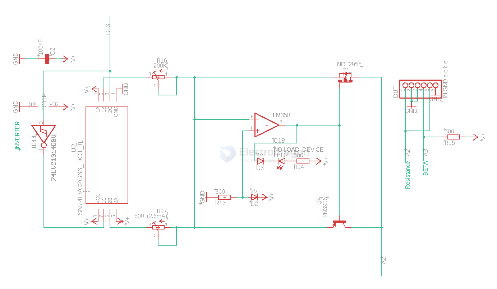

# meter-resistance-dat

== Ohmmeter

- [[meter-internal-resistance-dat]] - [[meter-resistance-dat]] - [[meter-dat]] 

- [[resistance-dat]] - [[physics-dat]] - [[impedance-dat]]

## SCH 

## apps 

- [[Micro-Ohmmeter-dat]] - [[app-dat]]

## ref 

