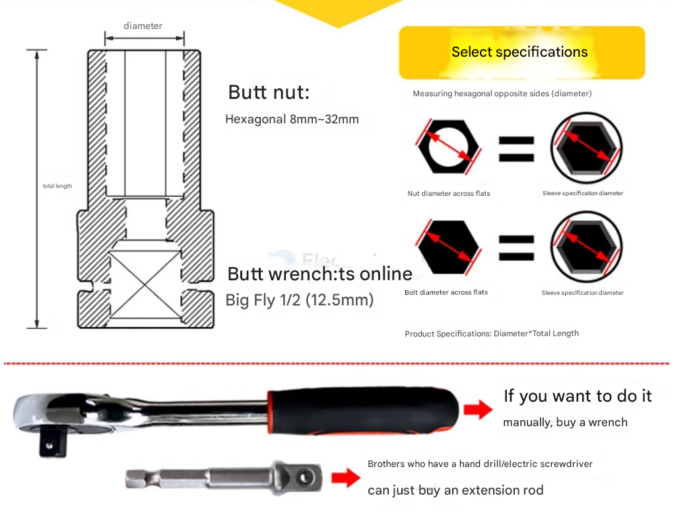

# mechanic-tools-dat

- [[tools-hand-dat]] - [[tools-mechanical-power-dat]] 

- [[tools-protective-dat]] - [[protective-glass-dat]]

- [[tools-maintenance-dat]]

- 模切机 

- 勾刀

- [[tools-mechanical-power-dat]]

## hand tools 

- [[Wrench-dat]]

- [[screw-dat]] - [[hex-socket-screw-dat]] 

- [[hex-socket-screwdriver-dat]]

## Socket Wrench Drive

### Common Socket Wrench Drive Sizes:

| Name   | Drive Size | Square Drive (mm)  | Typical Use Cases                         | CN        |
| ------ | ---------- | ------------------ | ----------------------------------------- | --------- |
| Small  | 1/4" drive | 6.35 mm            | Electronics, precision work, small screws | 方头 小飞 |
| Medium | 3/8" drive | 9.5 mm             | Household use, light automotive repair    |
| Large  | 1/2" drive | 12.7 mm (aka 12.5) | Automotive, heavy torque applications     | 大飞      |

## 🔧 Hex Bolt Screwdriver Size Categorization

### 1. By Tip Size (Across Flats)

The most important measurement is the **distance across the flat sides of the hex tip**.

#### 🧮 Metric Sizes (in millimeters)

1.5 mm, 2 mm, 2.5 mm, 3 mm, 4 mm, 5 mm, 6 mm, etc.

#### 📏 Imperial Sizes (SAE, in inches)

1/16", 5/64", 3/32", 1/8", 5/32", 3/16", 1/4", etc.

> 🔹 These sizes must match the hex socket of the bolt exactly.

## the bad brand

- [[delixi-dat]]

## ref 

- [[mechanic-tools]] - [[mechanics]]
