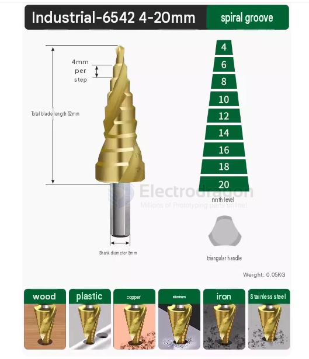

# drill-bit-step-dat

- [[drill-bit-dat]] - [[drill-bit-step-dat]]

### Step Drill Bit: Straight Flute vs. Spiral Flute

For general-purpose use and broader applicability, **spiral flute step drill bits** are recommended.

#### 1. Spiral Flute (Recommended for General Use)
* **Pros**: Smoother cutting, lower vibration, automatic chip evacuation, cleaner holes, and better performance on slightly thicker materials.
* **Best For**: All-around DIY, electronics enclosures, plastics, and sheet metal.

#### 2. Straight Flute
* **Pros**: Good for very thin sheet metal; easier to manually resharpen.
* **Cons**: Poor chip evacuation, higher vibration, more prone to binding or overheating.

#### Summary
Choose **spiral flute** for a smoother, more versatile experience. Look for titanium-coated (TiN) or cobalt-alloyed (M35) versions for better durability.

## ref 

