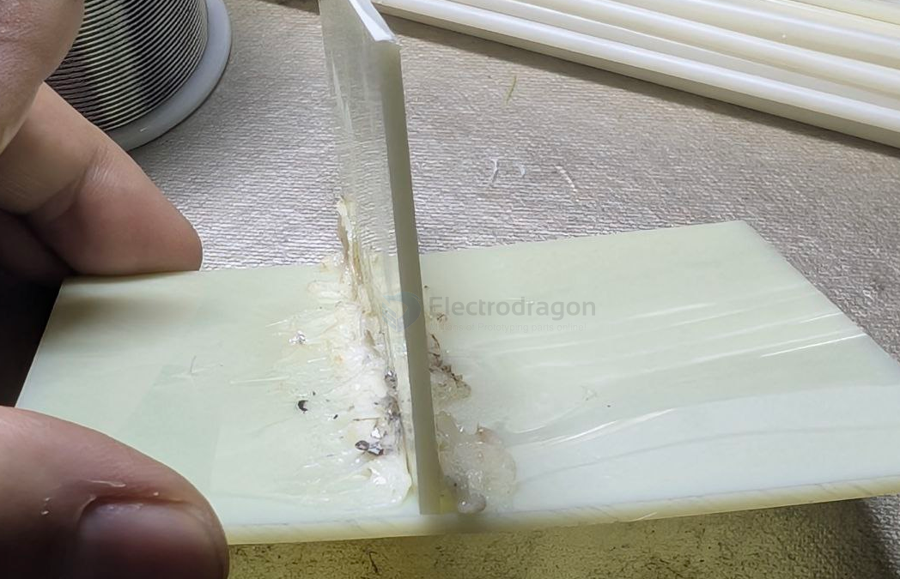
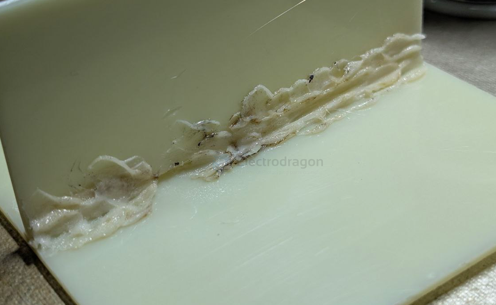

# ABS-dat

- [[mechanic-tool-dat]]

- [[plastic-dat]]

- [[ABS]] - [[plastic]] - [[materials]]

## plastic glue 

using a small brush with plastic specific glue - [[plastic-glue-dat]]

very strong 

## plastic "soldering"

- easy deform 
- deed holders 

easily deform on slow heating

### 1. Tools Needed

- ABS 焊条（你已经有）
- 塑料焊枪 / 热风枪（温控 250–300°C 最好）
- 小平口刀或修整刀
- 夹具（固定零件）
- 砂纸（320~600 grit）

---

### 2. Preparation
1. **清洁表面**  
   去油污、灰尘，保持 ABS 表面干净。

2. **开 V 槽（可选）**  
   为了更强度，可在接缝处削出一个浅浅的 **V 形槽**，让熔化的焊材有地方填充。

3. **固定工件**  
   先夹紧，让工作中不会移动。

---

### 3. Welding Procedure (主步骤)
1. **预热温度：250–300°C**  
   ABS 融化温度大约在 220°C 左右，塑料焊枪通常设在 260–280°C 最合适。  
   *避免太高温度，否则 ABS 会变黄或烧焦。*

2. **预热基材（底部 ABS）**  
   不要直接对焊条加热，  
   **先对 ABS 零件表面扫动热风，让其表面开始变软、发亮即可。**

3. **加热焊条**  
   把 ABS 焊条放在接缝上方，同时用热风枪让它也开始变软。

4. **同向推焊法**  
   一手推焊条，让它在软化后填进 V 槽；  
   另一手控制热风枪，保持均匀加热。

   - 不需要用力压  
   - 让焊条自然流入接缝

5. **逐段焊接，慢慢前进**  
   ABS 冷得很快，所以建议 **每 2–3 cm** 分段焊接。

---

### 4. Cooling & Finishing
1. **自然冷却（不要用水）**  
   快速冷却会让 ABS 更脆。

2. **打磨修整**  
   用 320~600 grit 砂纸让表面更平滑。

## ref 

- [[masterials-dat]]