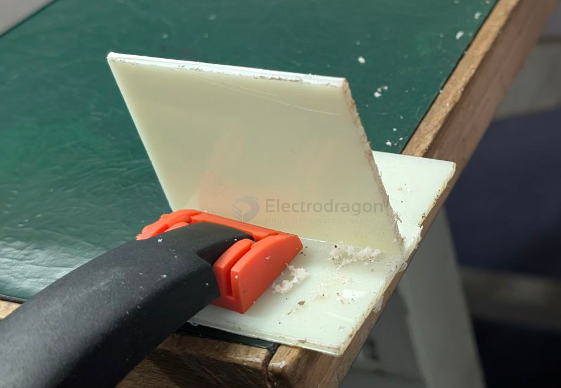
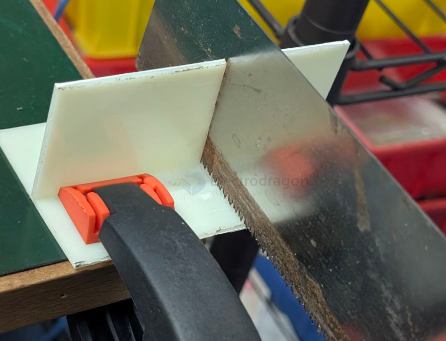

# plastic-dat

- [[Heat-Set-Insert-dat]]

- [[glue-waterproof-dat]]

- [[injection-molding-dat]]

## frication compare 

1️⃣ NBR（丁腈橡胶）

PU (Polyurethane) 

| Material                       | Typical Friction Coefficient (Dry vs Metal) | Wear Resistance | Hardness Range          | Key Characteristics                                              | Typical Applications                                |
| ------------------------------ | ------------------------------------------- | --------------- | ----------------------- | ---------------------------------------------------------------- | --------------------------------------------------- |
| NBR (Nitrile Butadiene Rubber) | High (≈ 0.7 – 1.0)                          | Low–Medium      | Shore A 40–90           | Very high grip, soft, good oil resistance, poor heat resistance  | Drive rollers, anti-slip pads, friction seals       |
| PU (Polyurethane)              | Medium–High (≈ 0.5 – 0.8)                   | High            | Shore A 60 – Shore D 75 | High friction with excellent wear resistance, good load capacity | Friction wheels, conveyor rollers, pressure rollers |
| PVC (Polyvinyl Chloride)       | Medium (≈ 0.4 – 0.6)                        | Medium          | Shore A 70 – Shore D 85 | Relatively rough surface, stable, low cost                       | Guide rails, low-speed friction parts               |

## materials compare 

PU PTFE PP PA6 PE PVC FR4 PEEK Bakelite PVDF ABS NBR POM 6mm

stainless steel / copper rod 3mm 

| Material (Rod)                      | Tensile Strength (MPa)           | Yield Strength (MPa) | Toughness (Impact)             |
| ----------------------------------- | -------------------------------- | -------------------- | ------------------------------ |
| **Stainless Steel (3 mm, 304/316)** | 520–620                          | 200–300              | ★★★★★ Very high                |
| **Copper (3 mm)**                   | 200–250                          | 70–120               | ★★★★ Good                      |
| **PEEK (6 mm)**                     | **90–100**                       | **80–95**            | **★★★★ Good**                  |
| **FR4 (Fiberglass, 6 mm)**          | **300–350 (in fiber direction)** | **~250  **           | **★★★ Medium (brittle)**       |
| **POM / Acetal (6 mm)**             | 60–70                            | 55–65                | ★★★★ Good                      |
| **PA6 / Nylon 6 (6 mm)**            | 60–80                            | 45–70                | ★★★★ Good (better when moist)  |
| **PVC (6 mm)**                      | 45–55                            | 40–50                | ★★★ Medium                     |
| **PVDF (6 mm)**                     | 45–55                            | 40–50                | ★★★ Medium                     |
| **ABS (6 mm)**                      | 35–50                            | 30–40                | ★★★ Medium–High                |
| **PU (Polyurethane, 6 mm)**         | 25–55                            | 25–45                | ★★★★★ Very tough/elastic       |
| **PP (6 mm)**                       | 25–40                            | 20–35                | ★★★ Medium (brittle when cold) |
| **PTFE (6 mm)**                     | 20–30                            | 10–20                | ★★ Low, very soft              |
| **PE (HDPE, 6 mm)**                 | 20–35                            | 15–30                | ★★★ Medium                     |
| **Bakelite (Phenolic, 6 mm)**       | 50–100                           | 40–60                | ★★ Very brittle                |
| **NBR (Rubber, 6 mm)**              | ~15                              | N/A (elastomer)      | ★★★★★ Extremely tough but soft |

Ranking by Tensile Strength (highest → lowest)

- Stainless steel (3 mm)
- FR4 (6 mm)
- Copper (3 mm)
- PEEK (6 mm)
- PA6 / POM / PVC / PVDF (6 mm)
- ABS / PP / PU / PE (6 mm)
- PTFE (6 mm) (very soft, creeps heavily)
- NBR (rubber) (not for structural load)

- 聚氨酯
- 

PA66: This stands for Polyamide 66, which is a type of nylon. It's a common engineering thermoplastic known for its high mechanical strength, rigidity, and excellent resistance to heat and chemicals. It's often used to make durable enclosures for electronics, some of which are designed to be waterproof.

- [[ABS-dat]]

## plastic cutting 

## by hand saw 

- [[holder-dat]]

hold on table with wood [[holder-dat]], this is how the cutting looks like

cut by [[hand-saw-dat]] 

### plastic cutter - by a knife

cut with scissors or knife - [[PCB-cutter-dat]] - [[fab-PCB-soldering-tools-dat]]

✅ Much safer ways to cut 4 mm plastic sheet

These are tools that are far safer for teens to use:

1) Utility knife + score & snap

For ABS / acrylic → clean and fast.
(Just score many times along a ruler, then snap.)

2) Hand saw (fine tooth)

Like a small hacksaw → slow but safe.

3) Jigsaw (with adult supervision)

Use a fine-tooth blade → works well for curves and straight cuts.

4) Small circular cutter for plastic

If you have a hobby cutter or mini saw, they usually work safely.

## choose same type of plastic for guling 

你遇到的现象其实很常见，这涉及 ABS塑料的配方差异 和 溶剂型胶水的溶解机理。分析如下：

1️⃣ ABS的基本组成

ABS = Acrylonitrile (AN) + Butadiene (B) + Styrene (S)

配方比例不同，会影响 溶剂敏感性：

Styrene 含量高 → 更易被苯类或氯化溶剂溶解

Butadiene 含量高 → 更韧，但对溶剂耐受性强

2️⃣ 颜色添加剂的影响

米黄色ABS里可能含有：

填料（如钛白之外的矿物）

色母粒或染料（某些颜料会阻碍溶剂渗透）

这些添加剂会改变表面溶解性，导致专用胶无法溶解表面，从而无法粘合

3️⃣ 专用胶的溶解机理

一般ABS胶（如丙酮型胶）通过溶解表面塑料，然后两面塑料融合固化

现象说明：

亮白色ABS → 表面容易被溶解 → 胶水有效

米黄色ABS → 表面不溶或溶解慢 → 胶水不起作用

4️⃣ 解决思路

换胶水

选择更强的ABS溶剂型胶（如含甲苯、二氯甲烷等）

需注意安全，通风和手套必须

表面处理

轻微砂纸打磨 → 增加表面粗糙度 → 增加胶水机械附着

可尝试预处理溶剂擦拭，帮助胶水溶解

热熔焊接或超声焊

对不起反应的ABS，可用加热方式粘接，不是溶剂型胶水

## ref 

- [[materials-dat]]