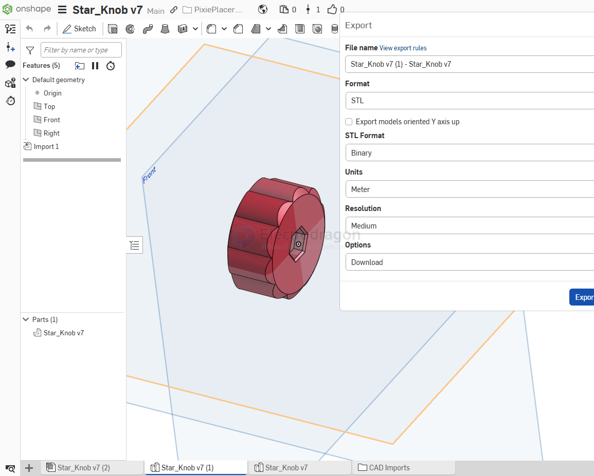

# 3d-print-service-dat

Supported 3D formats: stl/stp/step/obj/3mf. 

You can upload up to 20 files at a time, with each file size less than 100MB. 

For full-color printing, compressed files in rar/zip format can be uploaded.

Note: To ensure more accurate printing and avoid unnecessary disputes, it is strongly recommended to upload STL format files!

Special reminder: Wall thickness should be greater than 1.2mm, with the thinnest part not less than 0.8mm.

## extra 

### embedded nuts 

## material 

### 9600 

适用范围: 适用于管道，卡扣，电子产品外壳，汽车壳体，仪表盘组件等。

优点: 颜色更白，样件纹路佳，表面光滑，韧性、耐用性强，机械性能好。

缺点: 不适宜放置高温及强太阳光环境。

成型工艺: SLA立体光固化

材料精度: ±0.2mm或0.3%以内

颜色: 哑光白

热变形温度: 59°C

## ref 

- [[3d-print-service]] - [[3d-print]]