# Alu_Extrusion-dat

## Aluminum Extrusion Profiles

| Profile Type | Dimensions (mm) | Typical Applications                                        |
| ------------ | --------------- | ----------------------------------------------------------- |
| 2020         | 20x20           | Lightweight frames, 3D printer structures, enclosures       |
| 2040         | 20x40           | Machine guards, small CNC frames, automation projects       |
| 3030         | 30x30           | Medium-duty frames, workbenches, conveyor systems           |
| 3060         | 30x60           | Robot frames, furniture, machine structures                 |
| 4040         | 40x40           | Industrial automation, machine bases, heavy-duty structures |
| 4080         | 40x80           | Large machine frames, CNC machines, conveyor systems        |
| 4545         | 45x45           | High-strength structures, machine enclosures                |
| 4590         | 45x90           | Industrial racking, automation systems                      |
| 5050         | 50x50           | Structural supports, high-load frames                       |
| 6060         | 60x60           | Heavy-duty machine frames, CNC enclosures                   |
| 8080         | 80x80           | Large industrial structures, load-bearing frames            |

### 4040 dual groove 

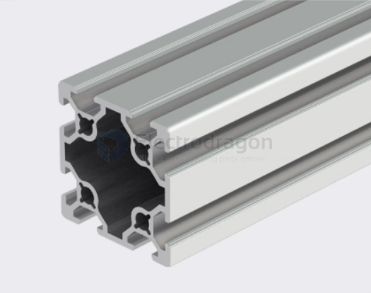

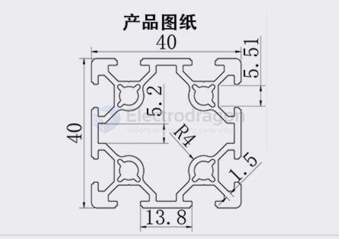

groove size 5.5 mm

### extra profiles: 

- 15x15

thickness version 1.0 mm, other versions include 1.5 mm, 0.8 mm

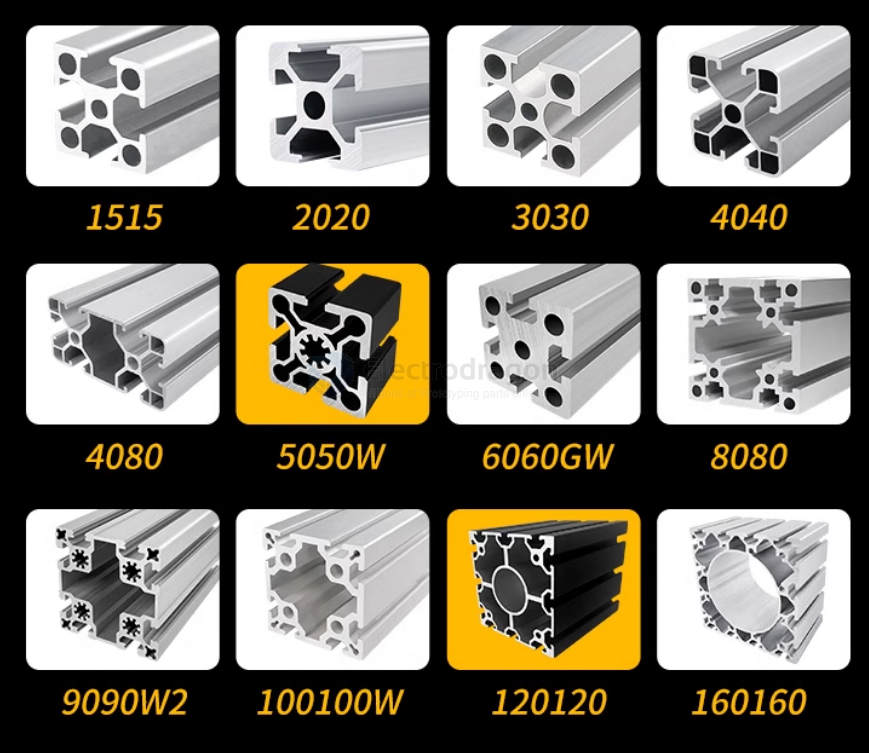

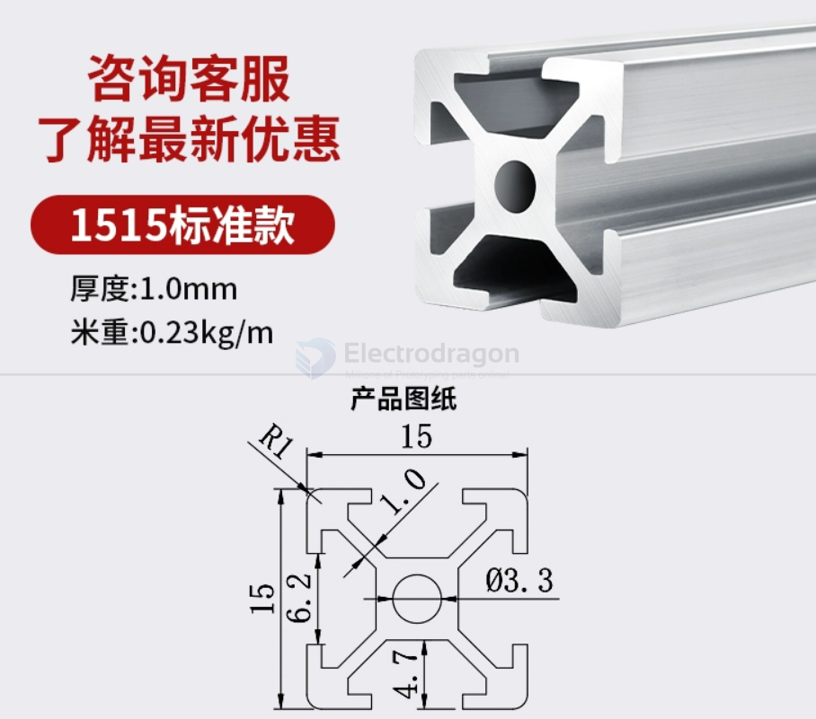

### 2040 

- version: 2024L, 2040V

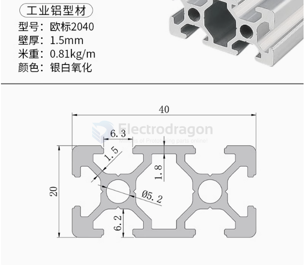

## Accessories 

| ALU Profile | T-nut Type | T-nut Size | Screw Type | Screw Size | Common Lengths         |
| ----------- | ---------- | ---------- | ---------- | ---------- | ---------------------- |
| 1515        | T-nut      | M5         | Bolt       | M5         | 10mm, 20mm, 30mm       |
| 2020        | T-nut      | M5         | Bolt       | M5         | 10mm, 20mm, 30mm       |
| 4040        | T-nut      | M6         | Bolt       | M6         | 10mm, 20mm, 30mm, 40mm |

If you want to use M3 screws with larger extrusions like 1515, 2020, or 4040, you would need to check if there are smaller T-nuts available for those profiles that are designed to accept M3 screws. Generally, M5 or M6 screws are more common in those sizes.

### Profile Bracket

L-type 

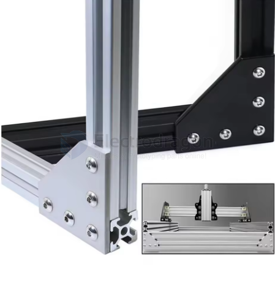

L and T type Bracket for 4040

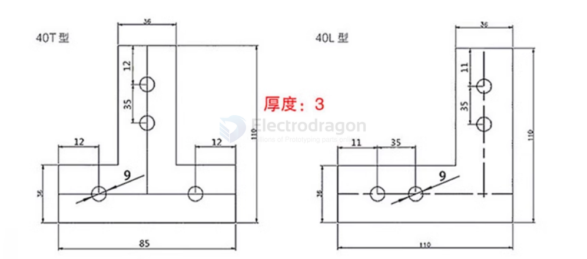

L and T type Bracket for 2020

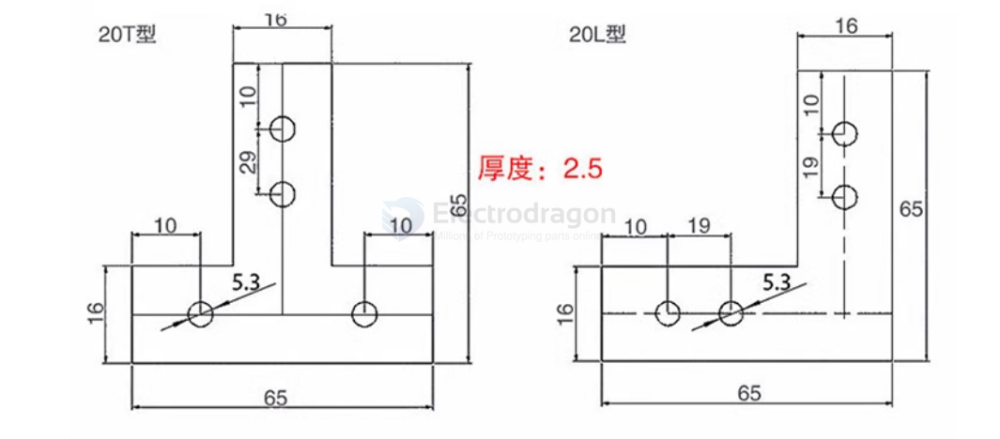

### Profile Angle == 角码

type: 2020

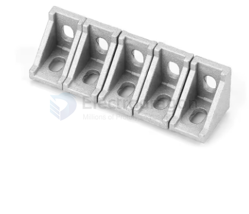

### T-nuts

single rail 

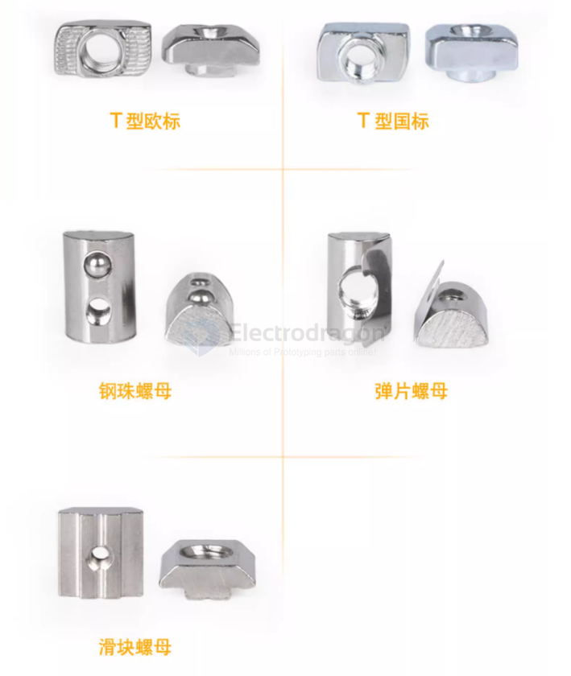

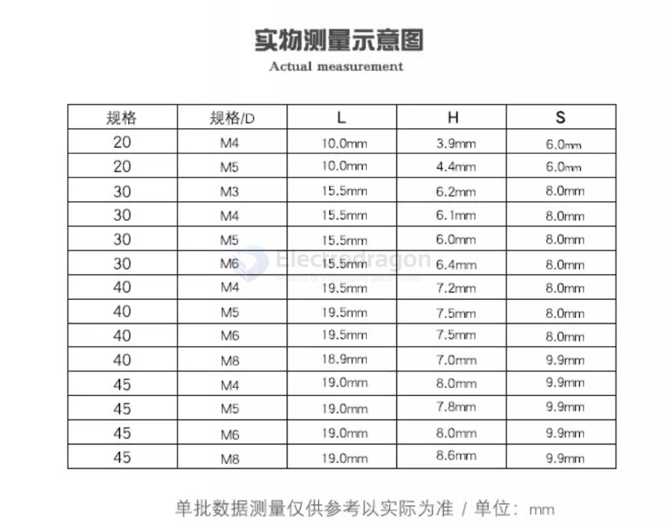

large locker with ribs 

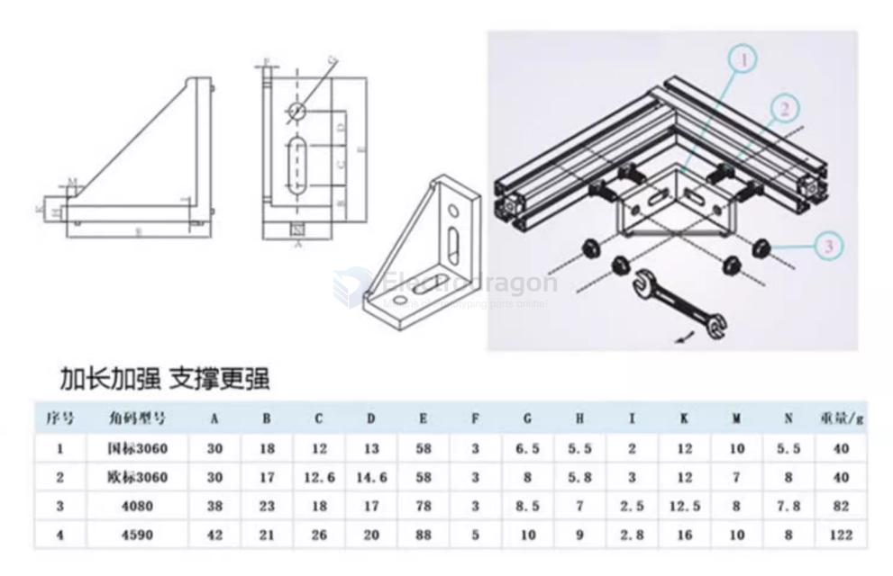

EU 30M4T == 304 == M4 

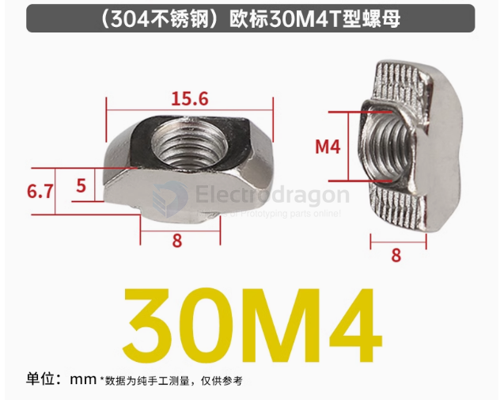

dual rail 

#### Locking Effect Explained:

Tightening the Screw:

As you tighten the screw into the T-nut, the screw's threads engage with the internal threads of the T-nut.
When the screw is turned, it applies a force that presses the T-nut tightly against the sides of the aluminum extrusion's groove.

Increased Friction:

The horizontal part of the T-nut, the "T" portion, makes contact with the two sides of the groove. This creates a large contact area between the T-nut and the extrusion.
As the screw continues to tighten, the pressure between the T-nut and the groove increases, resulting in higher friction. The friction prevents the T-nut from moving within the groove.

Stability:

The tightening force from the screw effectively locks the T-nut into place. The T-nut's "T" shape, combined with the increased pressure, causes it to grip tightly inside the extrusion, which prevents it from shifting or loosening.
This means that once the screw is fully tightened, the T-nut is securely fixed within the extrusion, providing a stable and non-moving connection.

Prevention of Movement:

The combination of friction and compression ensures that the T-nut will not slide or move within the extrusion slot. It becomes firmly anchored, even under load, ensuring the connection stays intact over time.
In summary, the locking effect is the result of the screw creating a compressive force that increases friction between the T-nut and the aluminum extrusion groove, securing the T-nut in place and preventing it from shifting. This guarantees a strong, stable, and secure connection.

### Hex Head (Hexagonal Head):

- [[screws-dat]]

Description: A hexagonal-shaped head that requires a wrench or a socket driver for tightening.

Why it's preferred: The hex head provides a large surface area for torque, allowing you to apply more force to tighten the screw securely. This helps achieve a stronger locking effect for the T-nut.

Application: Suitable for heavy-duty applications where a high level of torque and secure fastening is required.

## APP 

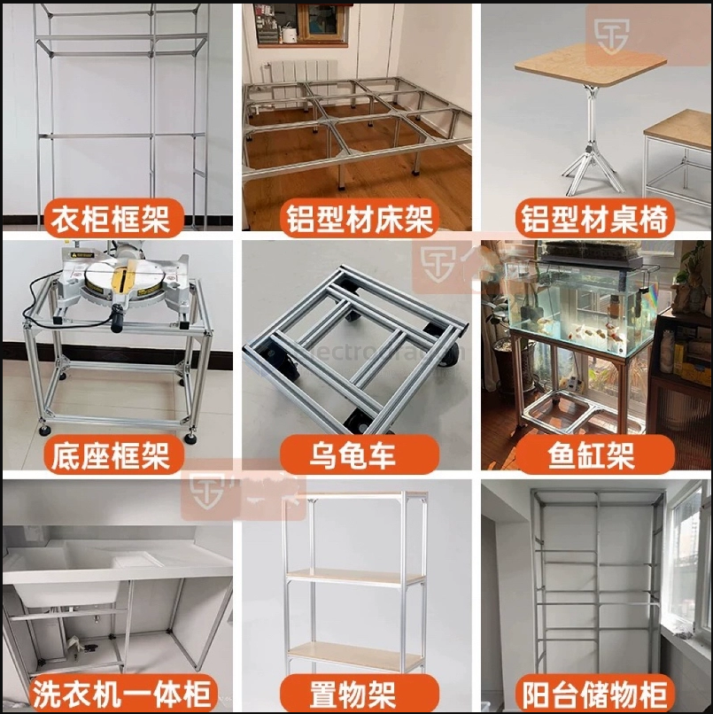

## ref 

- [[mechanics-dat]] - [[mechanics]]

- [[Alu_Extrusion]]