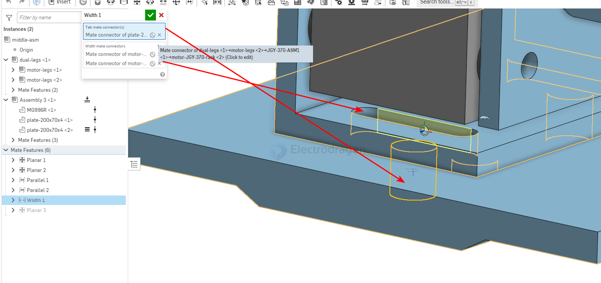

# onshape-constrain-dat.md

## Pin slot mate (m)

Allow rotation about the Z axis and translation along the X axis. The 1st selection serves as the pin and the rotational movement point, and the 2nd selection serves as the translational movement.

## Slider mate (m)

Allow translation along the Z axis. The lst selection serves as the slidingpoint, and the 2nd as the stationary point.

## Width mate

Allow translation and normal rotation on a slot's center plane. 

The 1st selection defines the item to be centered. 

The 2nd selection defines the center plane.

## ref 

- [[onshape-dat]]

