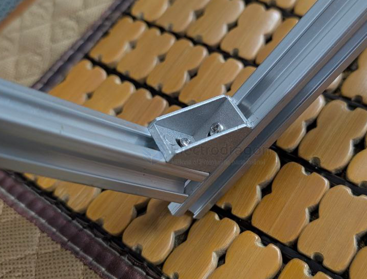
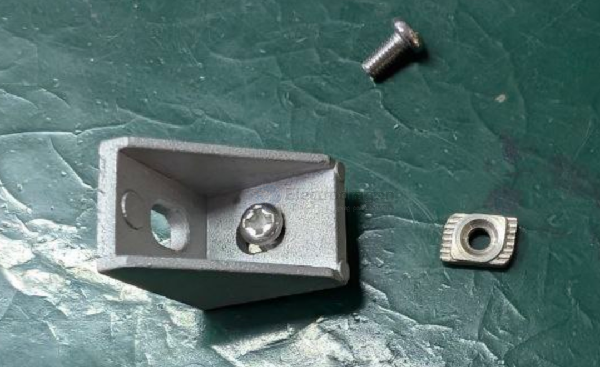

# Profile-Angle-dat

### Profile Angle == 角码

### 1515 

- 20 x 20 x width 15 
- internal width == 11 for [[washer-dat]]
- hole == 4.8 mm 

### type: 2020

width == 20 

## installation 

- t-nut 
- screw 
- washers

| components         | specs |
| ------------------ | ----- |
| angle              | 1515  |
| t-nut              | 15M4  |
| hex [[screws-dat]] |       |
| washers            |       |

## ref 

- [[alu-extrusion-dat]]