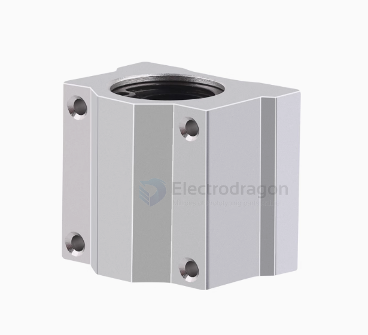
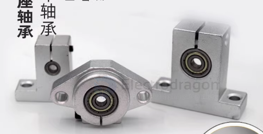
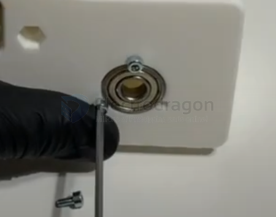

# bearing-dat

## linear bearing 

## bearing wtih vertical stand 

## 608_Bearing

Here's what "608" means:

- 6 – The bearing type (6 = single row deep groove ball bearing)
- 0 – The bearing series, indicating the robustness (0 = light duty)
- 8 – The bore size, which is 8mm

Basic Dimensions of a 608 bearing:

- Inner diameter (bore): 8 mm
- Outer diameter: 22 mm
- Width (thickness): 7 mm

## block the bearing 

by M3 screws 

## What is a Bearing?  

A **bearing** is a mechanical component that **reduces friction** between moving parts and supports rotational or linear motion. Bearings are commonly used in machines, vehicles, and industrial equipment to enhance efficiency and durability.  

---

### Types of Bearings  

#### 1. Rolling Element Bearings (Most Common)  
These use balls or rollers to reduce friction.  

- **Ball Bearings** 🏀  
  - Use small balls between inner and outer rings.  
  - Suitable for high-speed applications.  
  - **Example:** Used in **electric motors, bicycles, fans**.  

- **Roller Bearings** 🎢  
  - Use cylindrical, tapered, or spherical rollers instead of balls.  
  - Handle higher loads than ball bearings.  
  - **Example:** Found in **conveyor belts, gearboxes, heavy machinery**.  

#### 2. Plain Bearings (Bushings)  
- Do not have rolling elements, relying on smooth surfaces and lubrication.  
- **Example:** **Hinges, automotive suspension systems**.  

#### 3. Magnetic Bearings 🧲  
- Use **magnetic fields** to support a rotating shaft without physical contact.  
- **Example:** **High-speed turbines, advanced aerospace applications**.  

#### 4. Fluid Bearings 💧  
- Use **oil or gas film** to eliminate direct contact between surfaces.  
- **Example:** **Hard drives, turbochargers**.  

---

### Key Functions of Bearings  
✅ **Reduce Friction** → Increases efficiency  
✅ **Support Loads** → Radial (sideways) & axial (thrust) loads  
✅ **Improve Precision** → Smooth motion & alignment  
✅ **Enhance Durability** → Reduces wear on components  
