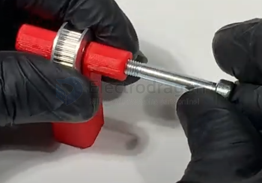
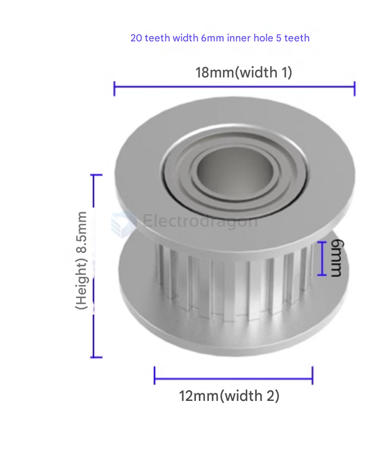

# timing-pulley-dat

## GT2_Timing_Pulley_20T_8B_6mm

- **GT2**: Refers to the tooth profile – 2 mm pitch (distance between teeth), ideal for precise motion control (e.g., 3D printers).
- **20T**: 20 Teeth – the pulley has 20 teeth around its circumference.
- **8B**: 8 mm **inner bore diameter** (fits an 8 mm shaft).
- **6mm**: **Belt width** – designed for 6 mm wide GT2 timing belts.

## Summary:
This is a 20-tooth GT2 pulley with an 8 mm bore, suitable for 6 mm belts. It's commonly used in 3D printers, CNC machines, and robotics for accurate belt-driven motion.

https://cad.onshape.com/documents/707b8372a3c9ced9cde96289/v/ee73401f89c866bc22119094/e/19e0ed0d5720546e9089804c?showReturnToWorkspaceLink=true

- measured witdth = 9 mm
- measured hole = 5 mm

## GT2_Timing_Pulley_20T_8B_5mm

the following images show inner hole 5mm, not 6mm 

## ref 

- [[timing-pulley]]