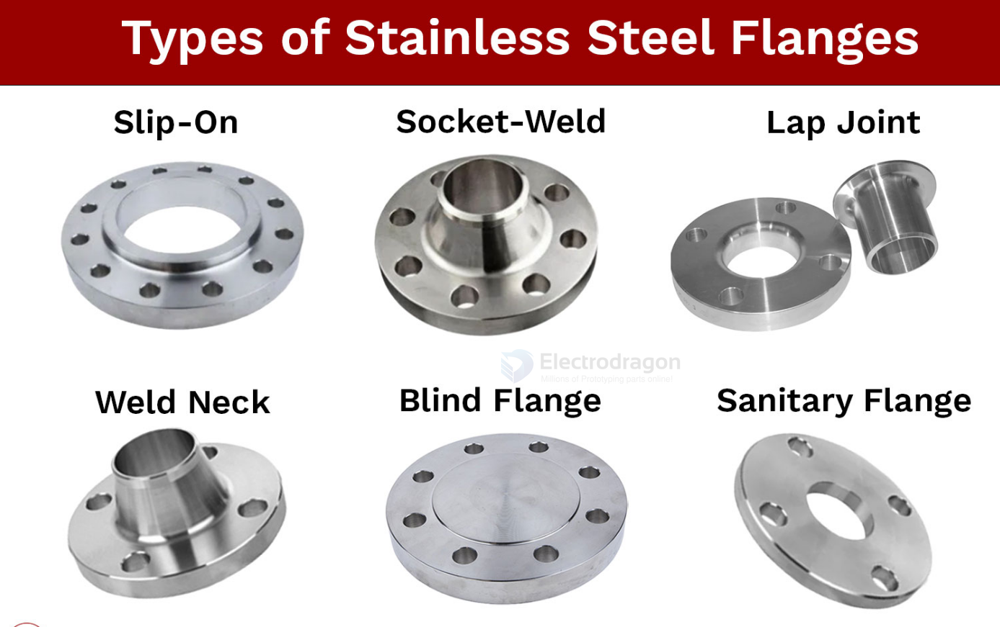
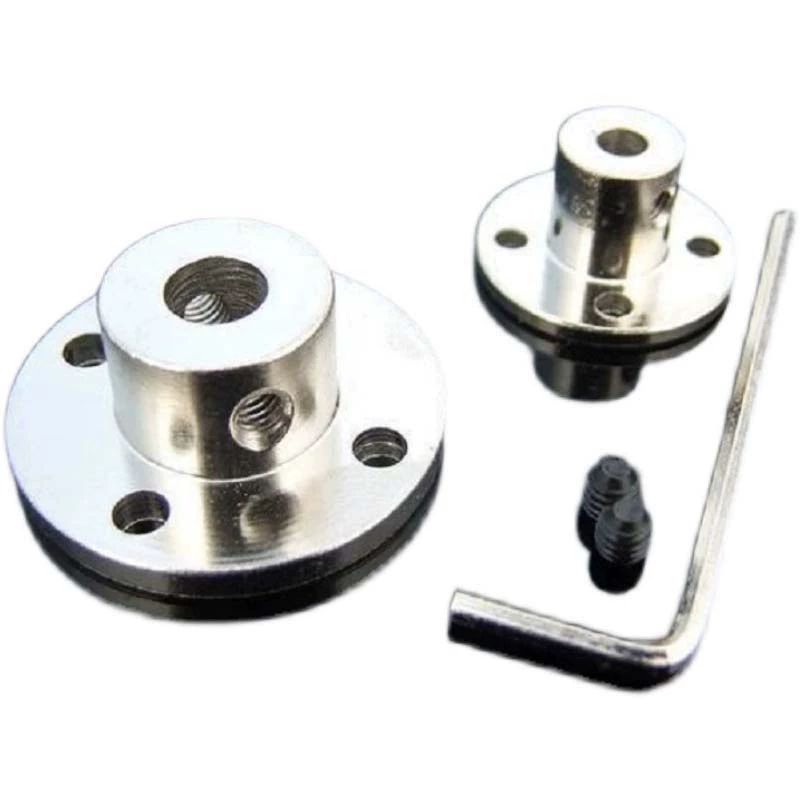
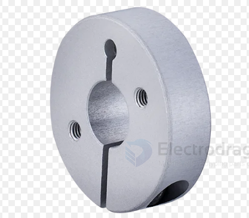
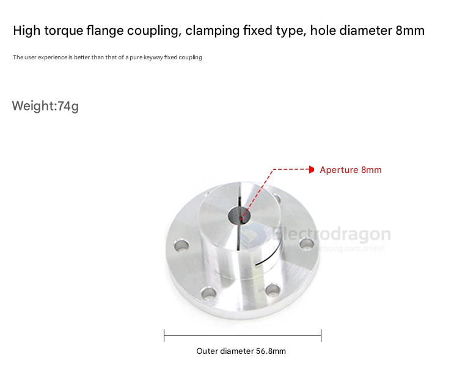

# flange-dat.md

A flange is a protruding rim, lip, or ridge used for various purposes, including fixing, strengthening, guiding, or connecting. It can be a flat surface sticking out from an object, or a decorative edge on clothing. 

## shaft coupling flange set == set-screw flange

The image shows a shaft coupling flange set, typically used to connect a motor shaft to a wheel, gear, or other rotating component. The screw part in this flange assembly refers to the grub screws (set screws) shown next to the hex key (Allen wrench).

Breakdown of the parts:

**Grub screws (set screws):**
These are the small black screws included in the image. They are inserted into the threaded side holes of the flange (visible on the cylindrical hub) to secure the shaft in place.

Function:

Once the shaft is inserted into the flange's central hole, the grub screws are tightened using the included hex key to clamp the shaft securely, preventing it from slipping.

These components are commonly used in RC cars, robotics, CNC machines, and 3D printers for coupling motors to shafts or wheels.

### set-screw flange for 100KG motor 

NO, a basic set-screw flange on an 8mm shaft is not recommended to handle 100 kg load especially under torque or dynamic conditions.

Consider:

- A larger diameter shaft (12–16mm)
- Clamping flanges
- Keyed shafts
- Stronger materials
- Proper bearing support

## Clamping Flange 

## keyed flange

## Options selection

If possible, use a clamping flange — it’s safer, more secure, and better for D-shafts and higher loads.

If you already have a set screw flange (like in your image), it can work, especially on a D-shaft, but be extra careful with alignment and torque.

## ref 

-[[motor-shaft]]

- [[flange]] - [[mechanics]]