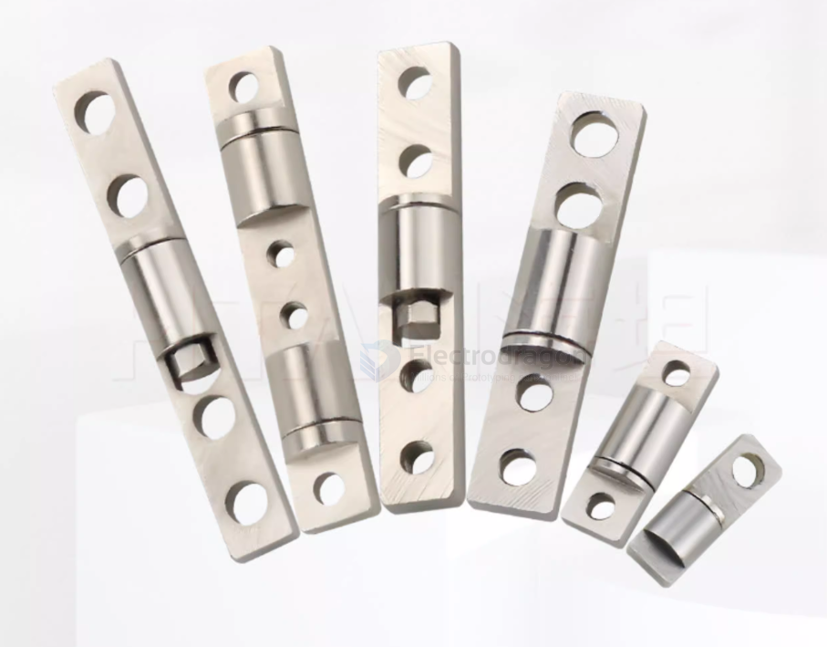

# damper-dat

- [[damping-dat]] 

damper is a mechanical device that resists motion via viscous friction. It is used to reduce vibrations, shocks, and oscillations in mechanical systems.

## Friction / Viscous Damper

### damper linear

### damper ball-round 

### damper 转盘

## Hydraulic Damper / Shock Absorber 液压 damper linear 

## Spring-Damper / Rubber Buffer

## 气压阻尼件 (Gas Damper / Gas Spring)

- 气撑 

## apps 

门合页

## ref 

- [[mechanical-parts-dat]]

- [[force-dat]]