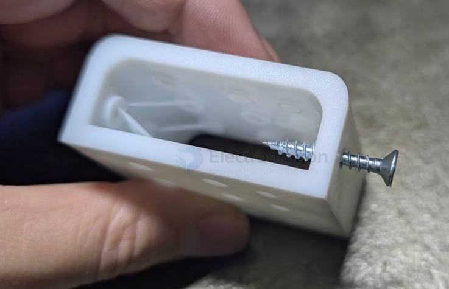

# screw-Self-tapping-dat

- easy for two layer assembly 

- works for [[plastic-dat]] [[wood-dat]]

3. 工程语境中的常用表达

Pre-drilled hole: 预钻孔（自攻螺钉通常需要一个比螺纹略小的引导孔）。

Pilot hole: 引导孔。

Thread pitch: 螺距。

Course thread: 粗牙螺纹（塑料件常用）。

## screw into 3d printed parts 

## ref 

- [[screw-dat]]