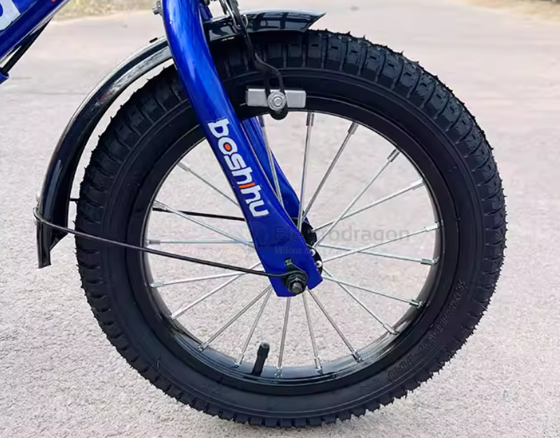
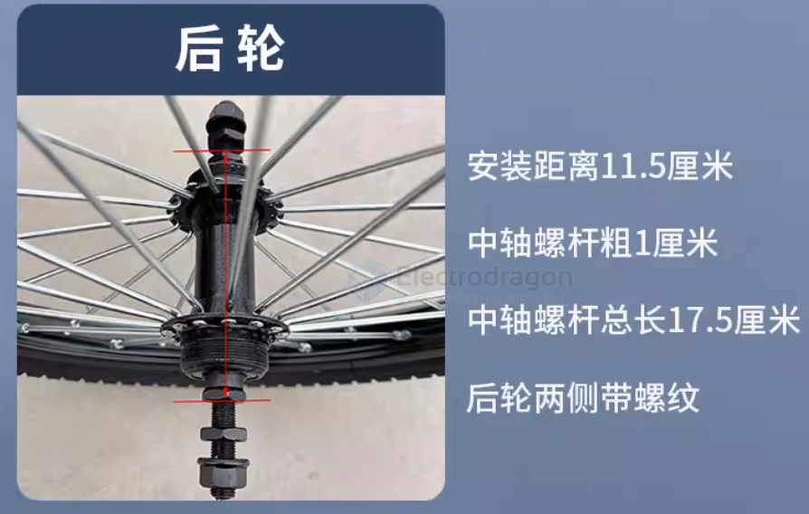
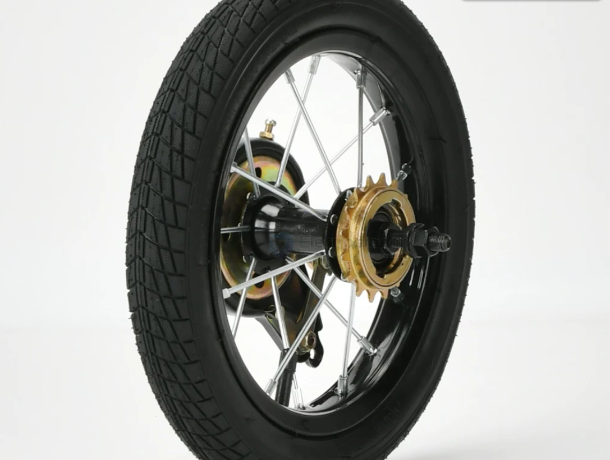
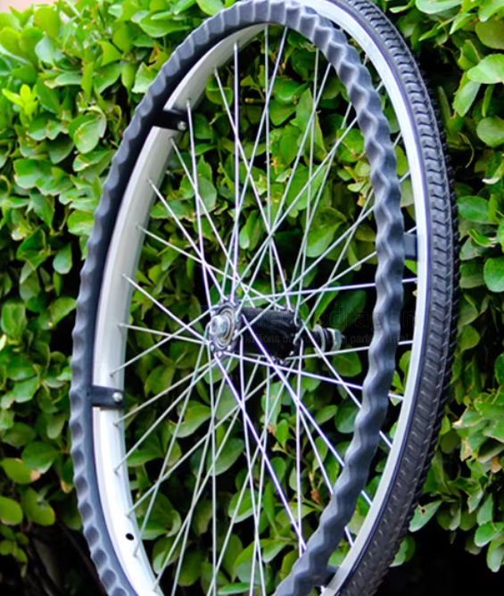

# wheel-hub-dat

- [[wheel-dat]] - [[wheel-hub-dat]] - [[bearing-dat]] - [[gear-dat]]

- 14 x 2.125 
- 16 x 2.125 

- 12~20 inch

## 14-inch wheels == kids bike 

front wheel 

rear wheel 

## other sizes 

- 24-inch == wheelchair 

## static wheel hub 

in almost all modern bicycles, the axle itself does not rotate.

### Bicycle Rear Wheel Rotation: What Moves?

| Component             | Status         | Movement Description                                               |
| :-------------------- | :------------- | :----------------------------------------------------------------- |
| **Axle (The Axis)**   | **Stationary** | Bolted or clamped to the bike frame; it never spins.               |
| **Sprockets (Gears)** | **Rotating**   | Spin when you pedal; they stay still when you "coast."             |
| **Hub Shell & Wheel** | **Rotating**   | Always spin while the bike is in motion.                           |
| **Bearings**          | **Active**     | The bridge that allows the wheel to spin *around* the static axle. |

---

### How it works:
1. Your **frame** holds the **axle** perfectly still.
2. The **bearings** sit on that axle.
3. The **hub** (the middle of the wheel) sits on the bearings.
4. When you pedal, the **sprockets** push the hub, and the whole wheel spins around that fixed center axis.

## ref 

- [[wheel]] - [[wheel-hub]]