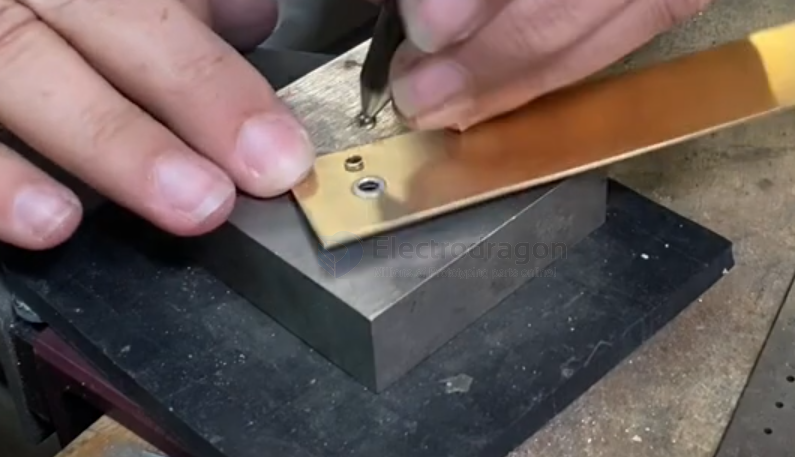
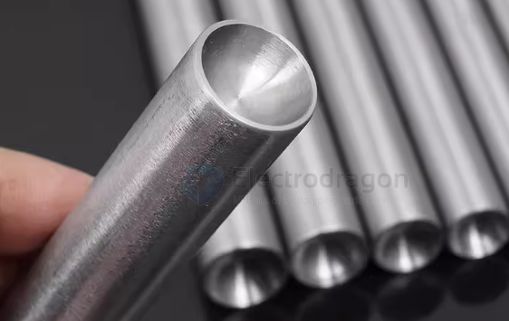

# Rivet-dat

- [[rivet-nut-dat]]

能从一侧安装、通用性最强 → 铆钉螺母

能用压床、追求稳定与精度 → 压铆螺母

| 项目       | 铆钉螺母                    | 压铆螺母                     |
| ---------- | --------------------------- | ---------------------------- |
| 英文       | Rivet Nut / Blind Rivet Nut | PEM Nut / Self-Clinching Nut |
| 固定原理   | 拉铆变形夹紧板材            | 齿纹压入材料冷流锁死         |
| 是否“盲装” | ✅ 是（单面操作）            | ❌ 否（需双面受力）           |
| 是否可拆   | ❌ 不可拆                    | ❌ 不可拆                     |

三、安装方式差异（非常关键）
🔹 铆钉螺母（Rivet Nut）

安装过程

钻孔

插入螺母

用铆枪拉芯 → 后端鼓包

特点

从一侧即可完成

不需要压床

现场安装友好

📌 类似：抽芯铆钉 + 螺纹

🔹 压铆螺母（PEM Nut）

安装过程

冲孔（精确尺寸）

放入螺母

压床直接压入

特点

需要上下两侧受力

依赖材料“冷流”

精度和稳定性更好

## Semi-Tubular Rivet (Tubular Rivet)

- Hollow at the tail, slightly deformed during installation.
- Leaves a shaft that can act like a **pin**, allowing attached pieces to **rotate**.
- Can also act as a **built-in spacer** if you control the gap when pressing it.

管状铆钉：强调它是“中空的圆管状”，尾部可轻微展开。

半空心铆钉：常用在手工 / 皮革 / 轻金属 DIY 场景，尾部只有部分空心，方便旋转或作为活动关节。

## Spacer / Washer + Pin or Rivet
- Place a **metal or plastic washer** between parts.
- Insert a solid or semi-tubular rivet/pin through the washer.
- Rivet clamps only the washer, leaving a **free gap for rotation**.
- Works with many rivet types and is very precise.

## cap rivet 

- Also called a **decorative rivet**, commonly used in leather, fabric, or light metal decoration.
- Once installed, the head and shaft clamp the materials tightly.
- **Does NOT allow rotation** and is not suitable as a spacer by itself.
- Mainly used for **decoration or permanent fastening**, not mechanical rotation.

## hand rivet tools 

https://www.instagram.com/reel/CjiwHKfgFZo/?igshid=YmMyMTA2M2Y%3D

打锤 + 铆钉座／冲头（Hammer + Rivet Setter / Anvil / Bucking Bar / Setters） — 对于某些铆钉（尤其在皮革、布料、铜铆钉、花帽铆钉等）可以在锤子 + 座子/冲头上手工敲压固定。适合简易金属片、皮革、布料等，或者当你没有铆枪时。很多皮革／手工爱好者会用这类工具。

## pop rivet 

### After a Pop Rivet (Blind Rivet) Is Installed, Can It Rotate?

After a pop rivet (blind rivet) is pulled (installed), it becomes a **tight, permanent, non-rotating joint**.

When the mandrel pulls the rivet:
- The rivet body expands.
- It clamps the material tightly.
- There is **no clearance** for rotation.
- The joint becomes fixed and cannot rotate.

This is the *intended behavior* of a pop rivet.

## info 

A **rivet** is a type of permanent mechanical fastener used to join two or more pieces of material together, such as metal, plastic, or leather.

### How a Rivet Works
1. A hole is drilled through the materials.
2. The rivet is inserted into the hole.
3. The tail end of the rivet is deformed (flattened or expanded).
4. This creates two “heads” that clamp the materials tightly together.

Once installed, a rivet **cannot be removed without destroying it**, making it a strong and reliable connection.

---

### Basic Structure
- **Head**: The factory-made top of the rivet.
- **Shank**: The cylindrical body that goes through the hole.
- **Tail**: The end that gets deformed during installation.

---

### Common Types of Rivets
- **Solid Rivet**: Strongest type, used in aircraft and heavy machinery.
- **Blind Rivet (Pop Rivet)**: Installed with a rivet gun, used when only one side is accessible.
- **Hollow Rivet**: Used for leather, fabric, or light materials.
- **Semi-Tubular Rivet**: Used for rotating joints; the tail is partially hollow.

---

### Why Rivets Are Used
- Strong and vibration-resistant
- Simple and low-cost
- Good for thin sheets and layered materials
- Do not loosen like screws can

---

### Simple Explanation
A rivet is **a metal pin that you put through a hole and squash the end to lock two parts together**.

## Can a Rivet Joint Keep a Gap and Allow Rotation?

Yes, a rivet joint **can** keep a controlled gap and allow rotation — but only if you use the correct method. A normal rivet creates a tight, permanent joint that cannot rotate. Here are the practical solutions:

---

### ✅ Method 1: Loose Riveting (Hinge-Style Rivet Joint)
Do not fully squeeze the rivet tail. Leave a small clearance so the two plates are not clamped tightly.

**Effect:**
- The plates stay aligned by the rivet shaft.
- A small gap remains.
- The plates can rotate around the rivet.

**Cons:**
- Gap is hard to control precisely.
- Lower strength.
- Rotation may not be very smooth.

---

### ✅ Method 2: Add a Washer or Spacer
Place **washers** or a **spacer** between the two plates, then rivet through them.

**Effect:**
- The gap is controlled by the washer/spacer thickness.
- The rivet clamps the spacer, not the plates.
- The joint rotates smoothly and reliably.

👉 This is the **recommended** method for precise rotation.

