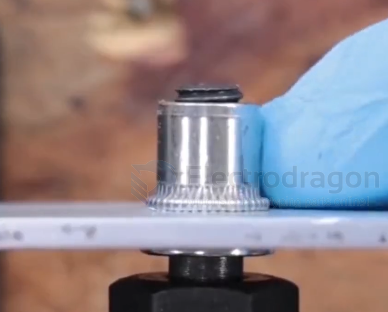
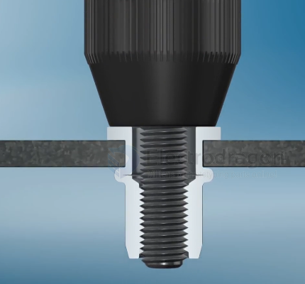

# rivet-nut-dat

- [[fab-sheet-metal-annotation-dat]]

## pull rivet 

## pull tool 

能从一侧安装、通用性最强 → 铆钉螺母

能用压床、追求稳定与精度 → 压铆螺母

| 项目       | 铆钉螺母                    | 压铆螺母                     |
| ---------- | --------------------------- | ---------------------------- |
| 英文       | Rivet Nut / Blind Rivet Nut | PEM Nut / Self-Clinching Nut |
| 固定原理   | 拉铆变形夹紧板材            | 齿纹压入材料冷流锁死         |
| 是否“盲装” | ✅ 是（单面操作）            | ❌ 否（需双面受力）           |
| 是否可拆   | ❌ 不可拆                    | ❌ 不可拆                     |

三、安装方式差异（非常关键）
🔹 铆钉螺母（Rivet Nut）

安装过程

钻孔

插入螺母

用铆枪拉芯 → 后端鼓包

特点

从一侧即可完成

不需要压床

现场安装友好

📌 类似：抽芯铆钉 + 螺纹

🔹 压铆螺母（PEM Nut）

安装过程

冲孔（精确尺寸）

放入螺母

压床直接压入

特点

需要上下两侧受力

依赖材料“冷流”

精度和稳定性更好

## ref 

- [[rivet-dat]] - [[rivet]] - [[mechanical-structure]]

- [[rivet-nut]]