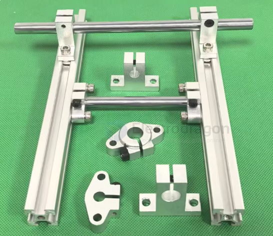
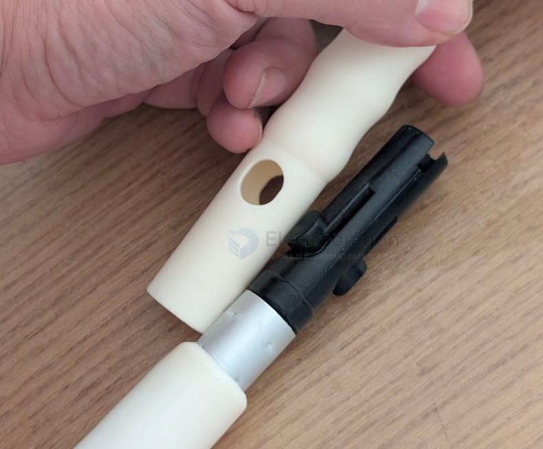

# Shaft-dat

- [[mechanical-structure-dat]] - [[materials-dat]]

- [[shaft-connection-dat]]

## dimension 

- 8mm 

- 6mm - [[3d-printer-dat]]

## smooth shaft accessories 

- [[shaft-limit-ring-dat]] == Hose clamp

- [[shaft-coupler-dat]]

- [[Shaft-Cross-Connector-dat]]

## tech 

- [[shaft-dat]] - [[shaft-waterproof-dat]] - [[waterproof-dat]]

## Shaft cutting

Is it dangerous to cut a 6 mm smooth shaft (steel) with an angle grinder?

Yes. There are risks, especially in the following situations:

1. High angle grinder speed

Angle grinders typically run above 10,000 RPM. When cutting metal, if the workpiece is not clamped securely or the angle is wrong and the shaft rolls, this can cause:

- Hand injury (kickback)
- Workpiece ejection
- Cutting wheel shattering (severe hazard)

2. Round shaft is hard to secure

A round shaft can roll or be grabbed by the wheel, which may lead to:

- Disc jam
- Thrown workpiece

3. Cutting discs are unfriendly to small-diameter metal

Cutting thin rods → easy to bite → can cause kickback

How to make it safer

- Use proper fixturing

  Secure the shaft. Recommended:

  - Use a bench vise (required)
  - Wrap the clamped area with aluminum or wood to prevent slipping

- Use a cut-off disc, not a grinding disc

  Use a metal cut-off disc (thin cut-off). Do not use a grinding disc to sever the shaft.

- Wear personal protective equipment

  - Safety goggles
  - Cut-resistant gloves
  - Long sleeves

- Avoid contacting the wheel side

  Use only the thin cutting edge of the disc; do not apply side pressure.

- Cut gently, do not force

  Keep a steady motion; do not rock the shaft.

## shaft assembly 

芯轴加热 / 冷冻的本质作用只有一个：
——利用热胀冷缩，让“本来很紧的过盈配合在装配瞬间变得好装”。
下面我用直观 + 定量给你解释清楚。
一、一句话核心原理
加热孔 → 孔变大
冷冻轴 → 轴变小
👉 装配瞬间从“硬压”变成“顺滑插入”，
冷却后恢复尺寸，形成非常牢固的过盈配合。

## ref 

- [[rod-system-dat]]
