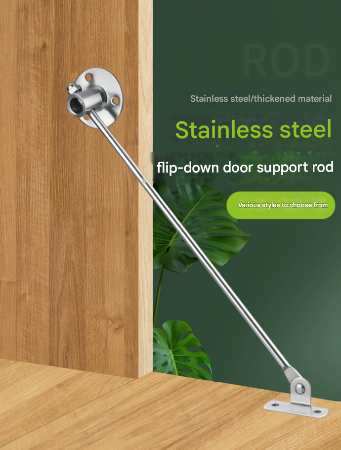
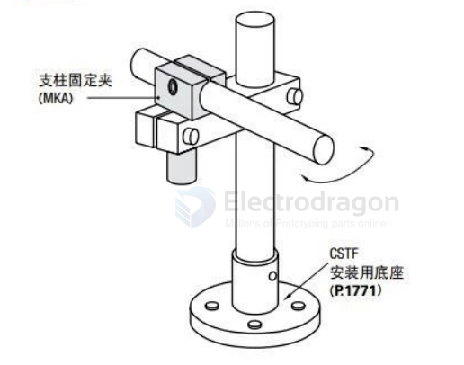

# rod-system-dat

- [[shaft-dat]] 

- [[PVC-tube-dat]] 

- [[carbon-rods-dat]]

- [[stainless-steel-solid-tube-dat]]

- [[stainless-steel-hallow-tube-dat]]

- [[rod-system-dat]] 

- [[hinge-dat]] - [[rod-tie-dat]] - [[crank-dat]] - [[rod-dat]]

- [[shaft-coupler-dat]]

- [[stainless-steel-dat]] - [[stainless-steel-solid-rod-dat]] - [[metal-dat]]

- [[clamp-dat]]

rod hinge 

## size 

- 3mm [[ABS-dat]] [[shaft-dat]] - weak 

- 3mm [[stainless-steel-solid-tube-dat]] - [[shaft-dat]] - ?

## common parts 

- [[shaft-limit-ring-dat]] - [[shaft-coupler-dat]]

- [[flange-dat]]

## compare 

| Feature | 3mm Solid Carbon Rod | 3mm Solid Stainless Steel Rod |
|---------|--------------------|-------------------------------|
| **Material** | Carbon fiber (reinforced with epoxy) | Stainless steel (commonly 304 or 316) |
| **Density / Weight** | ~1.6 g/cm³ (lightweight) | ~8.0 g/cm³ (heavy) |
| **Tensile Strength** | ~600–1000 MPa | ~500–700 MPa |
| **Flexural Strength / Stiffness** | Very high stiffness (high modulus) | Lower stiffness compared to carbon |
| **Impact / Shock Resistance** | Brittle, can snap under sudden impact | Tough, can bend under load without breaking |
| **Corrosion Resistance** | Excellent (does not rust) | Good (resists corrosion, but can rust in harsh environments) |
| **Weight-to-Strength Ratio** | Extremely high (very strong per gram) | Low (heavier for same strength) |
| **Practical Notes** | Ideal for **lightweight reinforcement**, RC aircraft spars, hobby robotics | Better for **impact-heavy or load-bearing metal parts**, mechanical shafts |

### Summary

- **Carbon rod** is **much lighter** and very stiff; for **bending stiffness** or lightweight structure, it is stronger per weight.  
- **Stainless steel rod** is **heavier but tougher**; it can withstand impact and bending better without snapping.  
- **Conclusion:**  
  - For **lightweight RC planes, drones, or aerospace applications** → **3mm carbon rod** is preferred.  
  - For **mechanical shafts or parts under heavy impact** → **3mm stainless steel rod** is safer.

## other 

cantilevel 

tube cross locker 

vertical tube connector == water pipe joint

## ref 

- [[mechanical-structure-dat]]

- [[mechanical-structure]] - [[mechanics]]

## ref 

- [[rod]]

- [[mechanics]]
