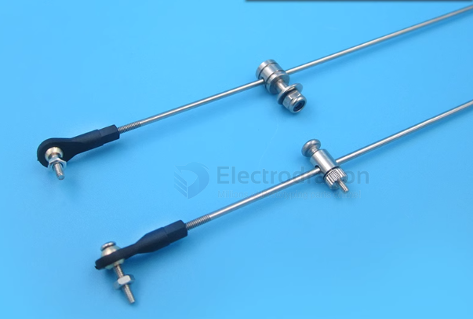

# rod-tie-dat

- [[hinge-dat]] 

## Tie Rod vs Hinge

| Feature                 | Tie Rod                               | Hinge                                  |
|-------------------------|--------------------------------------|----------------------------------------|
| **Function**            | Transmits **tensile force** (pulling). | Allows **rotational movement** around a fixed axis. |
| **Load Type**           | Works under **tension**, rarely compression. | Works under **rotation**, may carry vertical/horizontal loads depending on design. |
| **Movement Allowed**    | Linear connection; **no rotation** at ends unless designed with joints. | Rotational; **connects two parts allowing pivoting**. |
| **Typical Applications**| Structural reinforcement, suspension, kinematic linkages. | Doors, lids, flaps, robotic joints, mechanical linkages. |
| **Example**             | Car suspension tie rod, truss tie rod. | Door hinge, laptop hinge, robot elbow hinge. |

### Key Difference
- **Tie Rod:** Keeps parts **aligned and under tension**, preventing separation or spreading.  
- **Hinge:** **Connects two parts and allows rotation**, does not resist tension in a straight line.

## ref 

- [[rod-system-dat]] - [[hinge-dat]] - [[rod-tie-dat]]