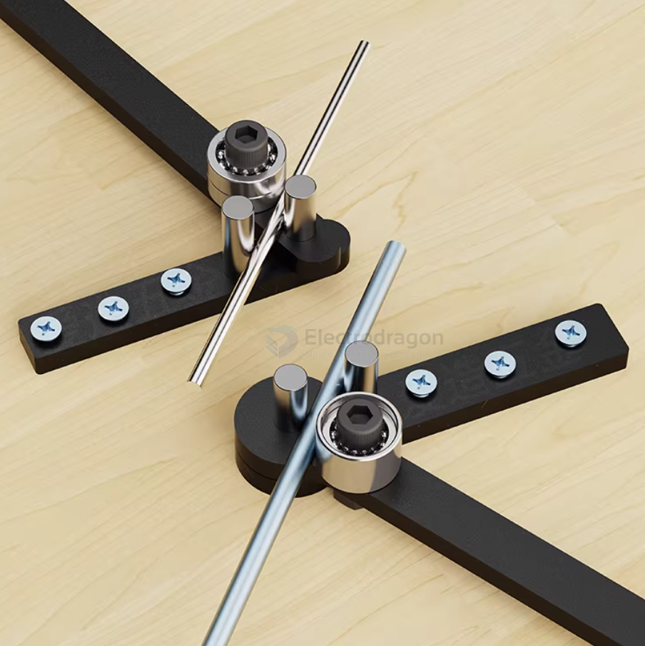
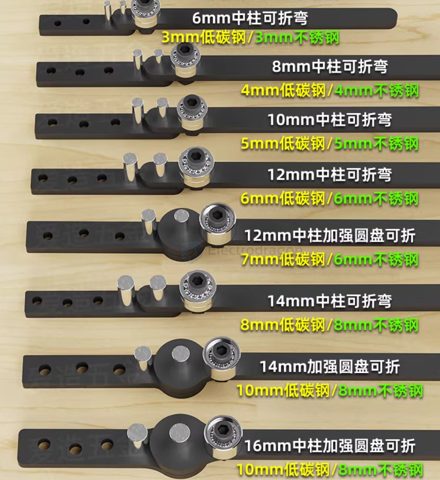
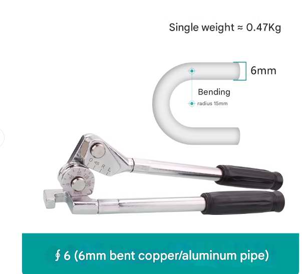

# tube-bend-dat

## hand tool 2 

## hand tool 1 

## R15 

Quick reference table (R = 15 mm)

| Bend angle | Total bend length (mm) | Middle point (mm) |
| ---------- | ---------------------- | ----------------- |
| 45°        | 11.78                  | 5.89              |
| 60°        | 15.71                  | 7.85              |
| 90°        | 23.56                  | 11.78             |

## fix "Twist" (Clocking)

If the material is steel or aluminum and the diameter isn't too large, you might be able to "cold straighten" it:

`The Table Test`: Lay the tube on a flat welding table or floor. Press one end flat. If the other end is lifting off the surface, that is your error.

`The Lever Method`: Secure one end in a heavy-duty vise (use soft jaws or wood blocks to protect the tube). Slide a longer, larger pipe over the other end to act as a lever, and gently twist until the two horizontal sections are coplanar.

## ref 

- [[tube-dat]]