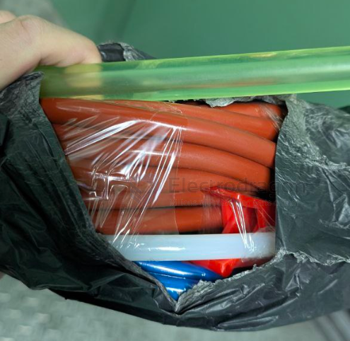

# tube-dat

- [[tube-copper-dat]] 

- [[tube-pvc-dat]] 

- [[shaft-dat]]

6mm 以下 

聚氨酯管

氟管, 铁氟龙管

PA6尼龙管

硅胶软管

以下为 **≤6 mm 管径** 常见材料的**典型物理属性对比**（工程常用范围，具体数值会随配方/厂家变化）：

| 材料 | 常见英文 | 密度 (g/cm³) | 硬度 | 抗拉强度 (MPa) | 工作温度 (°C) | 柔韧性 | 耐化学性 | 典型特点 |
|---|---|---|---|---|---|---|---|---|
| 聚氨酯管 | PU / TPU Tube | 1.10–1.25 | Shore A 80–98 | 30–55 | -40 ~ +80 | ⭐⭐⭐⭐ | ⭐⭐⭐ | 高弹性、耐磨、回弹好，气动常用 |
| 氟管 / 铁氟龙管 | PTFE Tube | 2.10–2.30 | Shore D 50–65 | 20–35 | -200 ~ +260 | ⭐ | ⭐⭐⭐⭐⭐ | 极强耐腐蚀、低摩擦、不老化 |
| PA6 尼龙管 | PA6 / Nylon 6 Tube | 1.12–1.15 | Shore D 70–80 | 50–80 | -40 ~ +120 | ⭐⭐ | ⭐⭐⭐⭐ | 强度高、耐压好、尺寸稳定 |
| 硅胶软管 | Silicone Tube | 1.10–1.20 | Shore A 30–70 | 5–12 | -60 ~ +200 | ⭐⭐⭐⭐⭐ | ⭐⭐⭐⭐ | 极柔软、耐高低温、生物惰性 |

---

### 关键工程对比要点（≤6 mm 管径时尤为明显）

- **耐压能力（由高到低）**  
  PA6 尼龙 ＞ PU ＞ PTFE（薄壁） ＞ 硅胶  
- **柔软度 / 可弯折性**  
  硅胶 ＞ PU ＞ PA6 ＞ PTFE  
- **耐化学 / 溶剂**  
  PTFE ＞ PA6 ≈ 硅胶 ＞ PU  
- **耐磨性**  
  PU ＞ PA6 ＞ PTFE ＞ 硅胶  

## tube holder 

## tubes 

- 蓝色 四氟管 铁氟龙管 ptfe 聚四氟乙烯管
- PA6 尼龙管
- 红色 硅胶管 耐高温软管
- 聚氨酯 空心棒材 减震 PU 空心管 弹性胶棒 橡胶棒 优力胶棒

# tube-dat

### PVC tube 

- 16 * 1.5mm
- 20 * 1.8mm
- 25 * 2.0mm
- 32 * 2.2mm
- 40 * 2.3mm
- 16 * 1.3mm
- 20 * 1.4mm
- 25 * 1.6mm
- 32 * 1.9mm
- 40 * 2.0mm

### small diameter tube

- inner == 3  mm x outter == 5 mm
- inner == 4  mm x outter == 6 mm
- inner == 5  mm x outter == 7 mm
- **inner == 6  mm x outter == 8 mm**
- inner == 7  mm x outter == 9 mm
- inner == 8  mm x outter == 10mm
- inner == 9  mm x outter == 11mm
- inner == 9  mm x outter == 12mm
- inner == 10 mm x outter == 12mm
- inner == 11 mm x outter == 13mm
- inner == 12 mm x outter == 14mm

- inner == 13 x outter 15mm
- inner == 13 x outter 16mm
- inner == 14 x outter 17mm
- inner == 15 x outter 18mm
- inner == 16 x outter 19mm
- inner == 17 x outter 20mm
- inner == 18 x outter 21mm
- inner == 19 x outter 22mm
- inner == 20 x outter 23mm
- inner == 21 x outter 24mm

- outter == 20mm * thickness 2.0 mm
- outter == 25mm * thickness 2.0 mm
- outter == 32mm * thickness 2.4 mm
- outter == 40mm * thickness 2.0 mm
- outter == 50mm * thickness 2.4 mm
- outter == 63mm * thickness 3.0 mm
- outter == 75mm * thickness 3.6 mm

## ref 

- [[tube]] - [[BOM]]

## ref 

- [[shaft-dat]]