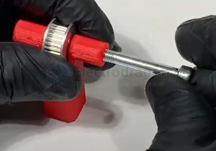

# timing-pulley-dat

- [[pulley-dat]] - [[pulley-drive-dat]] - [[pulley-drive-dat]]

| modes          | category | teeth | inner diameter | belt width | note  |
| :------------- | :------- | :---- | :------------- | :--------- | :---: |
| GT2_20T_8B_6mm | 2GT      | 20    | 8              | 6         |   -   |

### GT2_Timing_Pulley_20T_8B_6mm v8

The **GT2 Timing Pulley 20T 8B 6mm (v8)** refers to a specific type of timing pulley used in belt-driven motion systems, often found in 3D printers, CNC machines, and other precision mechanical setups. Here’s a breakdown of its specifications:

- **GT2**: Refers to the pulley type designed for **GT2 timing belts**, which have a 2mm pitch (distance between teeth). This type is commonly used in applications requiring precise movement and low backlash.
- **Timing Pulley**: A mechanical component with teeth that engage with a timing belt to transfer motion with high accuracy.
- **20T**: This pulley has **20 teeth**, which affects the step resolution and speed of the driven mechanism.
- **8B**: Indicates an **8mm bore diameter**, meaning it fits shafts with an 8mm diameter.
- **6mm**: This refers to the **belt width** it is compatible with, which is typically a **6mm-wide GT2 timing belt**.
- **v8**: This likely refers to the **version** or **design iteration** of the pulley.

This pulley is commonly used in precise motion control applications like 3D printing, where smooth and accurate belt-driven motion is needed. Let me know if you need further details! 🚀

## GT2_Timing_Pulley_20T_8B_6mm

- **GT2**: Refers to the tooth profile – 2 mm pitch (distance between teeth), ideal for precise motion control (e.g., 3D printers).
- **20T**: 20 Teeth – the pulley has 20 teeth around its circumference.
- **8B**: 8 mm **inner bore diameter** (fits an 8 mm shaft).
- **6mm**: **Belt width** – designed for 6 mm wide GT2 timing belts.

## Summary:
This is a 20-tooth GT2 pulley with an 8 mm bore, suitable for 6 mm belts. It's commonly used in 3D printers, CNC machines, and robotics for accurate belt-driven motion.

https://cad.onshape.com/documents/707b8372a3c9ced9cde96289/v/ee73401f89c866bc22119094/e/19e0ed0d5720546e9089804c?showReturnToWorkspaceLink=true

- measured witdth = 9 mm
- measured hole = 5 mm

## GT2_Timing_Pulley_20T_8B_5mm

the following images show inner hole 5mm, not 6mm 

## timing pulley VS. Coupler 

### 🔧 1. Function

| Aspect  | **Timing Pulley**                                 | **Idler Pulley**                                 |
| ------- | ------------------------------------------------- | ------------------------------------------------ |
| Purpose | Transmits power between shafts via timing belt    | Guides or maintains tension in the belt          |
| Motion  | Rotates with and drives the shaft it's mounted on | Usually free-spinning (not connected to a motor) |

---

### 🔁 2. Power Transmission

| Aspect         | **Timing Pulley**                               | **Idler Pulley**                            |
| -------------- | ----------------------------------------------- | ------------------------------------------- |
| Power Transfer | Yes – transfers torque and synchronizes timing  | No – only redirects or tensions the belt    |
| Engagement     | Toothed belt fits precisely to prevent slippage | May or may not be toothed; sometimes smooth |

---

### ⚙️ 3. Mounting and Design

| Aspect         | **Timing Pulley**                      | **Idler Pulley**                            |
| -------------- | -------------------------------------- | ------------------------------------------- |
| Shaft Mount    | Mounted on driven or driving shaft     | Mounted on a stationary or pivoting bracket |
| Size Variation | Chosen for gear ratio and torque needs | Chosen based on tensioning or routing needs |

---

#### 🛠️ Example Scenario

In a **3D printer or CNC machine**, the motor uses a **timing pulley** to drive a toothed belt, while an **idler pulley** on the other side keeps the belt tight and correctly aligned.

## ref 

- [[timing-pulley]]