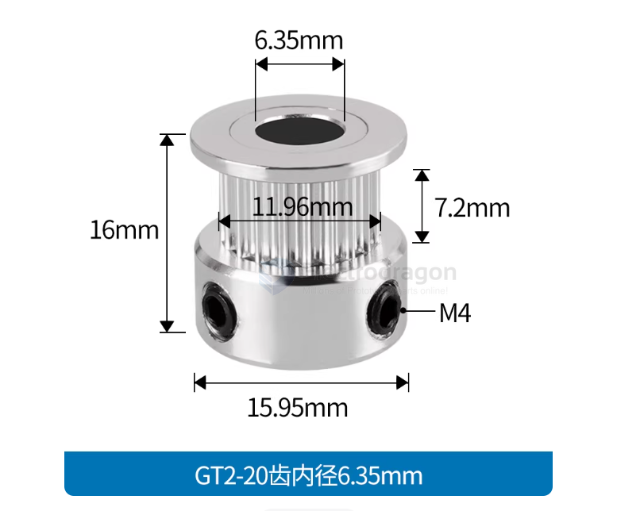

# pulley-drive-dat

- [[pulley-dat]] - [[pulley-drive-dat]] - [[pulley-drive-dat]]

- 普通版（16齿高14)内孔5mm
- 普通版（20齿高16)内孔5mm
- 普通版（20齿高16)内孔6.35mm
- 普通版（20齿高16)内孔8mm
- 普通版（20齿带宽6)内孔6mm
- 普通版（20齿高16)内孔4mm
- 普通版（16齿高14)内孔6mm
- 高品质（16齿高14)内孔5mm
- 高品质（20齿高16)内孔5mm
- 高品质（20齿高16)内孔6.35mm
- 高品质（20齿高16)内孔8mm
- 高品质（20齿带宽6)内孔6mm
- 30齿内孔5mm（带宽6mm）
- 30齿内孔8mm（带宽6mm）
- 36齿内孔5mm（带宽6mm）
- 36齿内孔6.35mm（带宽6mm）
- 36齿内孔8mm（带宽6mm）
- 40齿内孔6.35mm（带宽6mm）
- 40齿内孔5mm（带宽6mm）
- 40齿内孔8mm（带宽6mm）
- 40齿内孔10mm（带宽6mm）
- 40齿内孔12mm（带宽6mm）
- 80齿内孔5mm（带宽6mm）
- 80齿内孔5mm（带宽6mm）黑色
- 40齿/内径5mm带宽10
- 16齿内孔5mm高20带宽10
- 20齿内孔5mm高19带宽10
- 20齿内孔6.35mm高19带宽10
- 20齿内孔8mm高19带宽10
- 20齿内孔6.35mm带宽10外径14
- M3扳手【适用16齿同步轮】
- M4扳手【适用20齿及以上同步轮】

