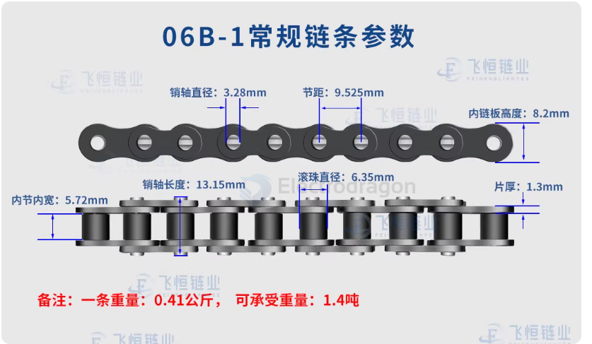
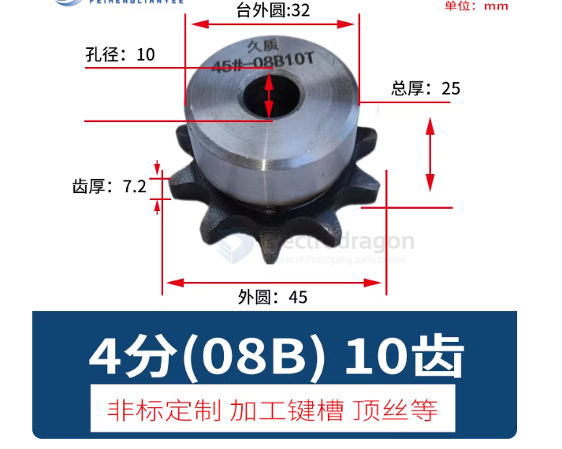

# chain-dat

## chain gear Sprocket

## main specs 

- 06B 
- 08B 

## specs 

### 1. Chain — Main Parameters

| Parameter | Description | Unit / Example |
| --- | --- | --- |
| Pitch (p) | Distance between adjacent roller centers | mm (e.g., 12.7, 15.875) |
| Roller Diameter (d₁) | Roller outer diameter | mm |
| Inner Width (b₁) | Inner width between chain plates (sprocket tooth fit) | mm |
| Chain Length | Total number of links × pitch | mm |
| Plate Thickness | Determines load capacity | mm |
| Tensile Strength / Rated Load | Maximum allowable tension the chain can carry | N or kN |
| Type / Series | Standard or series (ANSI, ISO, DIN, light/medium/heavy) | e.g., ANSI 40, DIN 08B-1 |

> ⚠️ Pitch is the most critical parameter. The chain and sprocket must have the same pitch to mesh correctly.

### 2. Sprocket — Main Parameters

| Parameter | Description | Unit / Example |
| --- | --- | --- |
| Number of Teeth (z) | Sprocket tooth count; determines gear ratio | 10–120 teeth |
| Pitch (p) | Must match the chain pitch | mm |
| Tooth Profile Standard | Defines the tooth shape for proper engagement | ANSI, ISO, DIN |
| Outside Diameter (OD) | Useful for layout and clearance calculations | mm |
| Mounting Bore / Pin Hole Diameter | Sprocket mounting for shaft or bolts | mm |
| Thickness / Tooth Width | Must be compatible with chain inner width | mm |
| Material / Strength | Determines wear resistance and load capacity | Steel, cast iron, aluminum alloy |

> ⚠️ Tooth count and sprocket diameter set the drive ratio but do not affect mesh compatibility as long as the pitch is the same.

### 3. Key Fit and Selection Points

- Pitch match: The chain pitch must match the sprocket pitch exactly.
- Inner width: Sprocket tooth width must be less than or equal to the chain inner width.
- Profile standard: Chain and sprocket standards (ANSI, ISO, etc.) must match to avoid poor engagement and premature wear.
- Minimum sprocket tooth count: Too few teeth increases bending fatigue on the chain; typically choose ≥ 12 teeth when possible.
- Mounting alignment: Shaft diameter, keyway, and bolt pattern must match the sprocket mounting method.

## ref 

- [[power-transmission-dat]]