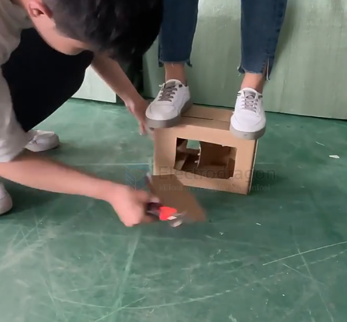

# sheet-dat

== [[fab-sheet-metal-dat]] - [[fab-dat]]

## sheet materials 

- [[materials-dat]] - [[foam-dat]]

- [[cardboardboard-dat]]

## MDF sheet 

## Steel Sheet 

- Magnetic for the Top of the Machine Bed. Glued onto the Bottom_Machine_Bed

## Bakelite Board

Bakelite Board (also known as Phenolic Laminate Board) is an insulating material made by impregnating paper or fabric with phenolic resin and then compressing it under high temperature and pressure. It is known for its heat resistance, durability, and excellent electrical insulation properties, making it widely used in electrical, electronic, mechanical, and mold industries.

## acrylic glass / PMMA 

Plexiglas Cover refers to a protective cover made of Plexiglas, a brand name for acrylic glass (polymethyl methacrylate, PMMA). It is a transparent, lightweight, and shatter-resistant material commonly used as a substitute for glass.

## cutting plastic sheet 

用 电烙铁切割塑料板（2–6 mm） 理论上可行，但几乎不推荐，原因如下：

🔹 **电烙铁切割原理**
- 利用高温熔化塑料来形成切口
- 实质是烧切而不是机械切割

❌ **缺点**

**切口不平整**
- 热熔拉丝，边缘粗糙
- 毛刺多，需要大量打磨

**容易产生烟雾和有毒气体**
- PMMA/ABS/PC加热会释放刺激性气味
- PVC 会释放氯气，非常有害

**热量控制困难**
- 厚板（>3 mm）容易烧透不均
- 薄板容易翘曲、起泡

**效率低**
- 需要慢慢熔化推进
- 对直线或曲线控制难

## ref 

- [[sheet]] - [[mechanics]]