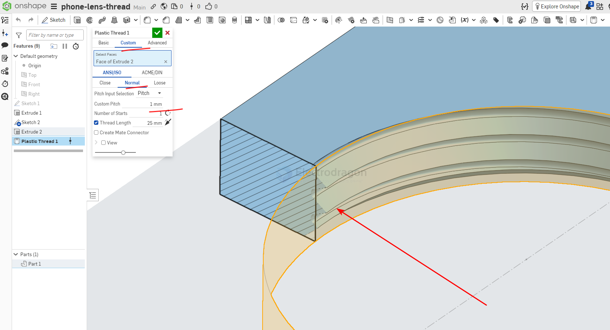

# thread-dat

- [[motor-brushless-dat]]

## thread adapter 

## The "Rule of Three" Threads

For a secure connection in engineering, it is standard practice to have at least 3 full thread rotations engaged.

If the pitch is 1.0mm: You need a minimum of 3.0mm thickness.

If the pitch is 0.75mm: You need a minimum of 2.25mm thickness.

## thread pitch 

For a 17mm mounting plate, **1.0mm (Fine Pitch)** is the superior choice over 2.0mm.

| Feature               | 1.0mm (Fine)                          | 2.0mm (Coarse)                       |
| :-------------------- | :------------------------------------ | :----------------------------------- |
| **Thread Engagement** | **High** (3-5 threads in a 4mm plate) | **Low** (1-2 threads in a 4mm plate) |
| **Security**          | Better resistance to vibration        | Higher risk of stripping             |
| **Compatibility**     | **Standard** for mobile optics        | Non-standard for this size           |

via custom script - internal thread 

## counterbore VS countersink 

## Metric & Imperial Systems

| Standard    | Name              | Angle     | Region    |
| ----------- | ----------------- | --------- | --------- |
| ISO Metric  | Metric Thread (M) | 60°       | Worldwide |
| Unified     | UNC / UNF / UNEF  | 60°       | USA       |
| Whitworth   | BSW / BSP         | 55°       | UK        |
| Pipe Thread | NPT / BSPP / BSPT | 60° / 55° | Piping    |

---

## 3️⃣ Metric Thread Details (ISO)

| Property       | Description              |
| -------------- | ------------------------ |
| Designation    | M6 × 1.0                 |
| Major Diameter | Nominal outer diameter   |
| Pitch          | Distance between threads |
| Thread Angle   | 60°                      |
| Direction      | Right-hand / Left-hand   |

### Common Metric Threads

| Size | Pitch (mm) |
| ---- | ---------- |
| M3   | 0.5        |
| M4   | 0.7        |
| M5   | 0.8        |
| M6   | 1.0        |
| M8   | 1.25       |

## ref 

- [[CAD-dat]]