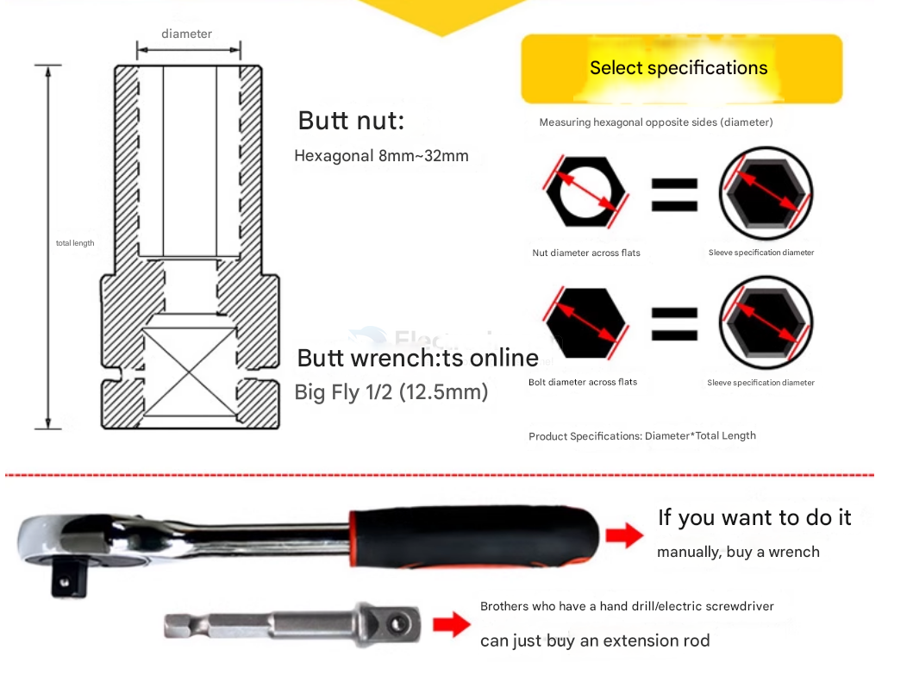

# mech-tools-dat

- [[Wrench-dat]]

- [[screws-dat]]

## Socket Wrench Drive

### Common Socket Wrench Drive Sizes:

| Name   | Drive Size | Square Drive (mm)  | Typical Use Cases                         | CN        |
| ------ | ---------- | ------------------ | ----------------------------------------- | --------- |
| Small  | 1/4" drive | 6.35 mm            | Electronics, precision work, small screws | 方头 小飞 |
| Medium | 3/8" drive | 9.5 mm             | Household use, light automotive repair    |
| Large  | 1/2" drive | 12.7 mm (aka 12.5) | Automotive, heavy torque applications     | 大飞      |

## ref 

- [[mech-tools]] - [[mechanics]]
